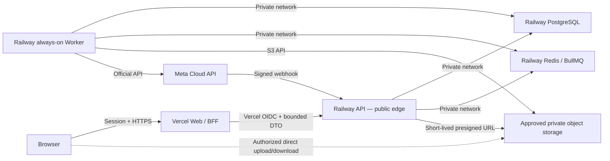

# ADR-0004 — Detailed Vercel and Railway target topology

## 1. מצב ההחלטה

1.1 סטטוס: `proposed`.

1.2 בעל ההחלטה: טל — כיוון התשתית; רועי מאשר תקציב ו־Plans;
ראשה מאשרת Deployment ו־Rollback; דוד מאשר API, ‏Queues ו־Workers;
אבטחה מאשרת Network, ‏Secrets, ‏Storage ו־Recovery.

1.3 אפשרות שאושרה: `unknown/unavailable`.

1.4 מועד אישור: `unknown/unavailable`.

1.5 המסמך מפרט את ההמלצה ההנדסית ליישום ADR-0001. הוא אינו מתיר
Provisioning, ‏Deployment או שינוי של `productionReadiness` לפני
אישור מפורש של סעיף 10.

## 2. הבעיה שצריך לפתור

2.1 ‏ADR-0001 בחר Vercel לשכבת ה־Web ו־Railway לשירותי API ו־Worker.
הוא לא בחר Database, ‏Queue, ‏Object storage, ‏Scheduler, ‏Rate
limiting, ‏Backup או Observability.

2.2 ‏Vercel אינו חלק מהרשת הפרטית של Railway. לכן קריאה מ־Vercel
ל־Railway עוברת דרך HTTPS ציבורי ומחייבת זהות שירות קצרת־חיים,
אימות קהל וסביבה, Replay protection ו־Audit.

2.3 ה־Scheduler הנוכחי מופעל פעם בדקה. Railway Cron מאפשר תדירות
מינימלית של חמש דקות, אינו מבטיח דיוק לדקה ומדלג על Run חדש כאשר
Run קודם עדיין פעיל. לכן Railway Cron אינו מנגנון תקין ל־Scheduler
המרכזי של Connect.

2.4 המערכת שולחת פעולות חיצוניות שאי אפשר תמיד לבטל. Queue או
Restart אינם רשאים להפוך תוצאה לא ידועה לשליחה חוזרת אוטומטית.

## 3. ההמלצה הכוללת

3.1 אפשרות A — **Vercel Web/BFF + Railway API/Worker + Railway
PostgreSQL/Redis + Object storage מאושר** — היא ההמלצה.

3.2 פירוש BFF, או Backend for Frontend: שכבת שרת דקה שצמודה ל־UI.
היא מאמתת Session, מצמצמת DTO ומתקשרת עם Railway API; היא אינה
מכילה Business logic ואינה פונה ישירות ל־PostgreSQL, ‏Redis או Meta.

3.3 תרשים הזרימה המומלץ:

3.4 החץ הישיר מה־Browser ל־Storage קיים רק אחרי שה־Railway API
אישר Tenant, ‏Purpose, ‏Content type, ‏Size, ‏Object key ותפוגה.
Credential של Storage לעולם אינו נשלח לדפדפן.

## 4. חוזי השירותים

4.1 ‏Vercel Web/BFF:

4.1.1 מרנדר React/Next.js, מנהל Session ו־CSRF ומחזיר DTO מצומצם.

4.1.2 שולח ל־Railway API ‏Vercel OIDC token קצר־חיים. Railway מאמת
חתימה, Issuer במצב Team, ‏Audience, ‏Subject, ‏Project ו־Environment.

4.1.3 אינו מחזיק `META_APP_SECRET`, ‏Database URL, ‏Redis URL או
Object-storage write credential.

4.1.4 אינו מבצע Queue consumer, ‏Scheduler, קמפיין או תהליך ארוך.

4.2 ‏Railway API:

4.2.1 זהו השירות הציבורי היחיד ב־Railway.

4.2.2 הוא מקבל שני סוגי תעבורה בלבד: בקשות BFF עם OIDC מאומת
ו־Meta webhook עם חתימה מאומתת. Health endpoint ציבורי מחזיר מצב
מינימלי ללא פרטי תשתית.

4.2.3 הוא מבצע Authorization עסקי מחדש. OIDC מוכיח איזו פריסת
Vercel קראה; הוא אינו מוכיח שלמשתמש יש הרשאה ב־Tenant.

4.2.4 כתיבה שמתחילה עבודה אסינכרונית שומרת State/Outbox אטומיים
ב־PostgreSQL לפני פרסום Job שמכיל מזהה אטום בלבד.

4.3 ‏Railway Worker:

4.3.1 הוא שירות Always-on ללא Domain ציבורי.

4.3.2 הוא צורך BullMQ, מפעיל Reconciliation ו־Scheduler tick ומבצע
קריאות Meta/AI/Scanner מאושרות.

4.3.3 ‏Shutdown מסודר מפסיק Claim חדש, ממתין עד Timeout מוגבל
ומשחרר Lease. עבודה שלא הושלמה ניתנת לתביעה מחדש רק לפי חוזה
Idempotency של אותו Use case.

4.4 ‏PostgreSQL:

4.4.1 זהו מקור האמת היחיד ל־Business state, ‏Outbox, ‏Audit,
Idempotency, ‏Provider reservation ו־Reconciliation.

4.4.2 המלצת Production היא Railway PostgreSQL HA עם PgBouncer ו־PITR.
Staging יכול להתחיל ב־Single node רק אם אינו מכיל Production data.

4.4.3 Railway מגדירה את תבניות מסדי הנתונים כ־Unmanaged. לכן הצוות,
ולא Railway, אחראי Tuning, ‏Monitoring, ‏Security, ‏Backup ותרגילי
Restore.

4.4.4 ‏Vercel וה־Browser אינם מקבלים Database credential. רק API,
Worker ו־Migration job מתחברים דרך Railway private networking.

4.5 ‏Redis + BullMQ:

4.5.1 Redis משמש Broker ו־Fast distributed limiter; הוא אינו מקור
האמת העסקי.

4.5.2 BullMQ מנהל Delay, ‏Backpressure, ‏Attempts ו־Failed state.
אחרי מספר ניסיונות מוגבל, עבודה סופית נשארת ב־Failed set ומקבלת
אירוע Audit/Alert ב־PostgreSQL; אין מחיקה אוטומטית של Failed jobs
לפני חלון הבדיקה המאושר.

4.5.3 Redis חייב AOF persistence, ‏`maxmemory-policy=noeviction`,
Memory alert, ‏Graceful reconnect ו־Restore test. ללא תנאים אלה
BullMQ אינו כשיר ל־Production.

4.5.4 Job payload מכיל Reference אטום וגרסת Contract בלבד. תוכן
שיחה, מספר טלפון, Access token או PII אינם נשמרים ב־Redis.

4.5.5 Retry אוטומטי מותר רק לכשל שסווג `safe-to-retry`. תוצאת שליחה
לא ידועה עוברת ל־`ambiguous` ב־PostgreSQL ול־Reconciliation; היא
אינה חוזרת לתור השליחה.

## 5. Scheduler

5.1 ה־Scheduler המרכזי ירוץ כחלק מתהליך Always-on של Railway
Worker, לא כ־Railway Cron.

5.2 בכל Tick של דקה התהליך מבקש מ־PostgreSQL Lease אטומי בעל תפוגה
קצרה. רק בעל ה־Lease רשאי לתבוע Runs שהגיע זמנם.

5.3 זמן ה־Tick אינו מקור האמת. מקור האמת הוא `due_at` ב־PostgreSQL,
והתביעה משתמשת ב־Expected status/version וב־`SKIP LOCKED` או מנגנון
שקול שנבדק על PostgreSQL.

5.4 לאחר Restart, ה־Worker סורק חלון Catch-up מוגבל. הוא אינו שולח
עבודה ישנה מעבר ל־Staleness policy של ה־Feature.

5.5 Railway Cron יכול לשמש בעתיד רק משימות תחזוקה של חמש דקות ומעלה
שאינן קריטיות לדקה ושיכולות לסבול Run שנדחה או דולג.

## 6. Object storage

6.1 בחירת הספק נשארת `unknown/unavailable` עד אישור אבטחה, פרטיות,
אזור, Retention, ‏DPA ותקציב.

6.2 המלצה ראשית: **AWS S3 private bucket** עם Default encryption,
Versioning, ‏Lifecycle, ‏Least-privilege IAM ו־Object Lock רק למחלקות
שמחייבות WORM/Legal Hold. ‏Vercel משתמש ב־OIDC כאשר הוא זקוק לגישת
AWS; Railway שומר Credential מצומצם ורוטט או מבקש URL חתום דרך
השירות המורשה.

6.3 חלופה: **Vercel Private Blob**. הוא זמין כעת ב־GA, מוצפן ותומך
Signed URLs ו־OIDC בתוך Vercel. החיסרון: Railway Worker חיצוני
זקוק Token או API מתווך, וצריך להוכיח Retention, ‏Versioning,
Legal Hold ו־Recovery בנפרד.

6.4 חלופה שאינה מומלצת כרגע לנתונים רגישים או לגיבויים:
**Railway Storage Bucket**. הוא פרטי ותואם S3, אך נכון לתאריך המסמך
אינו תומך Server-side encryption, ‏Object versioning, ‏Object Lock
או Lifecycle configuration.

6.5 קובץ חדש נשמר במצב `quarantined`, מקבל Digest, עובר Scanner
בשירות Railway פרטי ורק אז הופך `available`. URL חתום אינו עוקף
את ה־State הזה.

## 7. Rate limiting

7.1 Redis אוכף מכסות מהירות ל־API, ‏Mutation ו־Webhook לפי
Environment/Tenant/Actor/IP כאשר השדה מותר במדיניות.

7.2 PostgreSQL אוכף באופן אטומי את מכסות WhatsApp שמחייבות Ledger,
Reservation ו־Reconciliation בין כמה מספרים ו־Workers.

7.3 BullMQ limiter הוא שכבת Backpressure נוספת. הוא אינו מחליף את
מטריצת מגבלות Meta, את Pair limit או את Portfolio reservation.

7.4 כשל ב־Redis חוסם Mutations רגישות ופרסום קמפיינים באופן
Fail-closed; Meta webhook מאומת נשמר במסלול Durable שאושר או מקבל
שגיאת Retry ברורה — הוא אינו נזרק בשקט.

## 8. Backup, Recovery ו־Observability

8.1 PostgreSQL מפעיל PITR. Railway שומרת Full שבועי, Incremental
יומי ו־WAL, עם חלון משוער של כארבעה שבועות; חלון זה חייב להיבדק
בחשבון החי ולא להיות מוסק מהתצורה בלבד.

8.2 ‏PITR אינו מספיק לבדו: גיבוי Logical מוצפן נשמר בחשבון או
ספק נפרד, מקושר ל־`backupId`, ‏Schema digest ו־Object digest, ונבדק
ב־Restore מבודד.

8.3 ‏Object storage מקבל Versioning/Lifecycle ותרגיל Restore לפי
מחלקת המידע. אין לסמן Backup/Restore כ־Ready על בסיס Snapshot קיים.

8.4 כל שלושת שירותי הקוד מפיקים OpenTelemetry עם `release`,
`environment`, ‏`service` ו־Correlation ID זהים. ספק ה־Sink,
Retention וערוץ ההתראות נשארים `unknown/unavailable`.

8.5 Railway dashboard מספיק לבריאות Container בסיסית בלבד. לפי
התיעוד, Retention של Logs תלוי Plan; נדרש Sink חיצוני ל־Application
traces, ‏SLOs, ‏PII-safe alerts ו־Retention ארוך.

## 9. חלופות שנדחו כהמלצה

9.1 ‏Railway Cron ל־Scheduler המרכזי נדחה מפני שאינו תומך בדרישת
פעם בדקה ואינו מבטיח דיוק לדקה.

9.2 ‏PostgreSQL job queue לכל התורים נדחה כהמלצת היעד משום שמגבלות
WhatsApp וה־Webhook דורשות Headroom, ‏Backpressure ו־Scaling עצמאי.
הוא יכול לשמש רק אם Load test מוכיח את ה־SLO והפחתת המורכבות חשובה
יותר מה־Headroom.

9.3 חיבור ישיר מ־Vercel ל־PostgreSQL/Redis דרך TCP ציבורי נדחה.
הוא מרחיב את גבול ה־Secrets ועוקף את Railway API ואת ה־Authorization.

9.4 Hybrid עם D1, ‏R2 או Cloudflare Queues נדחה כבר ב־ADR-0001.

## 10. החלטות ואישורים שחסרים

10.1 טל — מאשר או דוחה את טופולוגיית השירותים וה־Scheduler:
`unknown/unavailable`.

10.2 רועי — מאשר Railway/Vercel Plans, ‏PostgreSQL HA, ‏Redis,
Storage ו־Observability budget: `unknown/unavailable`.

10.3 ראשה — מאשרת Regions, ‏Membership, ‏Environment isolation,
Deployment, ‏Health checks ו־Rollback: `unknown/unavailable`.

10.4 דוד — מאשר BullMQ, ‏PostgreSQL concurrency, ‏OIDC verifier,
Meta webhook ו־Ambiguous-send contract: `unknown/unavailable`.

10.5 אבטחה/פרטיות — מאשרות OIDC claims, ‏Secrets, ‏AWS/S3 או חלופה,
Encryption, ‏Retention, ‏DPA ו־Recovery: `unknown/unavailable`.

10.6 Product — מאשר Staleness/Catch-up, ‏RTO, ‏RPO ו־Pilot caps:
`unknown/unavailable`.

## 11. תנאי קבלה לפני שינוי ל־accepted

11.1 כל בעלי התפקידים בסעיף 10 מזוהים ומאשרים בכתב את החלק שבבעלותם.

11.2 נבחרים Region ו־Plan לכל Environment, כולל תקרת עלות ו־Owner.

11.3 נבחר Object-storage provider; מתועדים Encryption, ‏Versioning,
Lifecycle, ‏Legal Hold, ‏Backup ו־Credential rotation.

11.4 מתועד Redis configuration digest שמוכיח AOF ו־`noeviction`.

11.5 מתועד PostgreSQL topology digest שמוכיח HA/PgBouncer/PITR או
חריג חתום, יחד עם RPO/RTO ותרגיל Restore.

11.6 Contract tests מוכיחים ש־Vercel אינו ניגש ל־DB/Redis/Meta,
ש־OIDC Preview אינו מתקבל ב־Production וש־Scheduler כפול אינו תובע
את אותה ריצה.

11.7 Load test מוכיח Webhook ingress, ‏Queue backlog recovery,
Rate limiting ו־Graceful shutdown לפי ה־SLO המאושר.

11.8 ‏[חוזה API בין Vercel ל־Railway](../vercel-railway-api-contract.md)
מקפיא Contract/Client/Handler מקומיים. הוא אינו ממלא את תנאי
ה־Live configuration, ‏Production pool values ו־Schema parity מלאה, מלוא ה־Mutation
coverage, ‏Staging או Deployment evidence. ה־Cryptographic verifiers,
שלוש פעולות Read-only ו־`contacts.save` עם Transaction executor
ספק־נייטרלי, Tenant access, ‏Team membership mutations וכל Invitation
lifecycle repositories ו־16 Migrations ל־Critical Path כבר קיימים מקומית,
כולל WhatsApp delivery-policy, ‏Kill switch ו־Rate-limit ledger אטומיים.
שרשרת ה־Schema וכל 27 משפטי ה־Invitation SQL עברו PostgreSQL מקומי. ‏Adapter
`node-postgres` ו־Harness חוזר הוכיחו Contact/Invitation/Meta/Template/Campaign DML,
‏Rollback ו־22 תרחישי Concurrency; עדיין אין בכך הוכחה לכל ה־Repositories או לסביבת
Staging.
חוזה Pool מאובטח קיים, אך ספק, גודל Pool, ‏CA, ‏Timeouts ו־Telemetry חיים
נשארים `unknown/unavailable` עד קבלת החלטה וראיות Environment.
Foundation אחד מחבר 22 Adapters קיימים לאותו Pool בלי לחשוף אותו, ובהם
Contact organization/import אטומי ו־Meta connection, ‏Webhook receipts ו־
Credential envelopes מוצפנים, ‏Conversation/Message inbox אטומי,
‏Message Template lifecycle וכן Campaign
snapshot אטומי לפני Dispatch.
`contacts.list` מחובר ל־PostgreSQL ונבדק מול מסד אמיתי עם Tenant isolation
ו־Keyset pagination. ‏`reports.read` קיבל Adapter חד־שאילתי; Conversations,
Messages, ‏Templates, ‏Campaigns, ‏Bot deliveries, ‏AI audit ו־AI usage הומרו
ונבדקו מול PostgreSQL אמיתי, וה־Harness קרא דוח מלא מכל ששת המקורות.
Runtime composition בעל `close` מסודר עבר גם הוא מסלול HTTP מלא דרך זהויות
Vercel ו־Clerk, ‏Tenant resolution והרשאה. נוסף Node HTTP adapter עם
Liveness, ‏PostgreSQL readiness, גבולות Request ו־Service owner שסוגר HTTP
לפני Pool. ‏`PORT`, ‏`SIGINT` ו־`SIGTERM` מחוברים ב־Process controller מקומי.
ל־Railway Worker נוספו גם Timer שמתחיל מיד ומתיישר מחדש לגבול כל דקה,
מניעת overlap, המתנה לריצה פעילה לפני סגירת PostgreSQL ו־Process controller
משותף ל־`SIGINT`/`SIGTERM`. ‏Campaign dispatch ו־Invitation expiration
מחוברים לאותו Lease ול־PostgreSQL foundation; ‏Queue adapter, ‏Live config
ו־Startup executable עדיין חסרים.
‏Railway API מלא נשאר חסום עד Rate-limit adapter מבוזר, השלמת יתר ה־Routes
וה־Mutations, ‏Parity מלאה, ערכי Pool חיים וראיות Staging, כדי לא ליצור
Hybrid לא מתועד עם D1.

## 12. מקורות רשמיים שנבדקו

12.1 [Railway — Cron, Workers and Queues](https://docs.railway.com/guides/cron-workers-queues).

12.2 [Railway — Private Networking](https://docs.railway.com/networking/private-networking).

12.3 [Railway — PostgreSQL](https://docs.railway.com/databases/postgresql).

12.4 [Railway — Point-in-Time Recovery](https://docs.railway.com/volumes/point-in-time-recovery).

12.5 [Railway — Redis](https://docs.railway.com/databases/redis).

12.6 [Railway — Storage Buckets](https://docs.railway.com/storage-buckets).

12.7 [Railway — Third-party observability](https://docs.railway.com/guides/third-party-observability).

12.8 [Vercel — OIDC Federation](https://vercel.com/docs/oidc).

12.9 [Vercel — Private Blob GA](https://vercel.com/changelog/vercel-private-blob-is-now-generally-available).

12.10 [BullMQ — Going to production](https://docs.bullmq.io/guide/going-to-production).

12.11 [BullMQ — Rate limiting](https://docs.bullmq.io/guide/rate-limiting).

12.12 [AWS S3 — Data protection](https://docs.aws.amazon.com/AmazonS3/latest/userguide/DataDurability.html).

12.13 [AWS S3 — Object Lock](https://docs.aws.amazon.com/AmazonS3/latest/userguide/object-lock.html).

12.14 תאריך אימות מקורות: `2026-08-17`. תצורת חשבון חיה, מחירים,
Regions ו־Limits בפועל נשארים `unknown/unavailable` עד Provisioning.
