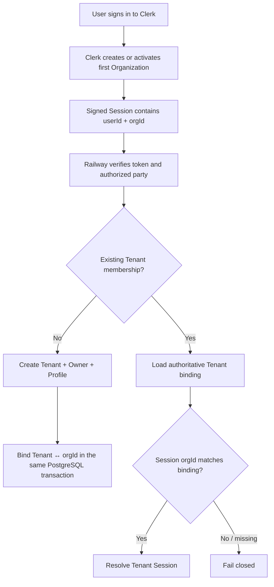

# Clerk Organization ↔ Tenant Binding

תאריך החלטה ומימוש מקומי: 2026-08-21

## 1. החלטה

1.1 לכל Tenant פעיל ב־Connect יהיה Clerk Organization יחיד.

1.2 אותו Clerk Organization לא יוכל להיות מקושר ליותר מ־Tenant אחד.

1.3 Connect לא תיצור Organization באמצעות קריאת Backend ישירה בזמן
Onboarding. במקום זאת, Clerk יוגדר ליצור למשתמש את ה־Organization הראשון
אוטומטית, ו־Connect תקבל את `orgId` מתוך ה־Session החתום.

1.4 PostgreSQL נשאר מקור האמת לקשר בין ה־Tenant לבין ה־Organization.
Clerk מוכיח זהות וחברות; Connect ממשיכה להכריע הרשאות Business לפי
`tenant_memberships`.

## 2. למה נבחר המסלול הזה

2.1 קריאת `createOrganization()` מתוך Transaction של Connect אינה יכולה
להיות אטומית יחד עם PostgreSQL. אם Clerk ייצור Organization אך התגובה
תאבד, Connect לא תדע בוודאות אם בטוח לנסות שוב.

2.2 API היצירה הרשמי אינו מתעד Idempotency key. בנוסף, Clerk מציינת
ש־Organization slugs כבויים כברירת מחדל ביישומים חדשים שנוצרו לאחר
7.10.2025. לכן Slug אינו Recovery key בטוח ללא תלות נוספת ב־Dashboard.

2.3 שימוש ב־Organization ש־Clerk כבר יצר והצבת `orgId` ב־Session מסיר את
תוצאת הביניים הלא־ודאית. Connect צריכה רק כתיבה מקומית אטומית.

## 3. הזרימה

## 4. חוזי הבטיחות שמומשו

4.1 ‏Migration `0027_clerk_organization_binding.sql` מוסיפה ל־`tenants`
את `clerk_organization_id`, בדיקת אורך/Whitespace/Control characters
ו־Unique index חלקי.

4.2 Existing tenants נשארים `NULL` במעבר ה־Schema. הם אינם מקבלים מיפוי
מומצא. לפני Pilot יש לבצע Backfill מאושר או Onboarding replay חתום.

4.3 ‏`clerkEndUserSessionVerifier` דוחה Session ללא `userId`, ללא `orgId`,
עם Token type שונה או עם Authorized party לא מאושר.

4.4 ‏Onboarding קושר את ה־Organization בתוך אותה PostgreSQL Transaction
שמכילה Tenant, ‏Owner, ‏Business profile, ‏Receipt ו־Audit.

4.5 Replay עם אותו Tenant ואותו `orgId` נשאר Idempotent. ‏Tenant שמקושר
ל־Organization אחר או Organization שכבר שייך ל־Tenant אחר נכשל ואינו נדרס.

4.6 כל Tenant Session קיים טוען את המיפוי מ־PostgreSQL ומשווה אותו ל־
`orgId` החתום. Connect אינה מקבלת Tenant ID או Organization ID מה־Payload.

## 5. תצורת Clerk שעדיין נדרשת

5.1 להפעיל Organizations ב־Clerk instance הנפרד של Staging.

5.2 להפעיל `Create first organization automatically` ולוודא שבכניסה
ראשונה מתקבל Organization פעיל ו־`orgId` ב־Session.

5.3 לחייב MFA לבעלי הרשאות Admin לפי החלטת D17, ולהגדיר Session lifetime,
Revocation ו־Authorized parties עבור Staging ו־Production בנפרד.

5.4 לבצע Browser E2E חי עבור: משתמש חדש, משתמש חוזר, מעבר Organization,
Session שבוטל, Tenant לא ממופה ו־Cross-organization attempt.

5.5 להפיק Evidence ללא Secrets: Clerk instance/environment, זמן בדיקה,
הגדרות Organizations/MFA, מזהים שעברו Hash או Redaction, תוצאות ו־Approvers.

## 6. הזמנות ותפקידים

6.1 Adapter הזמנות Clerk ממומש ומחובר מקומית ל־Worker composition באמצעות
Factory שמקבל את Organization binding repository ואת ה־Rate-limit binding
מאותו PostgreSQL foundation. הוא עדיין אינו Worker חי ב־Staging, ואין
להסיק מהמימוש המקומי שהזמנות חיות מוכנות ל־Production.

6.2 המלצת Role mapping ל־Pilot: Connect `owner` ו־`manager` נשארים תפקידי
האפליקציה; Clerk ישמש Membership coarse-grained בלבד. רק משתמש שצריך לנהל
את Clerk Organization יקבל `org:admin`; שאר המשתמשים יקבלו `org:member`.

6.3 ה־Adapter מחייב TTL של 72 שעות וממפה את כל תפקידי Connect המוזמנים
ל־`org:member`. הרשאות `manager`, ‏`agent` ו־`viewer` ממשיכות להיקבע רק
מ־`tenant_memberships`; הזמנה אינה מעניקה `org:admin`.

6.4 לפני יצירה, ה־Adapter סורק את הזמנות ה־Organization בכל ארבעת
הסטטוסים ומחפש `privateMetadata` עם `deliveryKey` דטרמיניסטי ו־Tenant ID.
אם תוצאת POST אבדה, אותו Metadata מאפשר ל־Reconciliation להוכיח שההזמנה
נוצרה בלי לשלוח שוב.

6.5 הסריקה מוגבלת ל־500 תוצאות. אם Clerk מדווחת שיש יותר תוצאות ולא נמצא
המפתח בתוך הגבול, התוצאה היא `unavailable` ולא `not-found`; כלומר Connect
חוסמת יצירה במקום להסתכן בכפילות. שמירת Clerk invitation ID מקומית יכולה
להתווסף כאופטימיזציה, אך אינה תנאי הבטיחות היחיד.

6.6 יצירה צורכת Guard משותף לפני הקריאה ל־Clerk. ה־Guard משתמש ב־Token
bucket ייעודי ב־PostgreSQL ומשותף לכל מופעי ה־Worker. שלושת ערכי התצורה
חובה, ללא ברירות מחדל. ה־Capacity מוגבל ל־125 וה־Refill period אינו קצר
משעה, כך שגם Bucket מלא ועוד Refill של שעה אינם עולים על 250 ניסיונות
יצירה — מגבלת ה־Endpoint הרשמית לכל Application instance בזמן האימות.

6.7 ‏Migration `0028_clerk_invitation_rate_limit.sql` מרחיבה את Constraint
ה־Policy הסגור עבור `clerk-organization-invitation`. ‏Migration
`0029_team_invitation_delivery_deferrals.sql` מוסיפה Deferral עמיד ומוגבל
ל־PostgreSQL. החיבור החי נשאר חסום עד להגדרת ערכי Policy מאושרים והפקת
ראיית Clerk/Railway Staging; המימוש המקומי אינו ראיה חיה. ‏Connect
invitation state וה־Audit נשארים סמכותיים.

6.8 אומת מחדש ב־21.08.2026 מול התיעוד הרשמי: Clerk מחזירה HTTP ‏429 עם
`Retry-After` בשניות, ו־SDK חושף אותו כ־`ClerkAPIResponseError.retryAfter`.
רק ערך שלם, חי ותחום מהשגיאה עצמה יוכל לקבוע Delay; Header חסר או פגום לא
יוחלף בערך מומצא.

6.9 ‏Retry ברמת BullMQ בלבד עדיין אסור. המימוש המקומי מקבל רק שגיאת Clerk
מזוהה מסוג 429 עם `retryAfter` שלם בטווח 1–86,400 שניות. לפני בקשת Delay
מהתור, ה־Processor שומר `retryAfterAt` עמיד ומחזיר אטומית את ה־Delivery
מ־`sending` ל־`pending`. מעבר SQL ישיר ללא רשומת Deferral תואמת נדחה.

6.10 מסירה מוקדמת קוראת את ה־Deferral העמיד, אינה פונה שוב ל־Clerk ומבקשת
רק את יתרת ה־Delay. לאחר ה־cutoff ניתן לבצע Claim חדש. ‏`retryAfter` חסר,
לא־שלם או מחוץ לטווח אינו מוחלף בערך מומצא ומסווג `unavailable`. נותר
להוכיח את המסלול מול שגיאת 429 חיה ב־Staging, כולל Telemetry וללא הזמנה
כפולה.

## 7. קבלה

7.1 בדיקות Unit/Contract מכסות Session ללא `orgId`, מיפוי חסר,
Cross-organization, Replay, Conflict, Migration inventory, Factory wiring,
הפרדת Policy ומדיניות שנכשלת סגור אם היא עלולה לעבור את מגבלת Clerk.

7.2 תנאי Production נוסף: אין Tenant פעיל ללא מיפוי, ואין Organization ID
שמופיע ביותר מ־Tenant אחד.

7.3 המימוש המקומי אינו Evidence של Clerk Dashboard ואינו מאשר MFA,
Session policy או הזמנות חיות.

## 8. מקורות רשמיים

8.1 [Clerk — Configure Organizations](https://clerk.com/docs/guides/organizations/configure).

8.2 [Clerk — Backend createOrganization](https://clerk.com/docs/reference/backend/organization/create-organization).

8.3 [Clerk — Auth object and active Organization](https://clerk.com/docs/reference/backend/types/auth-object).

8.4 [Clerk — Organization invitations](https://clerk.com/docs/reference/backend/organization/create-organization-invitation).

8.5 [Clerk — List Organization invitations](https://clerk.com/docs/reference/backend/organization/get-organization-invitation-list).

8.6 [Clerk — System limits](https://clerk.com/docs/guides/how-clerk-works/system-limits).

8.7 [Clerk — ClerkAPIResponseError](https://clerk.com/docs/js-frontend/reference/types/clerk-api-response-error).
