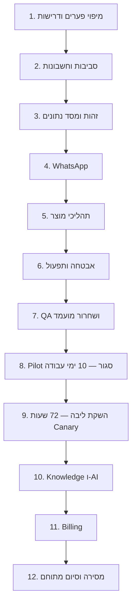

# 1. Connect — Master Plan לסיום הפיתוח והשקה

1.1 תאריך: 09.09.2026. בעל אחריות: Tal. ביצוע: Tal + Codex, לפי ההרשאה החדשה להכריע ולהתקדם. [מסמך ההחלטות](launch-decisions-2026-09-09.md) הוא חלק מהתוכנית.

1.2 **מקור העבודה הפעיל:** מסמך זה מחליף את סדר העבודה ב־[תוכנית 23 השלבים](connect-all-remaining-work-execution-plan-2026-08-30.md), לרבות Development freeze, Planning-only וחובת קבלת מנגנון ההוכחות לפני מימוש. סטטוסים וראיות היסטוריים נשמרים; אין סימון רטרואקטיבי של חבילה כ־Accepted.

1.3 **יעד סופי מתוחם:** Web SaaS עובד עם הרשמה וזהות, Tenant isolation, אנשי קשר והסכמה, WhatsApp רשמי, Templates, Inbox, קמפיין חד־פעמי, Bot בסיסי עם העברה לאדם, תפעול ושחזור. אחרי השקת הליבה: Knowledge/AI באישור אדם, Paddle Billing ודיווח שימוש בסיסי. Recurring campaigns, Enterprise, API ציבורי ו־Mobile native נשמרים ב־Backlog ומחוץ להגדרת הסיום.

1.4 “קוד קיים” אינו “מוכח מול ספק”; “החלטה התקבלה” אינה “Feature הופעל”. אין אחוז השלמה כולל עד מיפוי הפערים בשלב 1.

1.4.1 **תיקון דיווח ההתקדמות, 10.09.2026:** 12 הוא מספר השלבים הראשיים שטרם נסגרו, ואינו מספר המשימות שנותרו. 10–16 שבועות ב־30 שעות בשבוע הוא אומדן התכנון המקורי; הוא אינו אומדן שנותר שחושב מחדש ואינו תאריך פיילוט. העדיפות הנוכחית היא גישה לסביבות, פריסה ובדיקת Coexistence חיה — סעיף 45 ו־[דוח 24 השעות](launch-progress-audit-2026-09-10.md).

1.5 **עדכון דרישת QR, 09.09.2026:** חיבור WhatsApp Business קיים דרך Meta Coexistence הוא חלק מחייב מהליבה. Meta מנהלת את מסך האימות ומציעה קוד/QR; לא מבטיחים QR בלבד או תמיכה בחשבון WhatsApp אישי. אין תוכנית נוספת מתחרה: סעיף 4.5 והאומדנים כאן עודכנו. **12 שלבים עדיין לא הושלמו; שלבים 1, 2 ו־4 בביצוע.**

# 2. תמונת מצב שנבדקה בפועל

2.1 בסיס הקוד לפני השינויים בסשן: **Local Release Gate PASS**, ‏3,991/3,991 בדיקות, Build ל־Vinext/Cloudflare ו־Build ל־Vercel, TypeScript, ESLint ללא שגיאות ו־28 אזהרות, Source/Interface/Secret guardrails ומיגרציות. זו הרצה חדשה מ־09.09, לא העתקת מונים ממסמך ישן.

2.2 דוח Legacy: ‏5 ready, ‏18 blocked, ‏11 decision-required. חלק מ־ready הוא הצהרות D1/R2/Cloudflare, ולכן אינו מכנה נכון לאחוז השלמת יעד Railway.

2.3 דוח תשתית V2: `PRODUCTION_READINESS_V2_SOURCE_REQUIRED`, ‏source disabled. V2 מכסה שש בדיקות תשתית בלבד; אין להחליף באמצעותו את בדיקות המוצר/זהות/Meta/גיבוי. בשער השחרור נוספה בדיקת V2 לצד הבדיקות הקיימות.

2.4 בסביבת התהליך המקומי לא נמצאו משתני הגדרה לספקים. אין קביעה שאין חשבונות בעולם; חיבורי Vercel/Railway/Clerk/Meta/AWS/OpenAI אינם זמינים לתהליך שנבדק. בדיקת `gh auth status` הראשונה בסביבה המוגבלת דיווחה על Token לא תקף; **בדיקת GitHub API מרוחקת בהמשך הצליחה והוכיחה גישת Admin**. אין יותר חסם אימות כללי ל־GitHub; מצב הבקרות העדכני בסעיף 9.14.

2.5 npm audit מול Registry הרשמי מצא בתחילה ארבע תלויות Production פגיעות, לרבות Next.js בדרגת Critical. בוצע עדכון אבטחה ל־Next.js ולתלויות עקיפות; תוצאת האימות הסופית תתועד בסעיף 9.

2.6 קיימים 589 קובצי תכנון Untracked משלבים קודמים ועוד שלושה מסמכי תכנון ששונו לפני העבודה הנוכחית. הם נשמרים. פרסום עתידי יתבסס על רשימת קבצים מסווגת ומדויקת, לא על הוספת כל התיקייה ללא בדיקה.

# 3. מסלול ההשלמה

3.1 מסלול קריטי:



3.2 אפשר לקרוא תיעוד ולהכין קוד בזמן המתנה לחשבונות. אומדני הזמן אינם מניחים שאדם יחיד עובד בכמה מסלולים במקביל. Staging אמיתי הוא התנאי למדידה ולסגירת שלבי השילוב.

3.3 בכל תת־שלב: Owner=Tal, המזהה המספרי משמש Task ID, נשמרים קישור לשינוי ובדיקה/ראיה, והסטטוס מתקדם `TODO → IN_PROGRESS → VERIFIED` או `EXTERNAL_BLOCKED`. `SUPERSEDED_BY_SCOPE` מותר רק לתכולה שבוטלה במפורש, ואינו PASS של מימוש.

# 4. שלבים ותתי־שלבים עד השקת הליבה

4.1 הטווחים בטבלאות הם **אומדני הבסיס מ־09.09.2026, לפני רזרבה**. הם אינם ספירה מעודכנת של שעות שנותרו. האומדנים הם הערכה ראשונית של Codex לפי הקוד והתוכניות שנבדקו, ברמת ביטחון נמוכה־בינונית; הם אינם שעות שנמדדו. תתי־השלבים מסתכמים לשלב המקורי שלהם. פערי הקוד שהתגלו לאחר מכן מפורטים בסעיף 59, ללא חיבור כפול לאומדנים ההיסטוריים.

## 4.2 שלב 1 — מיפוי פערים, ממצאים ומקור אחד: 8–16 שעות

| משימה | עבודה | שעות | תנאי סיום |
|---|---|---|---|
| 1.1 | למפות את דרישות המוצר והממצאים ההיסטוריים; להפריד מטא־תכנון מהגנת מוצר | 3–6 | לכל דרישה/ממצא מקור, החלטת תחולה ומשימת המשך; אין P0/P1 שנעלם בגלל שינוי Scope |
| 1.2 | לסווג קוד KEEP/VERIFY/REFACTOR ותכולה שהוצאה מהגרסה | 2–4 | מפת פערים לכל Workflow מול endpoint/repository/UI קיימים |
| 1.3 | לאחד Release checklist, סמכות Repo ופקודות V1/V2 | 2–4 | אין Private/PUBLIC או Cloudflare/Railway סותרים במסלול השחרור הפעיל |
| 1.4 | לנעול backlog מתוחם וקישור ראיות מינימלי | 1–2 | משימות, תלויות ובדיקות; אין דרישה לבנות שפת AST חדשה |

4.2.1 תלות: אין. מצב: החל; ההכרעות ובדיקת הבסיס בוצעו, מיפוי כל הממצאים עוד לא הושלם.

## 4.3 שלב 2 — חשבונות וסביבות מבודדות: 10–18 שעות

| משימה | עבודה | שעות | תנאי סיום |
|---|---|---|---|
| 2.1 | לבדוק Membership, GitHub CI/Rulesets ו־Secrets | 2–4 | גישה אישית אמיתית; CI על SHA נבחר; secrets אינם מודפסים |
| 2.2 | להגדיר Vercel Web ו־Railway API/Worker/PostgreSQL/Redis | 4–6 | שירותי Staging עובדים עם גרסה תואמת ורשת פרטית ל־DB/Redis |
| 2.3 | להגדיר Clerk, Meta Test, S3 ו־Better Stack | 3–6 | מזהי משאבים אמיתיים, Origins מדויקים ובידוד מ־Production |
| 2.4 | להגדיר תקציב ו־configuration preflight | 1–2 | תצורה חסרה נחסמת; אין fallback לנתוני Production |

4.3.1 תלות: 1.3. חסם חיצוני: חיבורי חשבונות, בעלות ותקציב ספק בפועל. זמני אישור ספק אינם כלולים בשעות.

## 4.4 שלב 3 — זהות, הרשאות ו־PostgreSQL: 14–24 שעות

| משימה | עבודה | שעות | תנאי סיום |
|---|---|---|---|
| 3.1 | מיגרציות, חוזים ותרגיל העברה למסד מבודד | 4–6 | שימור counts/constraints ואימות עסקי; אין שינוי במסד ייצור |
| 3.2 | Login, Organization, MFA, הזמנה וקבלת צוות | 4–8 | happy path ותפוגה/ביטול/כפל/העברת בעלות עובדים ב־Staging |
| 3.3 | Vercel OIDC, הרשאות API ובידוד Tenant | 4–6 | בקשות מזויפות, cross-tenant ו־role ישן נדחות בשרת |
| 3.4 | טרנזקציות, concurrency ו־Audit/Outbox | 2–4 | crash/conflict אינם יוצרים פעולה כפולה או state חלקי |

4.4.1 תלות: 2.2–2.3. פלט: ליבה אמיתית ב־Staging עם מסלול rollback לנתונים ולגרסה.

## 4.5 שלב 4 — WhatsApp, חיבור QR, Queue ו־Rate limiting: 42–74 שעות

| משימה | עבודה | שעות | תנאי סיום |
|---|---|---|---|
| 4.1 | אימות Webhook, חתימה, replay, deduplication ו־storage | 4–6 | אירוע כפול/לא חתום/שגוי לא יוצר כתיבה עסקית כפולה |
| 4.2 | Template lifecycle וקריאת מצב החשבון | 4–6 | מצב ספק אמיתי; reject/pause/language משוקפים במוצר |
| 4.3 | LimitSnapshot, opt-out, חלון שירות ומכסות פנימיות | 4–8 | חסר/פג/סותר נחסם; ערכי Meta מגיעים ממקור חי |
| 4.4 | תורים, Worker, Scheduler, DLQ ומניעת double-send | 6–10 | Redis restart, 429, response loss ו־ambiguous מתנהגים לפי החוזה |
| 4.5 | Coexistence: launch, אירוע WABA-only, אימות מספר/בעלות וחיבור ל־Railway | 4–6 | מזהים נפתרים מ־Graph; מספר עמום נדחה; בחירת מסלול בשרת; CTA פועל רק כשכל הסנכרון מחובר |
| 4.6 | סנכרון אנשי קשר והיסטוריה: durable jobs/receipts, request_id והתקדמות | 6–12 | התחלה בחלון Meta; שימור הסכמת המשתמש; סירוב לשיתוף תקין; restart/timeout לא משכפלים קריאה חד־פעמית |
| 4.7 | קליטת smb_message_echoes והצגת הודעות מהטלפון ב־Inbox | 6–10 | הודעה יוצאת אינה inbound, אינה מפעילה Bot או מגדילה unread; dedup, סדר אירועים, עריכות ומחיקות נבדקים |
| 4.8 | ניתוק, offboard, reconnect, timeout ואבטחת הסריקה | 4–8 | הרשאה מבוטלת עוצרת שליחה; אין שימוש ב־Deregister API למספר Coexistence; התקדמות אינה מתחזה ל־connected |
| 4.9 | תצורת v4 אמיתית ובדיקת QR/קוד במכשיר Business מורשה | 4–8 | חשבון ספק זכאי, סריקה/ביטול/פקיעה/ניסיון חוזר; inbound/outbound/echo והסכמה להיסטוריה נבדקו עם מספר מבודד |

4.5.1 תלות: 3 וחשבון Meta Test אמיתי. בדיקות שליחה רק לרשימת נמענים שהרשאתם הוכחה.

4.5.2 **מסלול הסריקה:** Connect → חלון Meta → בחירת מספר WhatsApp Business קיים → אישור בטלפון בקוד או QR → החלפת code בשרת → אימות נכסים → הרשמת Webhook → סנכרון → חיבור מוכן. ה־QR, ככל שמוצג, נוצר ונוהל ב־Meta; לא מייצרים QR דמה או שומרים תמונת QR/Token בדפדפן.

4.5.3 **מצב המימוש העדכני:** נדרש מספר WhatsApp Business אמיתי ומורשה; Test WABA לבדו אינו הוכחת Coexistence. בקוד הושלמו קליטת אנשי קשר והיסטוריה, הקרנה ל־Inbox, עריכות טקסט ומחיקות Echo, ניסיון שרתי לפני SDK, קישור ההרשמה לסנכרון, משימת המשך עמידה ו־Worker, וכן API וממשק לפיילוט המושבת כברירת מחדל — סעיפים 19–33. בסעיף 34 נוסף שיוך מאומת ועמיד בין אירועי מדיה להודעות המקוריות, ובסעיף 35 מומשה הורדה פנימית עם אימות הרשאות, גודל ו־Hash. סעיף 36 מוסיף מתאם S3 פנימי להסגר עם KMS ו־VersionId, וסעיף 37 מוסיף יומן העלאות עמיד, Claims, שמירת אישורים ושחזור אישור ללא פנייה חוזרת לספק. סעיף 38 מוסיף בירור גרסאות S3 וקליטת תוצאת GuardDuty דרך תגית מוגנת, כולל שחזור אישור חסר ושמירה אטומית של ראיות הסריקה. סעיף 39 מוסיף תור עמיד ולולאות Worker נפרדות להעלאה ובירור, עם Claim וניסיונות מוגבלים. סעיף 40 מוסיף מסך אבחון מורשה של המשימות והראיות, בקריאה בלבד. סעיף 41 מוסיף קריאת קובץ פנימית לפי גרסה, עם הרשאת קורא עדכנית, סריקה חוזרת ואימות Bytes. סעיף 42 מחבר נתיב HTTP בינארי מאומת ב־Railway וכפתור בדיקה והורדה ב־Inbox, עם Audit, מכסה וביטול; ההפעלה החיה עדיין דורשת תצורה וראיות ספק. סעיף 43 מוסיף בקשת בעלים לניסיון בירור נוסף של משימה שמיצתה ניסיונות, עם Audit, מניעת כפילויות ותקרה מצטברת. סעיף 44 מוסיף הסרה מפורשת של גרסת עותק ידועה בהסגר, עם חסימת גישה מיידית ושמירת ראיות. סעיף 45 מעביר את העדיפות לחיבור סביבות ולהוכחת פיילוט. עדיין חסרים טיפול בגרסאות לא מזוהות או סותרות וניקוי אוטומטי לפי מדיניות, תשתית S3 וסריקה חיה, מדידת תעבורה וזיכרון בפריסה, עריכת מדיה מלאה, הוכחת השלמת הייבוא, חידוש אחרי offboarding עם שיוך אירועים לדור הנכון, והוכחה חיה של חשבון ומכשיר זכאים. חשבונות ותשתיות Staging נדרשים לפי שלבים 2–3; בדיקת המכשיר מפורטת במשימה 4.9.

4.5.4 תוספת ה־QR והסנכרון: **24–44 שעות לפני רזרבה; 30–55 שעות עם 25%**, ללא המתנת ספק. זו תוספת להיקף הבסיס, לא הבטחה שניתן להפעיל חיבור חי לאחר שינוי צד־לקוח בלבד. תתי־השלבים נשארים פתוחים עד בדיקות השילוב; תחילת המימוש מתועדת בסעיף 9.

## 4.6 שלב 5 — תהליכי המוצר מקצה לקצה: 20–36 שעות

| משימה | עבודה | שעות | תנאי סיום |
|---|---|---|---|
| 5.1 | Contacts, ייבוא, dedup, consent ו־suppression | 4–8 | קובץ מורשה אמיתי מטופל; שגיאה אינה משאירה ייבוא חלקי בלתי נשלט |
| 5.2 | Inbox: חיפוש, עימוד, unread, שיוך וסטטוס מסירה | 5–8 | שתי פעולות מקבילות מתיישבות; reconnect מציג state נכון |
| 5.3 | Templates וקמפיין חד־פעמי: preview/approve/schedule/pause/cancel | 5–10 | cancel/opt-out עוצרים גם עבודה שכבר נכנסה לתור לפי החוזה |
| 5.4 | Bot בסיסי, human handoff ו־UI states | 4–6 | העברה לנציג, גרסה ו־rollback; אין הבטחת AI שלא הופעל |
| 5.5 | הגדרת Release scope ו־Feature flags בשרת ובממשק | 2–4 | AI/Upload/Billing כבויים בצורה נבדקת; V2 אינו מחליף בדיקות מוצר |

4.6.1 תלות: 4. פלט: תרחיש עסקי רציף ולא אוסף מסכים בלבד.

4.6.2 עדכון מ־10.09: משימה 5.2 כוללת מענה טקסט ידני מתוך Connect לאחר
Handoff. המסלול אינו ממומש ב־Composer הנוכחי. גם הגשת/סנכרון Templates,
מוכנות Campaign delivery ב־Executable ו־Pause/Cancel מחייבים השלמת קוד.
הפירוט וסדר העבודה הם G01–G04 ב־[מפת התהליכים](workflow-implementation-map-2026-09-10.md).

## 4.7 שלב 6 — אבטחה, ניטור, שחזור ומידע: 18–30 שעות

| משימה | עבודה | שעות | תנאי סיום |
|---|---|---|---|
| 6.1 | Secrets, dependencies, public-source hygiene ו־provenance | 4–6 | סריקות פעילות, טיפול בחולשות ובחומר פרטי; חתימה אינה ראיית תקינות עסקית |
| 6.2 | Better Stack, redaction, SLO ו־alert drill | 4–6 | Tal מקבל התראת ניסוי מאושרת; אין PII בתוצרי התצפית |
| 6.3 | Backup, PITR, Restore ו־kill-switch drill | 5–10 | RPO/RTO נמדדים מול יעדים; שחזור מבודד עובד |
| 6.4 | Retention, Legal Hold, זכויות ו־release runbook | 5–8 | מדיניות מחיקה נבדקת; המסמכים המשפטיים המתאימים קיימים לפני מסחור |

4.7.1 תלות: 3–5. יעד SLO פנימי ל־Pilot: 99.5% לזמינות פעולות ליבה בחלון התפעול שנמדד, ללא הבטחת SLA. פגיעה בבידוד Tenant, שליחה כפולה או אובדן מידע עוצרות מיד גם כשהממוצע עומד ביעד.

## 4.8 שלב 7 — QA וקיבוע Release candidate: 14–24 שעות

| משימה | עבודה | שעות | תנאי סיום |
|---|---|---|---|
| 7.1 | Unit/Integration/Contract ו־CI מלאים | 3–5 | הכול על אותו SHA; אין כשל שמוסתר באמצעות skip |
| 7.2 | Browser E2E אמיתי לכל Workflow פעיל | 4–7 | נבדקו זהות, consent, inbound/outbound, Inbox וקמפיין |
| 7.3 | RTL, מקלדת, focus, contrast, mobile וביצועים | 4–7 | בעיות נגישות מרכזיות נסגרות; latency ו־queue lag נמדדים |
| 7.4 | ביקורת אבטחה ממוקדת, SBOM, רישוי ותיעוד חזרה | 3–5 | אין P0/P1 פתוח; חבילת Release ניתנת לשחזור |

4.8.1 תלות: 6. יציאה: RC כשיר ל־Pilot, לא אישור Production גורף.

## 4.9 שלב 8 — Pilot סגור: 10–18 שעות עבודה בתוך 10 ימי עבודה

| משימה | עבודה | שעות | תנאי סיום |
|---|---|---|---|
| 8.1 | Charter עם Tenant/משתמשים/נמענים אמיתיים והגבלות D21 | 2–3 | משתתפים אמיתיים, היקף ורשימת הרשאות מתועדים |
| 8.2 | ליווי, ניטור ותיקוני תקלות במהלך Pilot | 6–12 | לפחות מסלול inbound ו־outbound אמיתי, ביטול ו־opt-out; אין ספירת בדיקות ללא פעילות |
| 8.3 | Exit review ועלות/מסירה/תמיכה | 2–3 | 10 ימי עבודה והפעילות הנדרשת הושלמו; אין P0/P1 או תוצאה בלתי מוסברת |

4.9.1 תלות: 7. תקלה משמעותית מחזירה לשלב המתאים ומתחילה מחדש את חלון היציבות הרלוונטי. אין קיצור חלון באמצעות אישור מילולי.

## 4.10 שלב 9 — השקת הליבה: 6–10 שעות + 72 שעות תצפית

| משימה | עבודה | שעות | תנאי סיום |
|---|---|---|---|
| 9.1 | preflight, Backup, מיגרציות ופריסת RC | 2–4 | SHA ו־Artifacts תואמים; כל השערים החלים עוברים |
| 9.2 | Canary ל־Tenant אחד ובדיקת Post-deploy | 2–3 | 72 שעות ללא אירוע חוסם; חלון נעצר במקרה תקלה |
| 9.3 | הרחבה מבוקרת ותיעוד גרסה | 2–3 | תכולת ההשקה ברורה, rollback זמין ו־onboarding עובד |

4.10.1 תלות: 8 ואישורי ספק/זכויות הנדרשים לשימוש המיועד. ההוראה הנוכחית היא הרשאת ביצוע; אין לולאת אישור תכנון חדשה. פרטי יעד שאינם זמינים לא יומצאו.

# 5. השלמת כל התכולה המתוחמת אחרי השקת הליבה

## 5.1 שלב 10 — Knowledge ו־AI באישור אדם: 20–36 שעות

| משימה | עבודה | שעות | תנאי סיום |
|---|---|---|---|
| 10.1 | S3/GuardDuty/Quarantine והעלאה/קריאה מבודדת | 6–10 | קובץ אינו נקרא ללא תוצאת סריקה נקייה ואימות בעלות |
| 10.2 | Responses, model allowlist, budgets, timeout וטיוטות | 5–9 | מודל חשבון אמיתי שנבחר לפי Eval; פעולות צד כבויות |
| 10.3 | ידע, citations ו־Evals לאבטחה ואיכות | 6–12 | cross-tenant/injection/המצאת מקור ושליחה בלי אישור נחסמים |
| 10.4 | הרחבת Pilot ושער הפעלה נפרד | 3–5 | תצפית חיה לפני פתיחת AI/Upload ללקוחות נוספים |

5.1.1 תלות: 9, חשבון OpenAI מאומת והשלמת בקרות נתונים. הערכת המודל היא מדידה, לא התלבטות ארכיטקטונית פתוחה.

5.1.2 **סדר תשתית משותפת, עדכון 10.09.2026:** אחסון והסגר למדיה של WhatsApp נדרשים לפני השקת הליבה ונכללים במשימה 4.7. הם אינם ממתינים לשלב 10. משימה 10.1 עוסקת בשימוש בתשתית עבור Knowledge, התאמות מדיניות ובדיקות בידוד; אין לפתוח תלות מעגלית בין WhatsApp לשלב שאחרי ההשקה. הטווח הקיים ל־10.1 נשמר להתאמה ולאימות, ללא ספירה מחדש של מתאם המדיה שכבר מומש.

## 5.2 שלב 11 — Paddle Billing וחבילה ראשונה: 16–28 שעות

| משימה | עבודה | שעות | תנאי סיום |
|---|---|---|---|
| 11.1 | אישור חשבון, מיפוי מוצר, מחיר ומדיניות מסחרית | 3–5 | פרטי ישות ועלויות אמיתיים; ללא מחירי דוגמה |
| 11.2 | Checkout, Webhooks ו־Entitlements | 6–10 | idempotency, signature ו־Tenant binding נבדקים |
| 11.3 | cancellation/refund/dunning/reconciliation | 4–8 | אירוע כפול או מאוחר אינו יוצר חיוב או הרשאה כפולים |
| 11.4 | Sandbox E2E ושער Production Billing | 3–5 | חיוב חי מופעל רק אחרי הוכחת כל המסלול |

5.2.1 תלות: Pilot שהושלם ו־Paddle onboarding. זמני ספק/משפטי אינם שעות פיתוח.

## 5.3 שלב 12 — דיווח, מסירה וסגירה: 12–20 שעות

| משימה | עבודה | שעות | תנאי סיום |
|---|---|---|---|
| 12.1 | דיווח שימוש, עלות ומכסות על נתונים אמיתיים | 4–8 | חישובים ניתנים להתאמה ל־provider receipts |
| 12.2 | מסמכי הפעלה, תמיכה, incidents ושחזור | 3–5 | מפעיל יכול לבצע את המסלולים המוגדרים לפי התיעוד |
| 12.3 | סגירת Registry וביקורת סופית ממוקדת | 5–7 | לכל דרישה מתוחמת מימוש+ראיה או disposition מפורש; אין P0/P1; רשימת Backlog נפרדת |

5.3.1 תלות: 10–11. זהו סיום הגרסה המתוחמת. תחזוקה שוטפת, עדכוני אבטחה ויוזמות Enterprise אינם משימות בעלות “סיום תוכנה לנצח”.

# 6. אומדן כולל, קיבולת והמתנות

6.1 **עד השקת הליבה, כולל Coexistence:** 142–250 שעות עבודה; עם רזרבת תיקון ושילוב של 25%: **178–313 שעות** בעיגול כלפי מעלה.

6.2 **כל הגרסה המתוחמת, כולל QR/AI/Billing/מסירה:** 190–334 שעות; עם 25% רזרבה: **238–418 שעות** בעיגול כלפי מעלה. אין כאן תמחור עבודה או התחייבות ספק.

6.3 הנחות: משמרים את הקוד הקיים, אין שכתוב, אין לקוח Enterprise חדש, משתמשים בחשבונות מאושרים, ואין מיגרציית מידע מסובכת שלא נחשפה. ממצאים משלב 1 או Staging יכולים לשנות את האומדן.

| קיבולת פנויה משוערת | השקת ליבה | סיום התכולה המלאה |
|---|---|---|
| 20 שעות עבודה בשבוע | 11–17 שבועות | 14–23 שבועות |
| 30 שעות עבודה בשבוע — תרחיש תכנון מרכזי, לא זמינות Tal שנמדדה | 8–13 שבועות | 10–16 שבועות |
| 40 שעות עבודה בשבוע | 7–10 שבועות | 9–13 שבועות |

6.4 הנוסחה לתרחיש ההשקה: שעות שלבים 1–7 בתוספת 25% חלקי הקיבולת השבועית, ועוד שני שבועות Pilot, ועוד שעות שלב 9 בתוספת 25% חלקי הקיבולת, ועוד 72 שעות תצפית. עבודת שלב 8 כבר נמצאת בתוך חלון ה־Pilot ולא נספרת שוב. לסיום המלא מוסיפים את שלבים 10–12 עם הרזרבה. קצות הטווחים מעוגלים כלפי מעלה לשבועות שלמים.

6.5 כל הטווחים מתחילים **כאשר החשבונות והנכסים החיצוניים הנדרשים זמינים**. זמן המתנה שלא חופף לעבודה מתווסף למסלול הקריטי. זמני Meta/Paddle/משפטי/זמינות משתתפים אינם ידועים; אין תאריך קלנדרי מובטח.

6.6 פיתוח עצמאי של Codex אינו הופך לזמינות תפעולית של Tal. אין הנחה של צוות נוסף, עבודה מסביב לשעון או משימות רקע שכבר נקבעו.

6.7 עדכון אומדן ייעשה בסוף שלב 1 וביציאה הראשונה ל־Staging. הוא מחליף את הטווחים האלה במקום ליצור עוד Master Plan מתחרה.

# 7. מיפוי כל 23 שלבי התוכנית הקודמת

| שלב קודם | היעד החדש / ההכרעה |
|---|---|
| 1 — פרסום GitHub | ההרצה ההיסטורית נשמרת; פרסום חדש בשלבים 1–2/7 עם סריקה ו־SHA אמיתיים |
| 2 — Cutoff ומקורות | 1.1 ו־6.1; סיווג מקורות ו־source inventory, ללא יצירת דור תכנון נוסף |
| 3 — B0 | P01/P02; סמכות עבודה מהוראת Tal, הגנות עסקיות מועברות ל־3.4/6.1 |
| 4 — פרוטוקול שלוש ביקורות | 7.4/12.3; ביקורות מוגדרות, בלי אישור של אישור |
| 5 — Source Universe | 1.1/6.1/6.4; provenance, זכויות ופרטיות נשמרים |
| 6 — TRD-2 | 1.1–1.2; דרישות מוצר למבחני קבלה; מנוע Parser/AST כללי מחוץ לתחום |
| 7 — Master Control | המסלול בסעיף 3 והמשימות בסעיפים 4–5 מחליפים אותו |
| 8 — Repo/Cyber | 2.1/6.1/7.4; PUBLIC לפי ADR-0007, אבטחה והגנת סודות נשמרות |
| 9 — D02-A10 | D02/D25 ושלב 10; AI כבוי עד Evals וחיבור תקין |
| 10 — שילוב יסודות/Native evidence | P04 וסעיף 3 במסמך ההכרעות; NEXT-01..05 קיבלו בחירת מסלול; אין טענה שהמקורות כבר הותקנו |
| 11 — Atomic Registry וזמן | 1.1–1.4 וסעיף 6; טווחים מותנים עכשיו, עדכון אחרי מיפוי |
| 12 — חשבונות וסביבות | שלב 2 |
| 13 — ליבת פלטפורמה | שלב 3 |
| 14 — WhatsApp | שלב 4 |
| 15 — תהליכי מוצר | שלב 5 |
| 16 — AI/ידע | שלב 10 |
| 17 — Billing | שלב 11; Pilot ללא חיוב אוטומטי |
| 18 — Security/Operations | שלב 6 ובדיקות המשך בשלבים 7–9 |
| 19 — QA | שלב 7 |
| 20 — Pilot | שלב 8 |
| 21 — Production | שלב 9 |
| 22 — שיפור “הטוב בתחום” | 10–12 עבור התכולה שנבחרה; יתר היוזמות מחוץ לגרסה ולא מסומנות Complete |
| 23 — סיום | 12.3, Definition of Done ותיעוד מסירה |

7.1 סטטוס מסמכי B0/TRD/Native שנשארו בחוץ הוא שינוי תחולה, לא סגירת הממצאים שבהם. מיפוי כל Findings הרלוונטיים למוצר ב־1.1 הוא עבודה שנותרה במפורש.

# 8. תנאי השחרור וחסמים שאפשר לפתור רק בפועל

8.1 **תנאי שחרור:** בדיקות מקומיות ו־CI עוברות; כל Feature פעיל עבר Staging; אין P0/P1; Tenant isolation ושליחה כפולה נבדקו; סודות ותלויות נבדקו; Backup/Restore ו־kill switches תורגלו; ראיות הקוד והתשתית קשורות לאותו Release; זכויות ותנאים לשימוש המיועד הושלמו.

8.2 **אישור Scope אינו bypass:** הבדיקות הקיימות עדיין חלות עד שמימוש מפורש מוכיח כיצד Feature כבוי אינו יכול להיקרא. לא מוחקים Gate משום שחסר Credential ולא מכניסים JSON מקומי שמתחזה לראיית ספק.

8.3 **קלטים שנותרו חיצוניים:** Memberships, נכסי Meta, Origins שהוקצו בפועל, כתובת התראות, זמינות אחראי, משתתפי Pilot וזכויות/ישות משפטית. אין צורך לשלוח Token בצ׳אט; החיבור נעשה בחשבון או ב־Secret store. לא נוצרו חשבונות או חיובים בסשן הזה.

8.4 **מחקר מוגבל בזמן:** שאלה הנדסית שאינה תלויה בחשבון מקבלת עד שעתיים של מחקר ממוקד, בחירה ותיעוד tradeoff. חסר אצל ספק הופך ל־EXTERNAL_BLOCKED עם משימת חיבור, ומתקדמים בעבודה שאינה תלויה בו. אין יצירת שרשרת מסמכי ביקורת נוספת כברירת מחדל.

# 9. יומן ביצוע הסשן הנוכחי

9.1 הושלמו: קריאת הסיכום והקוד, מיפוי 30 החלטות המוצר ו־NEXT-01..05, שינוי סדר העבודה, מסמך החלטות, תוכנית שלבים ואומדנים עם מיפוי 23 השלבים הישנים.

9.2 תיקון קוד: serializer של Production Readiness V2 מכבד את ההבדל בין Staging ו־Production ודורש את כל שש בדיקות התשתית, בלי חסרות/כפולות/זרות. נוסף שער תשתית V2 לשחרור לצד שערי המוצר; ברירות המחדל של CLI הישן נשמרו לתאימות.

9.3 נוספו פקודות `npm run verify:production-readiness:v2` ו־`npm run verify:production-readiness:v2:json`. הרצה ללא מקור PostgreSQL פעיל מחזירה BLOCKED וקוד כשל, כמתוכנן.

9.4 בדיקות ממוקדות לאחר תיקון הכשירות: 27/27 PASS. TypeScript ו־ESLint לקבצים ששונו עברו. לא בוצעה טענה לבדיקת Staging חיה באמצעות קלטי בדיקות יחידה.

9.5 **אימות סופי: PASS.** אחרי כל שינויי הקוד והתלויות עבר Local Release Gate עם **3,995/3,995 בדיקות**, שני Builds, TypeScript, ESLint ללא שגיאות, guardrails ומיגרציות. [לוג מקומי](../../outputs/launch-validation-2026-09-09/local-release-gate.log) נשמר תחת outputs המוחרג מ־Git. ההרצה הייתה מקומית ב־macOS עם Node 25.9.0; הרצת CI על Node 24.18.1 המוצמד ב־`.node-version` ועל Linux עדיין לא בוצעה בסשן.

9.6 **אבטחת תלויות: PASS, אפס פגיעויות מדווחות גם בפיתוח.** שער `verify-development-dependency-audit.mjs` עבר מול npm הרשמי: [לוג](../../outputs/launch-validation-2026-09-09/dependency-audit.log). Next.js ו־eslint-config-next עודכנו ל־16.3.4; xmldom ל־0.9.12; sharp ל־0.35.4; ועודכנו baseline-browser-mapping, browserslist, fast-uri ו־js-yaml עם התלויות הנלוות. override ממוקד ל־Miniflare מחליף את pin ה־sharp הפגיע; לא בוצע downgrade של Cloudflare. בוצעה גם המרה ל־AVIF וקריאה חוזרת של תמונת og.png הקיימת בזיכרון, והיא עברה עם sharp 0.35.4. אפס התראות אינו הבטחה שאין חולשה לא ידועה.

9.7 מסמכי התכנון אומתו: **46 תתי־משימות**, 30 החלטות מוצר ושש החלטות ביצוע; סכומי שעות, רזרבה ותרחישי שבועות תואמים לנוסחה, וקישורי המקורות המקומיים נפתרים. README ושלושת יומני התכנון מפנים למסלול החדש; מקורות היסטוריים ותוכן מוקדם לא נמחקו. Release checklist תוקן להחלטת המאגר הציבורי ולחובת בדיקת תשתית V2.

9.8 **Production: BLOCKED.** [בדיקת V2 המקומית](../../outputs/launch-validation-2026-09-09/production-readiness-v2.log) מחזירה `PRODUCTION_READINESS_V2_SOURCE_REQUIRED`. לא בוצעו Push, CI מרוחק, Provisioning, חיוב, שליחה ללקוחות או Deployment. תוכנית השחרור והכרעותיה הושלמו; יישום יתר השלבים, חיבורי החשבונות ובדיקות Staging/Pilot נותרו לביצוע לפי השלבים לעיל.

9.9 **עדכון QR:** נבדקו בדפדפן דפי Meta הרשמיים ל־Coexistence ול־v4. נוספו 4.5–4.9; כעת **51 תתי־משימות**. נוספו שש הכרעות Q01–Q06 במסמך ההחלטות. ספירת 46 בסעיף 9.7 היא מצב לפני שינוי ההיקף.

9.10 **מימוש ראשון ב־4.5:** נוספו launch options מתועדים, parsing של WABA-only רק בניסיון Business app, העברה חד־פעמית לשרת ומברר Graph לקריאה בלבד שמאמת בעלות, עימוד ומספר יחיד עם `is_on_biz_app=true` ו־`platform_type=CLOUD_API`. ה־resolver עדיין אינו מחובר ל־runtime. לא שונו רישום המספר או נתוני חשבון.

9.11 **הפעלה נשארת חסומה במפורש:** ה־UI מסביר שהמסלול בהכנה. בקשת השלמה המסומנת `business-app` נדחית בשרת לפני החלפת קוד או כתיבה עם `synchronization-required`. לא קיים עדיין כפתור QR פעיל; אין טענה שהחיבור הושלם או שנבדק מכשיר. בביקורת ההמשך נוספה גם בדיקה בשרת של `is_on_biz_app` מול Meta; השמטת סוג המסלול בדפדפן אינה עוקפת את החסימה. חיבור מלא נותר ב־4.5–4.9.

9.12 אימות ממוקד אחרי המימוש הראשון: **60/60 PASS**, TypeScript ו־ESLint לקבצים ששונו עברו. נבדקו WABA-only, סדר הגעת אירועים, מספר עמום בעמוד מאוחר, לולאת pagination, דחיית origin זר, מצב ספק שגוי והיעדר side effects לבקשת Business app. אלה בדיקות קוד מקומיות; בדיקת חשבון/QR חיה טרם בוצעה.

9.13 **הוסרה סתירת PUBLIC/Private בקוד:** חוזה Source Control Governance הועלה ל־v4 עם `repositoryPublic`, אימות מטא־דאטה ציבורי עקבי, ו־binding למאגר talstilkol/connect ולענף main. נשמרו כל יתר הבקרות, TTL ו־SHA. ראיית v3 ישנה, מאגר אחר או ענף אחר נדחים גם עם digest מחושב מחדש. נדרשת ראיה טרייה מלאה מספק; בדיקת ספק והפעלת שתי הגנות בוצעו בהמשך בסעיף 9.14.

9.14 **GitHub — פעולה חיה שבוצעה ב־09.09:** GET מאומת אישר מאגר public, ענף main וגישת Admin. הגנת main החזירה `Branch not protected` ורשימת Rulesets הייתה ריקה. Secret Scanning ו־Push Protection נמצאו disabled; הופעלו שניהם באמצעות PATCH מוגבל לשני שדות האבטחה, ו־GET חוזר אישר **enabled/ enabled**. [תוצאת קריאה חוזרת, ללא סודות](../../outputs/launch-validation-2026-09-09/github-protection-readback.json). לא שונתה נראות ולא פורסם קוד. הגנת main, CODEOWNERS/Review ו־CI חדש נותרו ב־2.1; זו אינה ראיית Governance מלאה או אישור שחרור.

9.15 **אימות סופי אחרי QR ו־Governance: Local Release Gate PASS — 4,006/4,006**, ללא skipped/failed. נכללים שני Builds, TypeScript, ESLint ושערי המקור/ממשק/סודות/מיגרציות. [לוג](../../outputs/launch-validation-2026-09-09/qr-governance-release-gate.log). 18/18 בדיקות Governance ממוקדות עברו גם הן. לא בוצעה בדיקת דפדפן של QR חי; ה־UI במסלול זה הוא מידע על הכנה בלבד.

# 10. פערי קוד קריטיים שאומתו — התחלת מיפוי שלב 1

| דרישה | ממצא בקוד | המשימה שסוגרת |
|---|---|---|
| SPEC-09: חיבור Meta | `currentMetaEmbeddedSignup.ts` ו־`metaEmbeddedSignupActions.ts` עדיין משתמשים ב־cloudflare:workers ובמסד הישן | 4.5: מסלול Vercel→Railway עם הרשאות Tenant ומפתחות רק בשרת |
| חיבור Business ב־QR | אירוע Coexistence נדחה בעבר; כעת parser קיים ו־resolver נבדק, אך סנכרון אינו ממומש ולכן הפעלה חסומה | 4.5–4.9 |
| SPEC-15/23: Inbox והודעות | dispatcher תומך רק messages/status/template/account; processor אינו מעבד את שלוש משפחות אירועי Business app | 4.6–4.8 |
| ביטול הרשאה אצל Meta | אירועי ניתוק בסיסיים מחוברים ל־Worker ולביטול אטומי; נותרו בדיקת ספק חיה וסדר אירועים מול חיבור חדש | 4.8 + 4.1; התקדמות בסעיף 16 |
| D18: מאגר ציבורי מאושר | סתירת repositoryPrivate תוקנה ב־schema/producer/consumer v4; קריאה חיה אישרה PUBLIC ושתי הגנות; ראיית Governance מלאה עדיין חסרה | 1.3: קוד תוקן; 2.1/7.1: ראיה חיה ו־CI על SHA נבחר |
| שער תשתית | מקור V2 אינו מוגדר; קוד ה־CLI תוקן אך אין ראיית ספק | 2.1–2.4 ו־7.1 |

10.1 כל 27 דרישות SPEC מופו לתכולה הפעילה ולשלבים ב־[Traceability, סעיף 6](../product-specification-traceability.md). זהו מיפוי דרישות, לא הוכחת מימוש או בדיקת קבלה לכל דרישה. סקירת הממצאים ההיסטוריים והשלמת ראיות הקבלה נותרות 1.1–1.2.


# 11. ביקורת המשך ושיפורים — 09.09.2026

11.1 **חסימת עקיפת מסלול:** המאמת הרגיל קורא את `id,is_on_biz_app` מהמספר ב־Graph אחרי אימות בעלות ושייכות. מספר Business app נחסם גם כשהדפדפן משמיט או מזייף flow. שדה חסר, טיפוס שגוי או מזהה שונה נחסמים לפני שמירה/Subscription. העלות היא קריאת Graph נוספת; תאימות לחשבון ולגרסת Graph בפועל עדיין דורשת Staging.

11.2 **Retry מוגבל ומאומת:** הרשאת workspace.manage נבדקת לפני קריאת החיבור; Tenant זר נדחה; רק pending רשאי לנסות Subscription מחדש. מצב connected נשאר no-op לאחר אימות Tenant. מצב revoked/restricted/error/verification_required דורש חיבור מורשה חדש. לפני Subscription ב־Retry מאומתים הנכסים מחדש מול Meta. בביקורת זו נמצא גם מרוץ Revocation במהלך הניסיון; הגנת האישור האטומי נוספה בהמשך, בסעיף 12. עיבוד אירועי ביטול מ־Meta וחיבורם ל־runtime עדיין נדרש ב־4.8.

11.3 **סקירת תוכניות:** נוצר [מלאי מקומי](../../outputs/launch-validation-2026-09-09/planning-review-inventory.json) של 1,180 קבצים עם hash, סוג ובדיקת תחביר JSON; 600 מהם Markdown. שני מסמכי ההשקה הם הסמכות הפעילה. המלאי אינו סקירה סמנטית מלאה של כל המסמכים. ה־JSON הלא תקין היחיד הוא causal-graph ההיסטורי: הוא כבר מתועד כ־PRESENT-QUARANTINED-PARTIAL ב־[דוח ההסגר](trd2-v6-pass4-quarantine-reconciliation-v1-2026-08-31.md), ולכן לא הושלם באמצעות המצאת תוכן ולא הוכרז כראיה תקינה.

11.4 **יישור אפיון:** כל SPEC-01..27 קיבלו מיפוי עדכני לשלבים ולתנאי קבלה. בחירות Paddle, S3/GuardDuty ו־Scheduler יושרו להכרעות הפעילות; Recurring נשאר מחוץ לגרסה ולא מסומן כהושלם. נשמרה הטבלה ההיסטורית עם הודעת תחולה ברורה.

11.5 בדיקות ממוקדות: 22/22 עבור Graph/Runtime/Coexistence ו־14/14 עבור Orchestrator/Runtime עברו; הקבוצות חופפות ואין לחבר את המספרים. TypeScript ו־ESLint לקבצים ששונו עברו. בהרצה המלאה הראשונה עברו 4,009 מתוך 4,010; בדיקת Staging observation ציפתה לשלוש קריאות Graph ולא לקריאה הרביעית החדשה. הציפייה עודכנה עם אימות השדות; 17/17 בדיקות הקבוצה עברו. בהרצה מלאה חוזרת: **Local Release Gate PASS — 4,010/4,010**, ללא כשל או דילוג, כולל Builds, TypeScript, lint (0 שגיאות, 28 אזהרות קיימות), guardrails ומיגרציות. [לוג ההרצה החוזרת](../../outputs/launch-validation-2026-09-09/review-release-gate-recheck.log). זהו אימות מקומי בלבד; לא בוצע Deployment או CI מרוחק בביקורת זו.


# 12. אישור חיבור אטומי — המשך 09.09.2026

12.1 **מומש:** מסלול Embedded Signup ומסלול Retry מעבירים לשרת השמירה את גרסת החיבור שנקראה/נשמרה בתחילת הפעולה. אישור Subscription מבצע UPDATE רק כאשר Tenant תואם, status=pending ו־version שווה לגרסה הצפויה. הצלחה מגדילה version באחד; אפס רשומות שעודכנו הוא כשל מפורש ולא הצלחה של חיבור אחר.

12.2 ההגנה קיימת ב־PostgreSQL וב־D1. ב־PostgreSQL השאילתה וקריאת האימות נשארות בטרנזקציה; ב־D1 נבדק מספר הרשומות שעודכנו וגם מצב/גרסה בקריאה שאחרי העדכון. לא שונתה סכמת הנתונים. גרסה חסרה/לא תקינה נדחית לפני שאילתה.

12.3 **בדיקות ממוקדות עברו:** הרצה על SQLite עם מיגרציות היסוד ו־Meta מוכיחה דחיית אישור אחרי revoked, חידוש חיבור, החלפת מספר ואישור כפול; אישור תקין מצליח פעם אחת. בדיקות PostgreSQL מאמתות את תנאי השאילתה, הפרמטרים ודחיית UPDATE ללא תוצאה. זו אינה בדיקת מרוץ עם שני חיבורי PostgreSQL חיים.

12.4 **גבולות שנותרו:** אין אפשרות לבטל למפרע קריאת Subscribe שכבר יצאה ל־Meta. ההגנה מונעת מאותה פעולה ישנה להפעיל את הרשומה המקומית לאחר שינוי גרסה; היא אינה מחליפה טיפול ב־account_update/offboarding, נעילת ניסיונות Signup מקבילים או שיוך Token לגרסת נכסים. משימות אלה נותרות ב־4.5/4.8 לפני הפעלת QR.

12.5 **אימות מלא: Local Release Gate PASS — 4,012/4,012**, ללא כשל או דילוג. נכללים Builds, TypeScript, lint (0 שגיאות, 28 אזהרות קיימות), guardrails ומיגרציות. [לוג](../../outputs/launch-validation-2026-09-09/meta-confirmation-release-gate.log). בדיקת SQLite הממוקדת הורצה גם בנפרד לאחר חיזוק מקרה revoked עם הגרסה העדכנית ועברה. לא בוצעו Deployment, CI מרוחק או קריאות Meta חיות בהמשך זה.


# 13. כתיבת Credential מותנית בחיבור — המשך 09.09.2026

13.1 **מומש:** storeAccessToken דורש expectedConnectionVersion ומעביר אותה למאגר ה־Credentials אחרי ההצפנה. ה־INSERT/UPSERT מבוצע רק עבור Tenant תואם, pending וגרסה תואמת; כתיבה שלא שינתה רשומה נדחית. אין fallback לכתיבה בלתי מותנית. אין שינוי באלגוריתם ההצפנה או בסכמת מעטפת ה־Token.

13.2 ב־PostgreSQL השאילתה משתמשת ב־CTE עם SELECT FOR UPDATE על רשומת החיבור לפני UPSERT המעטפת, כדי שהבדיקה והכתיבה לא יתחרו בעדכון החיבור. ב־D1 מדובר ב־INSERT SELECT מותנה יחיד. נבדק [תיעוד PostgreSQL הרשמי לנעילות שורה](https://www.postgresql.org/docs/current/explicit-locking.html#LOCKING-ROWS) ב־09.09.2026; בדיקת שני חיבורים מול PostgreSQL חי עדיין נדרשת ב־Staging.

13.3 **גבול נוסף ב־Orchestrator:** אחרי שמירת נכסים מאומתים נבדקים שוב Tenant וזהות הנכסים שהוחזרו, לפני כתיבת Token או Subscription. Snapshot ששונה במהלך השמירה נדחה.

13.4 **בדיקות ממוקדות:** SQLite עם מיגרציות קיימות בדק כתיבת מעטפת תקינה, החלפת נכסים, ניסיון כתיבה מאוחר ושמירת המעטפת החדשה ללא דריסה. נבדקו דחייה במצב connected/revoked וגרסה חסרה. נוספו בדיקות לחוזה הנעילה של PostgreSQL, לגרסה חסרה ב־Vault ול־Snapshot זר/שונה ב־Orchestrator.

13.5 **לא נסגר כל נושא המקביליות:** מעטפה שנכתבה לפני החלפת נכסים עדיין דורשת binding בעת קריאה או החלפה אטומית יחד עם הנכסים. שני ניסיונות לאותם נכסים יכולים עדיין לקבל אותה גרסת pending; נדרש מזהה דור שרתי או Claim עמיד לכל ניסיון. בנוסף נותר עיבוד account_update/offboarding. אין להפעיל QR על סמך תיקון הכתיבה לבדו. המשימות נשארות ב־4.5/4.8.

13.6 **אימות מלא: Local Release Gate PASS — 4,016/4,016**, ללא כשל או דילוג, כולל Builds, TypeScript, lint (0 שגיאות, 28 אזהרות קיימות), guardrails ומיגרציות. [לוג](../../outputs/launch-validation-2026-09-09/meta-credential-fence-release-gate-recheck.log). בהרצה הקודמת עברו 4,015/4,016; ה־Fixture של Security observation העתיק את expectedConnectionVersion למעטפה, בניגוד למאגרים בפועל. ה־Fixture תוקן והקבוצה עברה לפני ההרצה החוזרת. בדיקת Snapshot החדשה תוקנה בזמן הבדיקה הממוקדת כדי להשתמש בממשק ה־Fixture הקיים. לא הורחבה סכמת המעטפה ולא בוצעו Deployment או בדיקות ספק חיות.


# 14. שיוך הרשאה בקריאת Token — המשך 09.09.2026

14.1 **מומש:** AAD של AES-GCM כולל Tenant ואת גרסת ה־pending שעבורה נכתב ה־Token. מאגרי D1/PostgreSQL מחזירים authorizationVersion המחושבת מהחיבור באותה שאילתת JOIN: pending משתמש בגרסתו, connected משתמש בגרסה פחות אחד. זה נשען על חוזה האישור האטומי בסעיף 12, שמגדיל גרסה פעם אחת בלבד. מצב אחר אינו מחזיר מעטפה לקריאת Vault.

14.2 החלפת נכסים/חידוש הרשאה משנה גרסה ולכן Ciphertext קודם אינו מתפענח תחת ההרשאה החדשה. מטא־דאטה חסר/לא תקין או Tenant לא מתאים נדחים לפני הפעלת callback. נבדק [תיעוד Web Crypto ל־additionalData](https://developer.mozilla.org/en-US/docs/Web/API/AesGcmParams#additionaldata): שינוי בנתונים המאומתים מכשיל פענוח. אלגוריתם AES-GCM, מפתח v1 ומנגנון IV הקיים נשמרו; לא נוספה אקראיות חדשה.

14.3 **שינוי תאימות מכוון:** Ciphertext מהפורמט הקודם (AAD לפי Tenant בלבד) אינו נקרא באמצעות fallback. נדרש Embedded Signup מורשה מחדש כדי לשמור Token בפורמט המקושר לגרסה. אין מיגרציה שמייחסת גרסה למעטפה היסטורית ללא אימות. סכמת האחסון אינה משתנה; authorizationVersion היא מטא־דאטה הנגזרת בעת הקריאה. תהליך Cutover/נתונים קיימים חייב לכלול חיבור מחדש לפני בדיקת שליחה; העתקת Ciphertext אינה הוכחת שימושיות.

14.4 **בדיקות מקומיות:** בדיקת SQLite עם המיגרציות הקיימות ו־Web Crypto אמיתי הוכיחה הצלחת פענוח ב־pending ואחרי connected, דחייה אחרי החלפת מספר, הצלחה לאחר כתיבת Token חדש, חסימה לאחר revoked ודחיית Ciphertext שנוצר עם AAD ישן. בדיקות נוספות משנות authorizationVersion ובודקות שלא מופעל callback. ראיית Security ב־Staging דורשת גם התאמה בין authorizationVersion לגרסת החיבור של הריצה.

14.5 **נותר:** שני ניסיונות לאותם נכסים עם אותה גרסת pending דורשים Claim/דור נפרד. שינוי אחרי קריאת המעטפה ולפני קריאת Meta הוא מרוץ אחר, הדורש fence במסלול הפעולה. אין כאן טענה לנעילה במהלך callback או לבדיקת PostgreSQL חי. account_update/offboarding ו־QR מלא עדיין ב־4.5–4.9.

14.6 **אימות:** Local Release Gate PASS — **4,018/4,018**, ללא כשל או דילוג, כולל Builds, TypeScript, lint (0 שגיאות, 28 אזהרות קיימות), guardrails ומיגרציות. [לוג](../../outputs/launch-validation-2026-09-09/meta-credential-binding-release-gate.log). בדיקת ההתאמה הנוספת לגרסת ריצת Staging נוספה לאחר תחילת ההרצה: קבוצתה **5/5 PASS**, ואחריה TypeScript ו־ESLint לקבציה עברו. אין טענה שהשער המלא כלל את הבדיקה החדשה הזו. ארבע קבוצות Template Runtime עברו גם בנפרד אחרי התאמת מאגרי הזיכרון בחוזי הבדיקות למטא־דאטה הנגזר. לא בוצעו Deployment, CI מרוחק, מיגרציית ספק או בדיקת Meta חיה.


# 15. גרסה נפרדת לכל ניסיון Onboarding — המשך 09.09.2026

15.1 **מומש:** כל saveAssetSnapshot לאחר אימות Meta יוצר דור pending חדש, גם כאשר הנכסים זהים לחלוטין. ההכרעה היא שהניסיון המאומת האחרון שנשמר במסד מחליף את קודמו; סדר לחיצות בדפדפן אינו סמכות. מספר הגרסה נגזר אטומית במסד, ללא מזהה אקראי וללא שינוי סכמת נתונים.

15.2 **הוסרה קריאה נפרדת אחרי הכתיבה:** D1 ו־PostgreSQL מחזירים את הרשומה המדויקת מ־UPSERT באמצעות RETURNING. כך ניסיון A אינו מקבל בטעות את הגרסה של B שנשמר בינתיים. התוצאה נבדקת להתאמת Tenant, נכסים ומצב pending; תוצאה חסרה/זרה נדחית.

15.3 **בדיקה התנהגותית:** על SQLite עם המיגרציות הקיימות הופעלו שני saveAssetSnapshot במקביל לאותם נכסים, לפני שאף Promise הושלם. התוצאות היו גרסאות 1 ו־2. כתיבת Token ואישור של גרסה 1 נדחו; גרסה 2 נשמרה, אושרה לגרסה 3 וה־Token שלה פוענח. ניסיון נוסף יצר גרסה 4 והכשיל קריאת Token מהדור הקודם. בדיקות PostgreSQL אימתו החזרת הרשומה מהכתיבה עצמה, ללא SELECT נוסף, ודחיית תוצאה חסרה/שונה; אין טענה שזהו ניסוי שני חיבורים מול PostgreSQL חי.

15.4 **התקדמות ב־4.5/4.8:** פער שיתוף אותה גרסת pending בין ניסיונות Signup, שהוזכר בסעיפים 13.5/14.5, נסגר במסלול השמירה המקומי. Retry של Subscription נשאר באותו דור ואינו מקצה דור חדש. אין Retry אוטומטי לאחר כשל שנגרם מדור שהוחלף.

15.5 **נותר:** Fence סמוך לפנייה לספק עבור שינוי אחרי קריאת Credential; טיפול ב־account_update/offboarding; runtime החדש, סנכרון ומבחן QR חי. פעולה שכבר יצאה ל־Meta אינה מתבטלת באמצעות שינוי הגרסה המקומית. כל אלה נשארים בתוכנית, ואין הכרזת מוכנות לשחרור.

15.6 **אימות מלא: Local Release Gate PASS — 4,021/4,021**, ללא כשל או דילוג, כולל שני Builds, TypeScript, lint (0 שגיאות, 28 אזהרות קיימות), guardrails ומיגרציות. [לוג](../../outputs/launch-validation-2026-09-09/meta-signup-generation-release-gate.log). הרצה זו כוללת גם את בדיקת דור ההרשאה ב־Staging שנוספה בהמשך סעיף 14.6. לא בוצעו Deployment, CI מרוחק או קריאות Meta חיות.


# 16. Webhooks של ניתוק וחיבור מחדש — המשך 09.09.2026

16.1 **מחקר ראשוני:** נקרא בדפדפן דף [Meta הרשמי ל־Coexistence](https://developers.facebook.com/documentation/business-messaging/whatsapp/embedded-signup/onboarding-business-app-users/). הוא מגדיר PARTNER_REMOVED ו־ACCOUNT_OFFBOARDED על field=account_update, וכן ACCOUNT_RECONNECTED כהודעת חיבור מחדש. הדוגמאות משתמשות ב־WABA ב־entry.id ובחותמת זמן ב־entry.time. מבנה ה־disconnection_info אינו משמש הרשאה להפעלה או מקור לתוכן המוצג למשתמש.

16.2 **מומש ומחובר ל־Railway Worker:** אירוע ניתוק עובר אימות חתימה, פתרון WABA, Receipt ו־Dispatcher; ה־Business processor מפעיל revokeConnection במאגר PostgreSQL. גם D1 מממש אותו חוזה. UPDATE מחייב Tenant, WABA וגרסה שנקראה, מסמן revoked ומגדיל version פעם אחת; תוצאה ללא שינוי אינה מנסה לבטל אוטומטית גרסה חדשה. במצב revoked מאגר ה־Credentials אינו מחזיר Token.

16.3 **משלוחים חוזרים וניתוק בזמן Onboarding:** ה־Publisher וה־Ingress מאפשרים מעטפה שמכילה רק אירועי Lifecycle מוכרים גם לחיבור שאינו connected. החתימה, WABA, הגבלת קצב, גבולות מטען ו־Receipt עדיין נדרשים. החריגה אינה מאפשרת הודעות רגילות או אצווה מעורבת בחיבור לא פעיל. אירוע שכבר עובד מקבל duplicate; כשל אחרי הביטול ניתן לעיבוד חוזר בלי להגדיל שוב גרסה.

16.4 **חיבור מחדש אינו הפעלה אוטומטית:** ACCOUNT_RECONNECTED מתועד באמצעות Receipt אך אינו משנה מצב מקומי ל־connected. נדרש מסלול חיבור מאומת עם Token וסנכרון תקינים. אצווה בחיבור פעיל שיש בה אירוע Lifecycle אינה מפעילה עיבוד הודעות, Templates או Bot; ביטול מקבל קדימות. לכן אירועים עסקיים מאותה אצווה אינם מיושמים — הכרעה מכוונת כדי שלא תתבצע אוטומציה בזמן מעבר הרשאה.

16.5 **בדיקות מקומיות:** SQLite עם מיגרציות קיימות, HMAC ו־Vault אמיתי בדק PARTNER_REMOVED → revoked → CREDENTIAL_NOT_FOUND, כפילות Receipt, ACCOUNT_OFFBOARDED בזמן pending, חסימת אישור ישן, ACCOUNT_RECONNECTED ללא הפעלה, חתימה פסולה, WABA זר, owner שאינו תואם, אירוע לא נתמך, הודעות שמופיעות לפני אירוע הניתוק ושינוי גרסה לפני UPDATE. נבדק גם חוזה SQL של PostgreSQL. אין בכך הוכחת ספק חי או שני חיבורים מתחרים מול PostgreSQL.

16.6 **סדר אירועים שנותר:** חותמת הזמן אינה מזהה את דור ההרשאה ב־Connect. אירוע חתום שלא עובד בעבר ומגיע באיחור, אחרי התחברות מחדש ולפני קריאת החיבור לעיבוד, עשוי לבטל את החיבור הנוכחי. נבחרה חסימה שמרנית; אין התעלמות אוטומטית ואין הפעלה מתוך ACCOUNT_RECONNECTED. נדרשים בדיקת מצב ספק/שיוך דור בעת קליטת האירוע וניסוי סדר אירועים ב־Staging לפני השקה. לעומת זאת, שינוי דור אחרי קריאת החיבור לעיבוד מוגן ב־UPDATE המותנה, ואירוע שכבר נרשם כמעובד אינו מבטל חיבור חדש בעת Replay זהה.

16.7 **גבולות שנותרו ב־4.5–4.9:** Fence סמוך לקריאת Meta, סדר אירועים מול Onboarding, סנכרון אנשי קשר/היסטוריה/echoes, runtime ו־QR חי. קריאה שכבר יצאה לספק אינה מתבטלת בדיעבד. לא בוצעה הרשמה או שליחה ללקוח במסגרת הבדיקות המקומיות.

16.8 **אימות מלא: Local Release Gate PASS — 4,027/4,027**, ללא כשל או דילוג. נכללים שני Builds, TypeScript, lint (0 שגיאות, 28 אזהרות קיימות), guardrails ומיגרציות. [לוג](../../outputs/launch-validation-2026-09-09/meta-account-lifecycle-release-gate.log). 16 בדיקות Lifecycle/PostgreSQL ממוקדות עברו לפני ההרצה. לא בוצעו Deployment, CI מרוחק, שינוי הרשאות Meta או בדיקת ניתוק בחשבון חי.

# 17. אימות חוזר לפני שימוש ב־Token ו־Subscription — המשך 09.09.2026

17.1 **פער בזמן פענוח:** קריאת Credential ופענוח AES-GCM כוללים המתנות אסינכרוניות. ה־Vault שומר כעת עותק בלתי משתנה של המעטפה וקורא אותה שוב אחרי הפענוח, לפני מסירת ה־Token לפונקציה המבצעת. Tenant, דור הרשאה, גרסת מפתח, IV וטקסט מוצפן חייבים להישאר תואמים. ניתוק, החלפת דור או החלפת מעטפה גורמים ל־AUTHORIZATION_CHANGED; כשל קריאה גורם ל־STORAGE_FAILED. בשני המקרים הפונקציה אינה מופעלת, ושגיאות אינן חושפות Token או פרטי אחסון.

17.2 **בדיקה לפני Subscription:** גם השלמת Signup וגם Retry קוראים מחדש את החיבור לפני בקשת Subscription ל־Meta. נדרשים אותו Tenant, מצב pending, אותה גרסה ואותם נכסים. ב־Retry הבדיקה נעשית אחרי אימות הנכסים מול Graph, כדי לתפוס שינוי שקרה בזמן האימות. מצב חסר, מבוטל, שונה או בלתי זמין עוצר לפני Subscription ואישור החיבור; אין Retry אוטומטי על דור שהוחלף.

17.3 **בדיקות:** שני תרחישי רגרסיה חדשים מכסים שינוי בזמן פענוח ושינוי בין קריאת החיבור ל־Subscription, כולל כשל אחסון. 21/21 בדיקות Vault/Orchestrator ממוקדות עברו. בדיקות אלו משתמשות בבידוד מקומי מבוקר; הן אינן הוכחה להתנהגות רשת או ספק חי.

17.4 **גבולות ההגנה:** הקריאה החוזרת ב־Vault מגינה עד כניסת פונקציית השימוש ב־Token. במסלולי Bot ו־Template יש המתנות נוספות לפני פנייה לספק; אימות הרשאה ונכסים סמוך לפנייה בפועל נשאר פתוח ב־4.4/4.8. גם בדיקה סמוכה אינה טרנזקציה משותפת למסד ול־Meta, ואינה מבטלת פעולה שכבר נשלחה. סנכרון Coexistence, runtime החדש ו־QR חי עדיין חסרים; 12 השלבים נשארים פתוחים והאומדן הכולל אינו משתנה.

17.5 **אימות מלא: Local Release Gate PASS — 4,029/4,029**, ללא כשל, ביטול או דילוג. נכללים שני Builds, TypeScript, lint (0 שגיאות, 28 אזהרות קיימות), guardrails ומיגרציות. [לוג](../../outputs/launch-validation-2026-09-09/meta-presubscription-authorization-release-gate.log). לא בוצעו Deployment, CI מרוחק או בקשות Meta חיות; ההרצה אינה מסירה את חסמי השילוב והחשבונות.

# 18. הרשאה לפני שליחת Bot, קמפיין ו־Template — המשך 09.09.2026

18.1 **מומש המשך לסעיף 17.4:** שלושת המסלולים שומרים עותק בלתי משתנה של החיבור הראשוני ומשתמשים בבדיקה משותפת לפני פנייה לספק. הבדיקה קוראת את החיבור מחדש ומחייבת connected, אותו Tenant, גרסה, Business Portfolio, WABA ומספר. ב־Bot היא מתבצעת אחרי Admission ו־Provider request claim; ב־Template אחרי גזירת המפתח ו־Claim; בקמפיין אחרי הקריאה ל־Vault. כך המתנות אלו אינן מאפשרות להמשיך עם Snapshot שהוחלף. נוסף גם אימות Tenant לפני קריאת Credential בהגשת Template.

18.2 **כשל לפני שליחה:** Bot משחרר את ההקצאה באמצעות cancelled-before-submit ומחזיר rejected ללא Retry אוטומטי. בהגשת Template משתחרר רק ה־Claim בעל אותו Tenant/Template/submissionKey, והטיוטה חוזרת לעריכה; שינוי חיבור מחזיר META_NOT_CONNECTED וכשל קריאה מחזיר SERVICE_UNAVAILABLE. בקמפיין מוחזר rejected לפני Sender; ה־Queue consumer מסווג במפורש את META_CONNECTION_UNAVAILABLE כ־cancelled-before-submit במקום provider-failed. הסיווג חל על הקוד המדויק, שאינו מופק מתשובת Meta; קודי דחיית ספק אחרים שומרים את הטיפול הקיים.

18.3 **כשל בשחרור ההקצאה:** אין הפעלה של Sender ואין סימון מלאכותי שהשחרור הצליח. Bot זורק כשל למסלול הבירור של ה־Worker; Template מחזיר SUBMISSION_UNCERTAIN ומשאיר את מצב ההגשה לבירור. בקמפיין ה־Delivery כבר מסומן rejected והתור מאשר קבלה ללא Retry; אם השחרור נכשל, ההקצאה נשארת עד לפקיעתה לפי החוזה הקיים. תוצאות רשת לא ידועות אחרי שליחה ממשיכות במסלולי ה־ambiguous הקיימים, ללא שחרור אוטומטי בעקבות Timeout.

18.4 **בדיקות ממוקדות: 62/62 במסלולי השליחה ועוד 15/15 בתור הקמפיינים — PASS.** שבעה מבחני רגרסיה חדשים כוללים שינוי בזמן Admission/Claim/Vault: רשומה חסרה, revoked, שינוי דור, Tenant או נכסים, כשל אחסון, שחרור Claim מדויק וכשל בשחרור. המבחנים משנים גם את האובייקט המקורי במקום, ומוודאים שה־Snapshot השמור אינו משתנה איתו. נבדקו חסימת Tenant זר לפני גישה ל־Credential בהגשת Template וסיווג ביטול בקמפיין ללא Retry גם כשהשחרור נכשל. אלה בדיקות מקומיות מבוקרות, ללא שליחה לנמענים.

18.5 **גבולות:** בבדיקת הקוד הקונקרטי אין המתנת קלט/פלט נוספת בין בדיקה זו ל־fetch בשלושת ה־Adapters. עדיין אין טרנזקציה משותפת למסד ול־Meta; ביטול שמתרחש אחרי הקריאה החוזרת או בקשה שכבר יצאה אינם מתבטלים בדיעבד. נדרשים ניסויי Staging, סדר אירועי offboarding מול reconnect, חיבור runtime ל־Railway, סנכרון Coexistence ו־QR חי. מספר השלבים נשאר 12; האומדן הכולל נשאר 10–16 שבועות בתרחיש 30 שעות/שבוע וזמינות חשבונות.

18.6 **אימות מלא: Local Release Gate PASS — 4,036/4,036**, ללא כשל, ביטול או דילוג. נכללים שני Builds, TypeScript, lint (0 שגיאות, 28 אזהרות קיימות), guardrails ומיגרציות. [לוג סופי](../../outputs/launch-validation-2026-09-09/meta-presend-authorization-release-gate.log). ההרצה הקודמת, לפני תיקון סיווג הביטול בקמפיין, עברה 4,035/4,035 ונשמרה [בנפרד](../../outputs/launch-validation-2026-09-09/meta-presend-authorization-before-campaign-cancellation-release-gate.log). לא בוצעו Deployment, CI מרוחק או בקשות Meta חיות.

# 19. קריאת מצב חיבור WhatsApp דרך Railway — המשך 09.09.2026

19.1 **תוקן מסלול הקריאה בממשק:** readCurrentMetaConnection השתמש ב־runtimeDatabase וב־D1, ולכן לא קרא את מקור המידע של שירותי Railway. הוא מפעיל כעת Client שרת מאומת אל meta.connection.read. הפעולה מחוברת ב־RailwayPostgresApiRuntime אל foundation.metaConnections, ומשם למאגר PostgreSQL הקיים. אין קריאת D1 או fallback ל־Cloudflare במסלול החדש.

19.2 **הרשאות ובידוד:** נדרש אימות Vercel OIDC ומשתמש Clerk בגבול ה־HTTP הקיים. ה־Tenant נפתר מהחברות והבחירה השמורות בשרת; Payload חייב להיות ריק, requestKind=query ו־idempotencyKey=null. הרשאת workspace.manage נשמרה. Tenant או מצב לא תקין ברשומה המוחזרת נדחים; פרמטר Tenant מהדפדפן אינו מתקבל.

19.3 **תשובת הממשק:** מוחזר רק status מתוך רשימת המצבים השמורים, או disconnected כשאין רשומה. App/Graph Tokens, Credentials, Tenant ID ו־WABA אינם נשלחים בתשובה. ה־Client דוחה שדות נוספים ומצב לא מוכר. כשל הרשאה/בחירת Tenant שומר את משמעותו בממשק; תשתית או תשובה לא תקינה אינן הופכות ל־disconnected. תצורת Clerk/Railway חסרה מוצגת כ־configuration-required.

19.4 **בדיקות ממוקדות: 44/44 PASS**, הכוללות שישה מבחני רגרסיה חדשים: Client → HTTP handler → פעולת הקריאה, כל המצבים, טוקן שירות/משתמש לא תקין, הרשאה חסרה, Tenant נבחר, Payload זר, Mutation במקום Query, כשל אחסון ותשובה בעלת שדות אסורים. האימות משתמש ב־fetch מקומי וב־Identity adapters מבודדים; הוא אינו בדיקת חשבונות ספק או PostgreSQL חי. בנוסף, רשומה חסרת status או בעלת disconnected שמור נדחית בבדיקת הרגרסיה.

19.5 **התקדמות ב־4.5 וגבול ההשלמה:** מעבר קריאת המצב הושלם בקוד. currentMetaEmbeddedSignup ו־completeMetaEmbeddedSignupAction עדיין משתמשים במסלול הישן; החלפת authorization code, סנכרון Coexistence והפעלת QR לא הועברו ולא הופעלו באמצעות שינוי זה. ההמשך הוא מסלול השלמת הרשמה ב־Railway עם טיפול בניסיון חד־פעמי ובתוצאה לא ידועה, ולאחריו הסנכרון. 12 השלבים נשארים פתוחים, והאומדן הכולל נשאר 10–16 שבועות בתרחיש 30 שעות/שבוע וזמינות חשבונות.

19.6 **אימות מלא: Local Release Gate PASS — 4,042/4,042**, ללא כשל, ביטול או דילוג. נכללים שני Builds, TypeScript, lint (0 שגיאות, 28 אזהרות קיימות), guardrails ומיגרציות. [לוג](../../outputs/launch-validation-2026-09-09/meta-railway-read-release-gate.log). לא בוצעו Deployment, CI מרוחק או קריאות לחשבון Meta חי; המעבר אומת מקומית בלבד.

# 20. השלמת Embedded Signup ב־Railway עם ניסיון שמור — המשך 09.09.2026

20.1 **מומש מסלול Cloud API:** currentMetaEmbeddedSignup ו־completeMetaEmbeddedSignupAction מפעילים כעת Client שרת מאומת ל־Railway. נוספו הפעולות meta.embedded-signup.configuration ו־meta.embedded-signup.complete. התצורה נקראת ב־Railway; החלפת code, אימות נכסים, הצפנת Credential, Subscription ואישור החיבור משתמשים ב־Orchestrator הקיים ובמאגרי PostgreSQL. אין D1 או Cloudflare fallback במסלולי הממשק האלה. אין שינוי של גרסת Graph או API ספק במסגרת השינוי.

20.2 **ניסיון חד־פעמי שמור:** לפני פנייה ל־Meta מתבצעת טרנזקציה קצרה השומרת Claim ו־Audit התחלתי. המפתח נגזר מ־SHA-256 של App ID וקוד ההרשאה, תחת Tenant שנפתר מהחברות השמורה. Digest נוסף מקשר את כל קלט ההרשמה; המשתמש המבצע נבדק בנפרד. קוד זהה עם נכסים אחרים או משתמש אחר באותו Tenant אינו מפעיל שוב את הספק. לא נטענת ייחודיות גלובלית בין Tenants. נעשה שימוש ב־railway_api_mutation_receipts וב־audit_logs הקיימים; אין מיגרציה חדשה.

20.3 **כשל ותוצאה לא ידועה:** טרנזקציית ה־Claim מסתיימת לפני בקשות הרשת. טרנזקציה שנייה שומרת תוצאה מצומצמת ו־Audit מסיים. ניסיון processing אינו ניתן להפעלה מחדש אוטומטית, גם אחרי אובדן תשובת Commit, Timeout או קריסת תהליך; נדרשת הרשמה חדשה וקוד חדש. תוצאה שנשמרה מוחזרת בלי פנייה נוספת לספק. הצלחה היסטורית נבדקת מול החיבור הנוכחי ואותה גרסה, ולכן אינה משחזרת חיבור שבוטל או הוחלף. אין טרנזקציה משותפת עם Meta ואין ביטול בדיעבד של פעולה שכבר נשלחה לספק.

20.4 **מידע והרשאות:** קוד ההרשאה מועבר ב־POST בין שרתי Web ו־Railway; הוא ו־Access Token אינם נשמרים ב־Receipt או ב־Audit. Credential נשמר במאגר המוצפן הקיים. נדרשים Vercel OIDC, משתמש Clerk, חברות שמורה, workspace.manage ו־Tenant mutation rate limit לפני Claim. חוזה ה־API מאפשר wabaId ו־phoneNumberId כמחרוזות ברמת השורש רק בבקשת Signup Mutation. אלה טענות נכסים לא מאומתות, שנבדקות מול Meta; הן אינן קובעות Tenant. שדות אלה נשארים אסורים בפעולות אחרות, באובייקטים מקוננים ובתשובות. התשובה לצרכן מוגבלת ל־status; תצורת הלקוח כוללת רק App ID, Configuration ID וגרסת API.

20.5 **תנאי הפעלה:** נדרשות כל הגדרות Signup בשרת ו־Webhook publisher מחובר. Runtime ללא Webhook אינו מציע הרשמה; סוד אפליקציה שונה בין Signup ל־Webhook מכשיל את יצירת ה־Runtime בלי חשיפת הערכים. Client ההשלמה מוגבל ל־60 שניות ואינו שולח שוב אוטומטית. מגבלת הזמן של סביבת האירוח בפועל עדיין דורשת אימות ב־Staging. business-app ממשיך להחזיר synchronization-required לפני Claim או קריאת Meta; אימות Graph הקיים חוסם גם הצגת חשבון Business App כאילו היה Cloud API.

20.6 **בדיקות ממוקדות: 104/104 ועוד 20/20 של גבולות האימות — PASS.** נבדקו SQL אמיתי של ה־Repository באמצעות מתאם SQLite, כפילויות מקבילות, שינוי נכסים/משתמש, כשל Audit עם Rollback, אובדן תשובת Commit, כשל שמירת תוצאה ואי־שחזור הצלחה לאחר החלפת חיבור. נבדק גם המסלול Client → HTTP → שירות, לרבות זהות שירות/משתמש, Tenant נבחר, הרשאה, Rate limit, בדיקת Digest, תגובות בעלות שדות זרים, חסימת Coexistence והיעדר Retry אחרי כשל תעבורה. ה־SQL adapter מסדר טרנזקציות ואינו מוכיח תחרות נעילות ב־PostgreSQL חי; ספק וזהות חיצונית מבודדים בבדיקות אלה.

20.7 **המשך נדרש:** חיבור durable synchronization של אנשי קשר/היסטוריה ב־4.6 וקליטת smb_message_echoes ב־4.7, ולאחר מכן פתיחת business-app ובדיקות 4.9 עם מספר מורשה. ה־QR עדיין אינו פעיל. לא בוצעו Deployment, CI מרוחק או החלפת קוד מול חשבון Meta חי. מספר השלבים נשאר 12; האומדן הכולל נשאר 10–16 שבועות בהנחת 30 שעות עבודה בשבוע וזמינות חשבונות ואישורי ספקים.

20.8 **אימות מלא: Local Release Gate PASS — 4,061/4,061**, ללא כשל, ביטול או דילוג. נכללים שני Builds, TypeScript, lint (0 שגיאות, 28 אזהרות קיימות), guardrails ומיגרציות. [לוג](../../outputs/launch-validation-2026-09-09/meta-railway-signup-release-gate.log). האימות מקומי בלבד ואינו הוכחת חיבור חי לספק או בדיקת נעילות PostgreSQL ברשת.

# 21. הודעות מהטלפון ב־Inbox ותיקון נעילות Meta — המשך 09.09.2026

21.1 **מחקר ראשוני:** נקרא ישירות דף [Meta — smb_message_echoes](https://developers.facebook.com/documentation/business-messaging/whatsapp/webhooks/reference/smb_message_echoes/). האירוע כולל הודעות מה־Business App או ממכשיר מקושר, וכן edit ו־revoke. הדוגמאות מציגות message_echoes, נמען ב־to, שולח עסקי ב־from, metadata.phone_number_id וזמן בכל הודעה; entry.time אינו מופיע בהן. לאחר שכשל כלי החיפוש, התוכן התקבל בקריאת HTTPS של הדף הציבורי. לא נעשה שימוש במדריך צד שלישי כבסיס לחוזה הממומש.

21.2 **מומש מסלול קליטה נפרד:** Dispatcher מזהה smb_message_echoes. היעדר entry.time מותר רק ב־Entry שכולו Echo; זמן ההודעה חובה ואינו מוחלף בזמן שרת. Metadata נבדקת מול מספר החיבור, from מול המספר העסקי ו־to כמספר הנמען. טקסט נשמר במלואו במגבלת האחסון הקיימת. בסוגי המדיה המוכרים נשמר סוג התוכן בלבד, לפי יכולת ה־Inbox הקיימת; אין בשינוי זה הורדה או תצוגה של קובץ מדיה/כיתוב. edit/revoke וסוג לא נתמך מכשילים Preflight לפני כתיבות של האצווה; אין המרה שלהם להודעה חדשה ואין אישור Receipt כאילו עובדו.

21.3 **אחסון ב־PostgreSQL:** נוסף Repository ייעודי המחובר ל־Foundation ול־Worker של Railway. באותה טרנזקציה נבדקים Tenant זכאי וחיבור connected בעל אותם WABA/Phone/Version, נפתר איש הקשר לפי מספר הנמען ונשמרים השיחה, ההודעה והתצוגה האחרונה. ההודעה היא outbound/sent. Unread, שיוך לנציג, מצב שיחה קיים, הסכמה שיווקית, חלון שירות ו־Bot אינם משתנים בעקבות Echo. שיחה חדשה מתחילה ב־new ו־Unread=0. קריאת Inbox הקיימת מחזירה את הטקסט והכיוון מהמאגר החדש ללא שינוי DTO.

21.4 **כפילויות וסדר:** המפתח נגזר מ־Tenant, מזהה הודעת הספק ומרחב השמות של Business App. Constraint של Tenant/Provider message מונע כפילות גם כשהמעטפה שונה. חזרה זהה אינה מורידה read/delivered ל־sent ואינה מעדכנת שוב Preview. תוכן/נמען/כיוון/מפתח סותרים גורמים לכשל ול־Rollback. הודעה מאוחרת אינה מחליפה Preview חדש; באותה חותמת זמן המפתח משמש הכרעה דטרמיניסטית. נעילת החיבור נשמרת עד Commit, כך שכתיבת Echo וביטול מקומי מתחרה מקבלים סדר במסד. אין הוכחה לזיהוי דור ישן של אירוע Meta מאוחר כאשר הספק אינו מספק קישור לאותו דור.

21.5 **תוקן פער שנחשף במסד אמיתי:** טריגרי 0057 דורשים Tenant barrier לפני עדכון meta_connections ולפני כתיבת Credential. מסלולי Meta הקיימים לא נטלו את הנעילה ולכן סכמת המסד המלאה דחתה אותם. נוסף CTE משותף וממומש MATERIALIZED, המשתתף בכל משפט כתיבה רלוונטי ונוטל pg_advisory_xact_lock עם מפתח הנגזר בפונקציית המסד הקיימת. Save/Confirm/Revoke/Status ושמירת Credential משתמשים בו; תנאי Version והנעילה על החיבור נשמרו. אין שינוי או הסרה של Trigger ואין מיגרציה חדשה. נדרש לפרוס את שרשרת המיגרציות הקיימת במלואה.

21.6 **אימות מול PostgreSQL אמיתי: 9/9 PASS.** הוקם Cluster זמני ב־/tmp, על loopback בפורט 55439, עם מסד ייעודי ריק. הוחלו כל קובצי המיגרציה הנוכחיים; Node driver וה־Repositories האמיתיים בדקו כתיבות Meta/מצבים/Credential, חמש כפילויות מקבילות, סדר הודעות, קריאת Inbox, שימור Unread/שיוך, סתירת נמען/תוכן, שימור מצב מסירה, שינוי חיבור וכשל אחרי Insert עם Rollback. נבדק גם ביטול חיבור שמקדים Echo מתחרה. ה־Cluster נעצר לאחר ההרצה. [מבחן האינטגרציה](../../tests/integration/meta-message-echo-postgres.test.mjs), [לוג](../../outputs/launch-validation-2026-09-09/meta-echo-postgres-integration.log). ההרצה הראשונה חשפה את פער ה־Barrier; ההרצה המתועדת הסופית עברה לאחר תיקונו. נבדקו גם 46/46 בדיקות ממוקדות, ובהן שבע בדיקות Echo חדשות דרך Parser/Dispatcher/חתימה/Processor. זהות ספק, מדיה וחשבון Meta חי לא נבדקו.

21.7 **המשך נדרש:** 4.7 התקדם אך לא נסגר: נדרשים עריכות/מחיקות, מדיה מלאה ובדיקות ספק. ב־4.6 נדרשים עדיין durable jobs לסנכרון אנשי קשר והיסטוריה, הסכמה, request_id והתקדמות. business-app נשאר חסום בשרת וה־QR אינו פעיל; לא בוצעו Deployment או CI מרוחק. 12 השלבים נשארים פתוחים והאומדן הכולל נשאר 10–16 שבועות בהנחת 30 שעות בשבוע וזמינות חשבונות ואישורי ספקים.

21.8 **אימות מלא: Local Release Gate PASS — 4,068/4,068**, ללא כשל, ביטול או דילוג. נכללים שני Builds, TypeScript, lint (0 שגיאות, 28 אזהרות קיימות), guardrails ומיגרציות. [לוג](../../outputs/launch-validation-2026-09-09/meta-message-echo-release-gate.log). תשע בדיקות PostgreSQL מסעיף 21.6 הורצו בנפרד ואינן כלולות במונה זה. לא נבדקו UI בדפדפן מול חשבון פעיל או תעבורת Meta חיה.

# 22. עריכות טקסט ומחיקות מהטלפון — המשך 09.09.2026

22.1 **חוזה הספק נבדק שוב:** נקרא דף [Meta — smb_message_echoes](https://developers.facebook.com/documentation/business-messaging/whatsapp/webhooks/reference/smb_message_echoes/). מזהה אירוע העריכה/המחיקה נפרד מ־original_message_id; תוכן העריכה נמצא ב־edit.message. המימוש מקבל עריכת text ומחיקת הודעה נתמכת. דוגמת הספק כוללת עריכת כיתוב תמונה, שעדיין נחסמת במפורש עד מימוש מדיה. סעיף זה מעדכן את החסימה ההיסטורית שב־21.2/21.7 ובהכרעה R26.

22.2 **מצב שמור וטרנזקציה אחת:** מיגרציה 0058 מוסיפה content_state להודעות ושתי טבלאות ייעודיות: מצב לפי Tenant/הודעת מקור וקבלות אירועים בעלות Hash. נעילת החיבור והמצב, אימות זהות האירוע, עדכון המצב, ההודעה וגרסת השיחה מתבצעים אטומית. שינוי תוכן או יעד תחת אותו מזהה אירוע נכשל ומבצע Rollback. רק הודעת outbound ממרחב השמות של Business App ובאותו נמען ניתנת לשינוי. המצב קשור גם ל־WABA ולמספר החיבור.

22.3 **אירועים בסדר הפוך:** עריכה/מחיקה שמקדימה את המקור נשמרת כ־deferred בלי ליצור הודעה, איש קשר או זמן חלופי. המקור ייצור בהמשך הודעה עם תוכנה העדכני וחותמת הזמן המקורית. מחיקה היא מצב סופי: חזרה של המקור או עריכה מאוחרת אינה מחזירה טקסט. הטקסט מנוקה משורת ההודעה וממצב העריכה; קבלות האירועים שומרות Hash בלבד. אין כאן הבטחת מחיקה מתורי Webhook, לוגים או גיבויים.

22.4 **סדר עריכות:** עריכה בעלת זמן מוקדם אינה דורסת עריכה מאוחרת. שתי עריכות בעלות טקסט שונה ואותה חותמת זמן יוצרות conflicted ומסירות את הטקסט מהתצוגה. לא מנחשים סדר לפי מזהה אירוע. עריכה מאוחרת יותר יכולה לפתור את הסתירה; מחיקה תמיד גוברת. מקור שכבר נשמר לפני 0058 מקבל Hash של תוכנו הקיים בטרם עריכתו, כך שחזרה שלו נבדקת בלי לשמור עותק ישן של הטקסט.

22.5 **הצגה ושימור משמעות עסקית:** שרשרת PostgreSQL → DTO של Railway → Inbox מעבירה מצב תוכן רק כשאינו original, ושומרת על צורת התשובה הקיימת להודעות רגילות. נוספו תוויות עברית/אנגלית/ערבית להודעה שנערכה, נמחקה או ממתינה לסנכרון. deleted/conflicted עם טקסט נדחים בגבולות המסד וה־DTO. זמן ההודעה, מיקומה, מצב מסירה/קריאה, Unread, שיוך ומצב שיחה אינם משתנים בעקבות עריכה או מחיקה. אין הפעלת Bot, שינוי הסכמה או פתיחת חלון שירות.

22.6 **אימות במסד אמיתי: 18/18 PASS.** מסד מקומי ייעודי וריק קיבל את כל 59 קובצי המיגרציה. נבדקו גם כל ששת סדרי ההגעה של מקור/עריכה/מחיקה, עריכות מקבילות באותה שנייה, חזרה אחרי יצירת Repository חדש, הודעה קיימת ללא מצב Revision, בידוד יעד/נמען/Tenant/מקור, כשל אחרי עדכון ההודעה עם Rollback מלא ו־Retry יחיד, וקריאת Inbox/Thread אמיתית. Cluster הבדיקה נעצר. [מבחן האינטגרציה](../../tests/integration/meta-message-echo-postgres.test.mjs), [לוג](../../outputs/launch-validation-2026-09-09/meta-echo-revisions-postgres-integration.log). בנוסף עברו 136/136 בדיקות ממוקדות של Parser, כללי סדר, DTO, תוויות ומיגרציות.

22.7 **פריסה ותכולה שנותרה:** 0058 היא מיגרציית יעד PostgreSQL בלבד, ללא הרחבת D1. לפני הפעלת Worker חדש יש להחיל מיגרציות ולפרוס בתיאום את API וממשק ה־Web שתומכים במצב התוכן; תהליך ה־Cutover צריך למנוע ערבוב גרסאות פעילות בזמן המעבר. אלה דרישות לפריסה עתידית, לא פעולות שבוצעו. 4.7 התקדם אך נשאר פתוח בגלל מדיה ובדיקות ספק; 4.6 עדיין דורש סנכרון אנשי קשר והיסטוריה, הסכמה, request_id והתקדמות. ה־QR נשאר חסום בשרת; לא בוצעו Deployment, CI מרוחק או בדיקת דפדפן מול חשבון Meta פעיל. נותרו 12 שלבים ראשיים, עם אומדן תוכנית 10–16 שבועות בהנחת 30 שעות עבודה בשבוע וזמינות חשבונות ואישורי ספקים.

22.8 **מלאי הפריסה:** הורחבו חוזי המיגרציות, רישום ה־Parity ורשימות Hosting Registry ל־59 מיגרציות PostgreSQL, מתוכן 30 מיגרציות יעד בלבד. ריצת השחרור הראשונה חשפה את החסר ברשימות ה־Hosting; לאחר התיקון עברו 16/16 בדיקות הרישום. אין שינוי במספר 43 מיגרציות D1 או 55 טבלאות המקור.

22.9 **אימות מלא לאחר התיקון: Local Release Gate PASS — 4,075/4,075**, ללא כשל, ביטול או דילוג. עברו שני Builds, TypeScript, lint (0 שגיאות, 28 אזהרות קיימות), guardrails וחוזי המיגרציות. [לוג השחרור](../../outputs/launch-validation-2026-09-09/meta-echo-revisions-release-gate.log). 18 בדיקות PostgreSQL מסעיף 22.6 הורצו בנפרד ואינן כלולות במונה זה. זו ראיה מקומית למימוש; אין בה הוכחת הפעלה חיה של Coexistence או אישור שחרור לשוק.

# 23. סנכרון אנשי קשר מהטלפון — המשך 09.09.2026

23.1 **מחקר חוזה הספק:** נקראו שוב דפי Meta הציבוריים של [smb_app_state_sync](https://developers.facebook.com/documentation/business-messaging/whatsapp/webhooks/reference/smb_app_state_sync/), [history](https://developers.facebook.com/documentation/business-messaging/whatsapp/webhooks/reference/history/) ו־[Coexistence](https://developers.facebook.com/documentation/business-messaging/whatsapp/embedded-signup/onboarding-business-app-users/). אירוע איש קשר מכיל action=add להוספה/עריכה או remove להסרה, טלפון, שמות וזמן בתוך metadata. בדוגמה אין entry.time, מזהה אירוע איש קשר, request_id או סימון סיום של סנכרון אנשי קשר. אין להסיק השלמה מגודל האצווה או מעצם קבלתה.

23.2 **קליטה ממומשת:** Dispatcher ו־Processor מנתבים smb_app_state_sync ל־Repository ייעודי ב־Foundation וב־Worker של Railway. כל אצווה עוברת Preflight לפני כתיבות. נכס המספר, הנמען, הפעולה, השמות והזמן מאומתים; מקור בלתי נתמך ומידע של messages/history בתוך שדה אנשי הקשר נדחים. היעדר entry.time מותר ב־Entry המורכב מ־Echo/Contact sync בלבד, עם אימות זמן לכל פריט. גבולות 512 תווים לשם ו־10,000 אנשי קשר באצווה הם גבולות מימוש מקומיים, לא מכסות Meta. התאמה לעומס ולגודל Payload אמיתי נשארת בדיקת Staging.

23.3 **אחסון אטומי:** מיגרציה 0059 מוסיפה מצב איש קשר לפי Tenant/WABA/Phone asset/מספר הלקוח, וקבלות אירועים בעלות Hash דטרמיניסטי של הקלט המנורמל והנכסים. נבדקים Tenant זכאי, connected וגרסת החיבור, ונלקחות נעילות החיבור והמצב לפני כתיבה. אותה טרנזקציה שומרת קבלה, מצב ורשומת Contact חסרה לפי מספר, ללא שם מקומי או הסכמה מומצאים. כשל ביצירת Contact מחזיר גם את המצב והקבלה לאחור. אין הפעלת Bot או יצירת שיחה בעקבות סנכרון איש קשר.

23.4 **שמות ממקור נפרד:** first_name ו־full_name של WhatsApp נשמרים בנפרד מהפרופיל המקומי. השם המלא, או השם הפרטי אם מלא אינו זמין, מועבר כ־whatsappDisplayName אופציונלי דרך PostgreSQL, ה־DTO, Contacts וה־Inbox. שם מקומי מקבל עדיפות; אין פיצול משוער של full_name לשם פרטי/משפחה. סינון וחיפוש Inbox כוללים את השם המסונכרן. השם זמין לקריאה רק עבור אותם נכסי Meta בחיבור connected. ניתוק או החלפת נכסים אינם מתירים הצגת שם מנכסים אחרים.

23.5 **סדר, הסרות וסתירות:** אירוע ישן אינו דורס מצב בעל זמן מאוחר. באותו זמן, remove גובר על add; שני שמות סותרים הופכים את מצב המקור ל־conflicted ומנקים את השמות. אירוע add בעל זמן מאוחר יותר יכול להחזיר שם. remove מנקה שמות מקור בלבד: הוא אינו מוחק Contact שכבר קיים, שיחות, פרופיל מקומי או הסכמות דיוור. לכן הסרה שמקדימה add ישן יכולה להשאיר רק מצב מקור ללא Contact; אין יצירה בדיעבד בעקבות האירוע הישן. קבלות אינן שומרות את השמות כטקסט. אין הבטחה למחיקת Payload גולמי מתור או מגיבוי.

23.6 **אימות ממוקד:** עברו 247/247 בדיקות של Parser, חתימה, ניתוב, Preflight, סדר אירועים, שמות/DTO, Repositories ורישומי מיגרציות. ב־PostgreSQL מקומי אמיתי עברו **26/26 בדיקות**, לרבות בדיקות ה־Echo הקודמות ושמונה בדיקות אנשי קשר חדשות. נבדקו Webhook חתום מול Receipt ו־Repository אמיתיים, כפילויות מקבילות, הוספה/עריכה/הסרה, סתירות באותה שנייה, Restart של Repository, Rollback לפני יצירת Contact, שימור פרופיל והסכמה שניתנה, חיפוש ותצוגת Inbox, קריאות Contacts, בידוד Tenant/נכסים, Constraints וביטול חיבור לפני כתיבות ממתינות. הוחלו כל 60 המיגרציות על מסד ייעודי ריק; ה־Cluster נעצר בסיום. [מבחן האינטגרציה](../../tests/integration/meta-message-echo-postgres.test.mjs), [לוג המסד](../../outputs/launch-validation-2026-09-09/meta-contact-sync-postgres-integration.log).

23.7 **דרישות פריסה:** יש להחיל 0059 לפני הקוד שקורא שמות מסונכרנים, ולתאם API/Web/Worker לפי R31. רישומי Hosting ו־Parity עודכנו ל־60 מיגרציות PostgreSQL, מהן 31 ליעד בלבד. אין שינוי ב־D1 או ייבוא שמות שלא הגיעו מהספק. לא בוצעו Deployment, CI מרוחק או בדיקת דפדפן מול חשבון פעיל.

23.8 **המשך 4.6:** קליטת אנשי הקשר הושלמה מקומית. Claim שמור לפני בקשות smb_app_data, שמירת request_id וטיפול בתוצאה לא ידועה מומשו בהמשך בסעיף 24; חיבורם לתהליך Onboarding נשאר פתוח. נדרשת קליטת history לפי Phase/Chunk, שימור בחירת שיתוף ההיסטוריה, שילוב היסטוריה עם הודעות קיימות ומדיה, והוכחת השלמה ללא יצירת Unread/Bot/חלון שירות מהעבר. מספרי התקדמות ב־history אינם תחליף לשמירת כל החלקים שהתקבלו. מסלול business-app/QR נשאר חסום. נותרו 12 שלבים ראשיים; אומדן התוכנית נשאר 10–16 שבועות בהנחת 30 שעות בשבוע וזמינות חשבונות ואישורי ספקים.

23.9 **אימות מלא: Local Release Gate PASS — 4,082/4,082**, ללא כשל, ביטול או דילוג. עברו שני Builds, TypeScript, lint (0 שגיאות, 28 אזהרות קיימות), guardrails ומיגרציות. [לוג השחרור](../../outputs/launch-validation-2026-09-09/meta-contact-sync-release-gate.log). הריצה הראשונה חשפה שלוש ציפיות בדיקה ישנות: שדה הקריאה החדש בשתי בדיקות Consent והרכיב החדש ברשימת Foundation. הציפיות עודכנו ונוסף אימות ששדה השם נשמר בתשובת עדכון Consent; לאחר מכן עברו שבע בדיקות התאימות והריצה המלאה. 26 בדיקות המסד מסעיף 23.6 נפרדות ממונה 4,082. האימות מקומי ואינו הוכחת חיבור ספק או פריסה.


# 24. ייזום חד־פעמי של סנכרון Meta — המשך 09.09.2026

24.1 **חוזה הספק והיקף המימוש:** נבדק התוכן הציבורי של [תהליך Coexistence הרשמי](https://developers.facebook.com/documentation/business-messaging/whatsapp/embedded-signup/onboarding-business-app-users/), שנקרא ב־09.09.2026. התהליך מתאר POST ל־`/{phone_number_id}/smb_app_data`, תחילה `sync_type=smb_app_state_sync` ואחריו `history`, ושמירת `request_id` מכל תשובה. לפי התיעוד, כל שלב ניתן להפעלה פעם אחת ונדרש סנכרון בתוך 24 שעות מה־Onboarding; ניסיון מחודש מחייב offboarding והשלמת הרשמה מחדש. מומשו שירות פנימי, Graph Adapter, Repository ורכיב הרכבה ל־Railway. הם עדיין אינם מופעלים מ־API, UI או Worker queue. אין קריאת Meta חיה או הפעלת QR בשינוי זה.

24.2 **תחילת ניסיון וחלון זמן:** מיגרציה 0060 מוסיפה רישום התחלה חד־פעמי לפי Tenant ושעון PostgreSQL, עם גרסת החיבור שהייתה קיימת בתחילת הניסיון. ההרכבה העתידית חייבת לקרוא `begin` לפני פתיחת Embedded Signup SDK. זהו סף מקומי שמרני: זמן זה מוקדם מסיום ההרשמה שעליו מדברת Meta, ואינו מדידה של זמן הספק. קריאה חוזרת אינה מרעננת את השעון. `prepare` מחייב חיבור מאומת חדש לאחר ההתחלה, ובמקרה שהיה חיבור קודם — גרסה שהתקדמה מעבר לגרסת הבסיס. שתי הבקשות והרישום ביומן נוצרים אטומית.

24.3 **מניעת שליחה חוזרת:** בקשה עוברת `prepared → dispatching` ונשמרת עם Audit לפני POST. ה־Claim בודק Tenant זכאי, נכסי חיבור וגרסה נוכחיים, ואת שעון המסד אחרי המתנות לנעילות. אין טרנזקציית מסד פתוחה בזמן HTTP. היסטוריה יכולה להתחיל רק לאחר שמירת קבלה לבקשת אנשי הקשר באותו ניסיון. כשל 4xx מפורש נשמר כ־rejected; timeout, כשל רשת, 5xx או תשובה לא תקינה נשמרים כ־unknown. אלה אינם מאפשרים POST אוטומטי חוזר. גם dispatching לאחר קריסה או Commit שתוצאתו לא ידועה אינו נלקח מחדש; ייתכן שלא נשלח POST בפועל, והמערכת אינה מנחשת אחרת.

24.4 **שימור תשובה ידועה והגבלת המתנה:** `request_id` תקין נשמר גם כאשר החיבור בוטל או ה־Tenant הושעה בזמן ההמתנה לספק. שמירה זו מתעדת תוצאה ואינה מעניקה הרשאה לעבודה נוספת. שמירת התוצאה במסד היא Idempotent ומקבלת ניסיון חוזר מקומי אחד לאחר כשל; ה־POST אינו נשלח שוב. אם שני ניסיונות השמירה נכשלים, הבקשה נשארת dispatching וחסומה. תוקן Transport משותף: ה־timeout הקיים מכסה כעת גם קריאת גוף התשובה, לרבות מימוש תעבורה שלא מסיים אחרי Abort. לא שונתה מכסת Meta ולא נוספה הבטחת הגבלת זיכרון ב־stream.

24.5 **גבולות מחזור החיים וההתקדמות:** אילוצי המסד מייחדים Phone asset + סוג סנכרון באופן גלובלי, וכן Tenant + סוג, ומונעים מחיקה או איפוס של התחלה ובקשה. שינוי גרסת חיבור מקומית אינו הוכחת הרשמה חדשה אצל Meta. המימוש מכסה מחזור ראשון בלבד; חידוש אחרי offboarding מאומת, החלפת מספר ופקיעת ניסיון שלא הושלם עדיין דורשים מסלול מפורש המשמר את ההיסטוריה. אין להפעיל את השירות למשתמש לפני השלמת מסלול זה. accepted מציין קבלת בקשה בלבד: אינו הסכמה לשיתוף היסטוריה, אינו הוכחת קליטת כל החלקים ואינו Sync complete.

24.6 **בדיקות מסד ומקביליות:** עברו **11/11 בדיקות ייזום חדשות** מול PostgreSQL מקומי אמיתי ו־**26/26 בדיקות רגרסיה** של Echo ואנשי קשר. שני מסדי הבדיקה נוצרו ריקים והוחלו כל **61 המיגרציות, 0000–0060**. נבדקו Claim מקביל, סדר אנשי קשר/היסטוריה, Rollback של Audit, Commit עמום לפני POST ולאחר שמירת תוצאה, כשל בשתי שמירות התוצאה, ביטול/השעיה בזמן HTTP, פקיעת חלון בזמן המתנה לנעילה, בידוד Tenant ואי־יכולת לאפס בקשה. קריאות HTTP וגישת ה־Token בבדיקות הייזום מוחלפות במימושי בדיקה; זו אינה בדיקת Credential Vault מלאה או חשבון Meta חי. ה־Cluster נעצר בסיום. [בדיקת הייזום](../../tests/integration/meta-data-sync-postgres.test.mjs), [לוג הייזום](../../outputs/launch-validation-2026-09-09/meta-data-sync-postgres-integration.log), [לוג הרגרסיה](../../outputs/launch-validation-2026-09-09/meta-data-sync-echo-contact-regression.log). בנוסף עברו 26 בדיקות Node ממוקדות של השירות, ה־Transport וה־Foundation.

24.7 **המשך ביצוע ופריסה:** 0060 היא מיגרציית יעד PostgreSQL בלבד. רישומי Hosting/Parity עודכנו ל־61 מיגרציות, מהן 32 ליעד בלבד; מקור D1 נשאר 43 מיגרציות ו־55 טבלאות. יש להחיל את הסכמה לפני חיבור השירות. המשימות הבאות הן קליטת `history` ושימור Phase/Chunk/בחירת השיתוף, שילוב היסטוריה ומדיה עם הודעות קיימות בלי Bot/Unread/חלון שירות מהעבר, חידוש הרשמה מאומת, וחיבור התחלה/הפעלה לתהליך ההרשמה. לאחר מכן נדרשת בדיקת Coexistence במכשיר ובחשבון Business מורשים. מסלול business-app נשאר חסום בשרת; אין Deployment או CI מרוחק. נותרו **12 שלבים ראשיים**, בשלבים 1, 2 ו־4 התקדמות חלקית; אומדן התוכנית נשאר **10–16 שבועות**, בהנחת 30 שעות בשבוע וזמינות חשבונות ואישורי ספקים.

24.8 **אימות מלא: Local Release Gate PASS — 4,094/4,094**, ללא כשל, ביטול או דילוג. עברו שני Builds, TypeScript, lint עם 0 שגיאות ו־28 אזהרות קיימות, guardrails ורישומי המיגרציות. [לוג השחרור](../../outputs/launch-validation-2026-09-09/meta-data-sync-release-gate.log), [לוג הבדיקות הממוקדות](../../outputs/launch-validation-2026-09-09/meta-data-sync-focused.log). 37 בדיקות המסד מסעיף 24.6 נפרדות ממונה זה. `git diff --check` עבר; לא נוספו מזהים אקראיים. האימות מקומי, ללא בדיקת ספק, פריסה או הכרזת מוכנות לשוק.


# 25. קליטה עמידה של היסטוריה ומטא־נתוני מדיה — המשך 09.09.2026

25.1 **מחקר עדכני:** נקרא מחדש דף Meta הציבורי של [history](https://developers.facebook.com/documentation/business-messaging/whatsapp/webhooks/reference/history/) ב־09.09.2026. היסטוריה מחולקת ל־Phase/Chunk ועשויה להגיע בסדר הפוך; חלק ללא נתונים עשוי לא להישלח. `progress=100` הוא דיווח השלמה מצד הספק, ואינו הוכחה שכל האצוות נשמרו ועובדו מקומית. מזהי מדיה נמסרים באירועי history נפרדים ב־value.messages. דוגמת המדיה מציגה מזהה הודעה משותף עם ה־Placeholder אך זמן ושולח שונים; לכן אין להשתמש בשדות אלה כדי לדרוס את כיוון ההודעה או את זמנה המקורי. קוד 2593109 מייצג סירוב לשיתוף היסטוריה.

25.2 **Parser וניתוב:** Dispatcher ו־Processor מזהים `history`, לרבות היעדר entry.time בדוגמאות הרשמיות. כל האצווה עוברת Preflight לפני כתיבות, וכל פריט מנורמל שוב בגבול המסד. הודעות נבדקות מול מספר העסק והמספר של ה־Thread; `to` יכול להיעדר בהודעה יוצאת לפי הדוגמה. נשמרים כיוון, זמן מכשיר, תוכן ו־history_context.status ללא המרת PENDING ל־sent או PLAYED לסטטוס מומצא. נתמכים text, image, audio, video, document, sticker, location, contacts, interactive ו־media_placeholder. תוכן אחר נכשל במפורש ודורש מדיניות/מימוש המשך. Placeholder אינו מקבל מזהה מדיה מומצא; אירועי מדיה נפרדים שומרים את השדות המדווחים בלבד, ללא הורדת קובץ.

25.3 **מסלול PostgreSQL נפרד:** מיגרציה 0061 מוסיפה Session הקשור במפתח זר מורכב לבקשת history המקורית, קבלות Hash, חלקים ומטא־נתוני מדיה. ה־Repository מחובר ל־Foundation ול־Worker של Railway. נבדקים Tenant זכאי, חיבור connected, נכסים, גרסה ובקשה שכבר עברה Dispatch. נתונים מתקבלים ב־dispatching/accepted/unknown כדי לטפל ב־Webhook שמקדים את תשובת POST או מגיע אחרי אובדן התשובה. אין שינוי בסטטוס בקשת הספק או יצירת request_id מתוך האירוע. prepared/rejected אינם מאפשרים קליטת נתונים. סירוב לשיתוף יכול עדיין לנקות נתונים שנקלטו לפני תשובת POST מאוחרת של rejected, ובלבד שהבקשה אכן נשלחה והחיבור עדיין תקף.

25.4 **מקביליות, כפילות וסתירה:** קבלה, תוכן החלק, התקדמות ו־Audit נשמרים באותה טרנזקציה לכל פריט, תחת נעילת Session ונעילת חיבור. תוכן JSON וסדר הודעות מנורמלים באופן דטרמיניסטי. אותו חלק חוזר אינו יוצר רשומה נוספת; אותו Phase/Chunk עם תוכן שונה מסומן conflicted ותוכנו מנוקה. גם שני תיאורי מדיה סותרים לאותה הודעה מבודדים. הסכמה מונעת הורדת התקדמות, החלפת זהות, איפוס קבלות והחזרת תוכן שנוקה. אין הכרעה שרירותית בין תכנים סותרים. קבלת חלק אינה יוצרת Messages/Conversations/Contacts, אינה משנה Consent ואינה מפעילה Bot, Unread או חלון שירות.

25.5 **סירוב לשיתוף קודם לנתונים:** כל אירועי הסירוב באצווה מעובדים לפני כתיבת הנתונים, גם אם הם ב־change אחר. הסירוב נשמר כמצב סופי ומנקה אטומית את Payload החלקים והמדיה באזור הקליטה של אותו ניסיון. נתונים שמגיעים מאוחר יותר נשמרים כקבלות/מטא־נתונים ללא תוכן. אירוע מקביל אינו יכול להחזיר תוכן לאחר הסירוב. זו בחירת שיתוף היסטוריה בלבד ואינה הסכמה לדיוור. אין כאן הבטחה למחיקת Webhook גולמי מ־Redis/DLQ/גיבוי, או מחיקת הודעות חיות שכבר היו ב־Inbox. טיפול בשימור ומחיקה בכלל המערכות נשאר בשלב 6.4; מחיקה של רשומות הבקרה אינה מסלול חידוש הרשמה.

25.6 **תיקון מגבלת התעבורה:** נמצא שהמסלול החדש עדיין ירש גבול 120,000 bytes מהתור הישן. HTTP Publisher, קידוד/פענוח BullMQ וה־Consumer ב־Railway הותאמו לגבול מקומי מפורש של **2MiB** לפני Base64. ה־Decoder בודק גם את מספר הבתים אחרי הפענוח; 2MiB ו־2MiB+1 עלולים לקבל אותו אורך Base64. מסלול Cloudflare שומר על ברירת המחדל הקודמת. זו החלטת Connect, לא גודל Payload מרבי שמובטח על ידי Meta. הוכחו מעבר HTTP מעל 120KB, שימור בתים בגבול 2MiB ודחיית Byte נוסף; בדיקות BullMQ משתמשות בתשתית בדיקה, ללא Redis חי. גודל אצוות ספק בפועל, זמן עיבוד, צריכת Redis ומדיניות לאצוות גדולות יותר עדיין מחייבים בדיקת Staging לפני הפעלת QR. מגבלות Parser נוספות — עד 10,000 הודעות ו־100 חלקים ב־change, עומק JSON עד 12 וגבולות תוכן — הן מקומיות ואינן מכסות Meta.

25.7 **אימות במסד אמיתי:** עברו **16/16 בדיקות היסטוריה** עם כל **62 המיגרציות, 0000–0061**, על מסד PostgreSQL ייעודי ריק. נבדקו Webhook חתום מול Receipts אמיתיים, אצווה בת 1,500 הודעות דרך ה־Consumer, כפילויות מקבילות, סדר חלקים הפוך, מדיה שמקדימה Placeholder, סתירות, סירוב לפני/אחרי נתונים ובזמן כתיבה מקבילה, סירוב אחרי דחיית POST מאוחרת, Rollback של Audit, Commit עמום, בידוד Tenant/נכסים וכתיבה שממתינה לביטול חיבור. בנוסף עברו **26/26 בדיקות Echo/אנשי קשר** ו־**11/11 בדיקות ייזום סנכרון** עם הסכמה החדשה — 53 בדיקות מסד בסך הכול. אין כאן חשבון Meta פעיל או בדיקת תשתית Railway/Redis חיה. [לוג ההיסטוריה](../../outputs/launch-validation-2026-09-09/meta-history-postgres-integration.log), [לוג Echo/אנשי קשר](../../outputs/launch-validation-2026-09-09/meta-history-echo-contact-regression.log), [לוג ייזום הסנכרון](../../outputs/launch-validation-2026-09-09/meta-history-request-regression.log), [בדיקת ההיסטוריה](../../tests/integration/meta-history-postgres.test.mjs). רישומי Parity עודכנו ל־62 מיגרציות, מהן 33 ליעד בלבד; מקור D1 נשאר 43 מיגרציות ו־55 טבלאות.

25.8 **המשך ותנאי פריסה:** ההקרנה העמידה שהוגדרה כאן מומשה בהמשך בסעיף 26. היעד היה: איחוד לפי מזהה ספק עם הודעות חיות ו־Echo, שימור עריכות/מחיקות, סימון מקור היסטורי והחרגתו מחלון שירות ומאוטומציה. נדרשים גם הורדת מדיה, טיפול בסוגי תוכן נוספים, הוכחת השלמה מקומית, חידוש אחרי offboarding מאומת וחיבור begin לפני SDK והפעלת הבקשות לאחר הרשמה. יש להחיל 0061 לפני ה־Worker החדש ולתאם את גרסאות API/BullMQ/Worker כדי שלא להעביר אצווה גדולה ל־Consumer ישן. מסלול business-app/QR נשאר חסום בשרת; לא בוצעו Deployment או CI מרוחק. נותרו **12 שלבים ראשיים**, עם התקדמות חלקית בשלבים 1, 2 ו־4; אומדן התוכנית נשאר **10–16 שבועות**, בהנחת 30 שעות בשבוע וזמינות חשבונות ואישורי ספקים.

25.9 **אימות מלא: Local Release Gate PASS — 4,107/4,107**, ללא כשל, ביטול או דילוג. עברו שני Builds, TypeScript, lint עם 0 שגיאות ו־28 אזהרות קיימות, guardrails ומיגרציות. השער הורץ שוב אחרי תיקון ניקוי הנתונים בעקבות סירוב שמגיע לאחר דחיית POST, ועבר גם במצב הקוד הסופי. [לוג השחרור](../../outputs/launch-validation-2026-09-09/meta-history-release-gate.log). עברו גם 169 בדיקות רגרסיה ממוקדות ו־23 בדיקות ממוקדות של ההיסטוריה והתעבורה אחרי הרחבתן; אלה חופפות למונה השחרור ואינן מתווספות אליו. [לוג הרגרסיה](../../outputs/launch-validation-2026-09-09/meta-history-regression.log), [לוג התעבורה](../../outputs/launch-validation-2026-09-09/meta-history-transport.log). 53 בדיקות המסד נפרדות ממונה השחרור. Cluster הבדיקות נעצר בסיום, בדיקת רווחים עברה ולא נוספו מזהים אקראיים. האימות מקומי ואינו הוכחת Deployment, חיבור Meta או סיום המוצר.


# 26. הצגת היסטוריה ב־Inbox בלי פעילות נכנסת חדשה — המשך 09.09.2026

26.1 **תוצאה:** הודעות היסטוריות נקראות כעת יחד עם הודעות חיות ב־Inbox של Railway/PostgreSQL. הן מסומנות כהיסטוריית WhatsApp, שומרות על זמן ההודעה המקורי ואינן נכתבות לטבלת messages החיה. נוצר Contact/Conversation חסר לפי המספר וזהות דטרמיניסטית; אין הענקת Consent, שינוי שיוך, הפעלת Bot/AI, הגדלת Unread או עדכון מצביע ההודעה החיה. Repository חלון השירות ממשיך לקרוא messages בלבד; בדיקת מסד הוכיחה שהוא דוחה מזהה של הודעה היסטורית ומקבל הודעה נכנסת חיה.

26.2 **הקרנה עמידה:** מיגרציה 0062 מוסיפה הפניות למיקום ההודעה בתוך חלק ההיסטוריה השמור, עם מפתחות זרים וזהות Tenant/שיחה/לקוח/מספר/זמן. אין עותק שני של טקסט ההודעה בטבלת ההקרנה. Cursor נשמר לכל חלק ומתקדם יחד עם ההפניות ו־Audit באותה טרנזקציה. כל טרנזקציה מעבדת עד 100 הודעות; תחזוקת ה־Worker הקיימת מבצעת עד 10 מקטעים בכל הרצה, רק כאשר מסלול Meta Webhooks מוגדר. אלה גבולות עבודה מקומיים, לא מכסות Meta. אין Queue חדש, POST לספק או עבודה מנותקת. כשל לפני Commit מתבטל; Commit עמום אינו משכפל הודעות לאחר חידוש.

26.3 **כשירות, כפילות וסתירה:** קריאות רשימת השיחות, התצוגה המקדימה וה־Thread משתמשות באותו מקור SQL. ההיסטוריה זמינה רק ל־Tenant זכאי, תחת אותם נכסים וגרסת חיבור connected, בקשת history מתאימה ב־dispatching/accepted/unknown, Session ללא סתירה וחלק שלא נוקה. ביטול הרשאה, שינוי גרסה, השעיה, סירוב לשיתוף או סתירת חלק מסתירים את התוכן בקריאה הבאה. הודעה חיה עם אותו מזהה ספק ב־Tenant מקבלת עדיפות גם אם הגיעה לאחר ההקרנה. עותק היסטורי זהה בחלק נוסף אינו מוכפל; תוכן או מטא־נתוני הודעה סותרים בין חלקים מבודדים את ההיסטוריה של הניסיון כולו, ללא בחירת מנצח. פתרון סתירה כזה דורש מסלול התאוששות עתידי; אין איפוס אוטומטי.

26.4 **עריכות ומחיקות:** התצוגה מחילה את מצב smb_message_echoes השמור על הודעה יוצאת היסטורית באותם נכסים ונמען. עריכת טקסט או מחיקה שהגיעו לפני ההקרנה או אחריה משתקפות גם ב־Thread וגם בתצוגה המקדימה. מחיקה וסתירה אינן מציגות את הטקסט המקורי; הגעה מאוחרת של ההודעה החיה אינה מחזירה טקסט שנמחק. זמן ההודעה, Unread והשיוך נשמרים. זו הסתרה בתצוגה באמצעות מצב ה־Echo; מחיקת Echo אינה מוחקת את טקסט המקור מתוך JSON של חלק היסטורי. מדיניות מחיקה ושימור של המקורות, התורים והגיבויים נשארת בשלב 6.4. סירוב לשיתוף כן מנקה את Payload החלקים לפי סעיף 25.5. תיעוד [Meta — smb_message_echoes](https://developers.facebook.com/documentation/business-messaging/whatsapp/webhooks/reference/smb_message_echoes/) נקרא מחדש ב־09.09.2026; עריכת מדיה מלאה עדיין אינה נתמכת.

26.5 **חוזה הממשק:** נתוני המסירה ההיסטוריים נשמרים ב־historyDeliveryState, לרבות PENDING ו־PLAYED; status ו־statusUpdatedAt הם null עבור מקור history בלבד. אין המצאת זמן עדכון סטטוס או המרה לסטטוס חי שאינו שקול. ה־DTO דוחה שדות מקור/סטטוס לא עקביים, ומסיר מזהי Tenant/ספק. נוספו תוויות בעברית, באנגלית ובערבית. media_placeholder מוצג כהודעת מדיה שהקובץ שלה עדיין אינו זמין. ה־Thread שומר על מגבלת הקריאה הקיימת של 100 ההודעות האחרונות, ממוינות בזמן; עימוד להודעות ישנות יותר נשאר בתת־שלב 5.2. לא בוצעה בדיקת דפדפן חי בסבב זה.

26.6 **בדיקות מסד אמיתי:** עברו **14/14 בדיקות הקרנה** ו־**53/53 בדיקות רגרסיה** של קליטת history, Echo, אנשי קשר וייזום חד־פעמי. כל ארבע סכמות הבדיקה המקומיות נוצרו ריקות והוחלו כל **63 המיגרציות, 0000–0062**. נבדקו קליטה חתומה והקרנה, 205 הודעות עם Cursor של 100, כמה מקרינים מקבילים וחידוש תהליך, שימור נתוני שיחה, עדיפות להודעה חיה לפני/אחרי ההקרנה, עריכה/מחיקה/סתירה, הסתרה לאחר סירוב/ביטול/השעיה/גרסה חדשה, כפילות בין חלקים, Rollback של Audit, Commit עמום וכתיבה הממתינה לנעילת ביטול הרשאה. אילוצי הסכמה דחו איפוס Cursor, שינוי זהות וחיבור הודעה ללקוח אחר. [בדיקות ההקרנה](../../tests/integration/meta-history-inbox-postgres.test.mjs), [לוג 14 בדיקות ההקרנה](../../outputs/launch-validation-2026-09-09/meta-history-inbox-postgres-integration.log), [לוג 53 בדיקות הרגרסיה](../../outputs/launch-validation-2026-09-09/meta-history-inbox-postgres-regression.log). אלה בדיקות מקומיות, ללא ספק Meta או Redis חי.

26.7 **אימות הקוד:** Local Release Gate **PASS — 4,113/4,113**, ללא כשל, ביטול או דילוג; שני Builds, TypeScript, guardrails ומיגרציות עברו. [לוג השחרור](../../outputs/launch-validation-2026-09-09/meta-history-inbox-release-gate.log). בהרצת השער הייתה אזהרת Import לא בשימוש שנוצרה בשינוי; ה־Import הוסר, ובדיקות TypeScript ו־lint נוספות עברו עם **0 שגיאות ו־28 אזהרות קיימות**: [TypeScript סופי](../../outputs/launch-validation-2026-09-09/meta-history-inbox-final-typecheck.log), [lint סופי](../../outputs/launch-validation-2026-09-09/meta-history-inbox-final-lint.log). עברו גם **199 בדיקות ממוקדות**, החופפות למונה השחרור: [לוג ממוקד](../../outputs/launch-validation-2026-09-09/meta-history-inbox-focused.log). 67 בדיקות המסד אינן כלולות במונה השחרור. Cluster הבדיקות נעצר בסיום; בדיקת רווחים ו־Source guardrails עברו. לא נוספו מזהים אקראיים. רישומי Hosting/Parity כוללים 63 מיגרציות ו־34 ליעד בלבד; מקור D1 נשאר 43 מיגרציות ו־55 טבלאות.

26.8 **המשך ופריסה:** נדרש להחיל 0062 לפני API/Worker עם קריאות ההיסטוריה, ולתאם Web/API כדי שהלקוח יקבל את חוזה ה־DTO החדש. מסלול Coexistence/business-app/QR נשאר חסום בשרת. המשימות הבאות: מדיה ואחסונה, הוכחת השלמה מקומית, חידוש ניסיון אחרי offboarding מאומת או פקיעה, begin לפני פתיחת SDK והפעלת בקשות הסנכרון לאחר הרשמה. אחריהן נדרשים חשבון Business זכאי, בדיקת מכשיר ואצוות אמיתיות ב־Staging. לא בוצעו Deployment או CI מרוחק ולא נסגר שלב ראשי. נותרו **12 שלבים ראשיים**, עם התקדמות חלקית בשלבים 1, 2 ו־4; האומדן הכולל נשאר **10–16 שבועות**, בהנחת 30 שעות בשבוע וזמינות חשבונות ואישורי ספקים.


# 27. פקיעת בקשות ומצב סנכרון גלוי — המשך 09.09.2026

27.1 **מחקר והכרעה:** נקרא מחדש התיעוד הציבורי הרשמי של [Meta — Onboarding Business App users](https://developers.facebook.com/documentation/business-messaging/whatsapp/embedded-signup/onboarding-business-app-users/) ב־09.09.2026. בקשות אנשי קשר והיסטוריה הן חד־פעמיות לכל הרשמה; חזרה עליהן מחייבת offboarding והרשמה מחדש. ניתוק Coexistence נעשה בטלפון דרך הגדרות WhatsApp Business, ולא באמצעות Deregister API. אירוע PARTNER_REMOVED מתועד בעקבות ניתוק. המימוש הקיים מבטל הרשאה בעקבות אירועי מחזור חיים, אך עדיין אינו שומר הוכחת ניתוק כבסיס לדור הרשמה חדש. הוחלט לשמר את הבקשות והקבלות, להציג צורך בטיפול ולא לאפס את שעון ההרשמה או לחזור על POST.

27.2 **הפער שתוקן:** prepared יכול היה להישאר כך לאחר פקיעת חלון ההפעלה או ביטול הרשאה כאשר לא בוצע Claim נוסף; היסטוריה הייתה יכולה להמשיך להמתין לבקשת אנשי קשר בעלת תוצאה סופית שלא מאפשרת התקדמות. נוסף Reconciler ב־PostgreSQL שסוגר רק בקשות שעדיין במצב prepared. חלון שחלף גורם ל־expired; שינוי Tenant/נכסים/גרסת חיבור/הרשאה גורם ל־cancelled; אנשי קשר ב־unknown/rejected/expired/cancelled מבטלים בקשת history שטרם נשלחה. שני סוגי הבקשות נבדקים תחת נעילות Tenant, ניסיון הרשמה, בקשות וחיבור, וההכרעה נבדקת מחדש אחרי ההמתנה לנעילות מול שעון המסד. שינוי מצב ו־Audit נמצאים באותה טרנזקציה.

27.3 **תוצאה מאוחרת אינה הולכת לאיבוד:** התחזוקה אינה משנה dispatching, accepted, unknown או rejected ואינה קוראת ל־Credential Vault או ל־Graph. תשובת ספק ידועה יכולה להישמר לאחר ביטול הרשאה, גם במקביל לתחזוקה שמבטלת בקשת history שלא נשלחה. כשל ב־Audit השני מבטל גם את השינוי הראשון בטרנזקציה. Commit עמום או כמה תהליכי תחזוקה מקבילים אינם יוצרים מעבר או Audit כפולים. dispatching ללא תשובה אינו מאופס ואינו מאפשר POST נוסף; טיפול בניסיון עמום וחידוש הרשמה נשארים משימות מפורשות.

27.4 **קריאת מצב עקבית:** מקור PostgreSQL אחד קורא את תחילת הניסיון, מצבי הבקשות, מצב החיבור וההיסטוריה, חלקים שנקלטו, חלקים שה־Cursor שלהם הגיע לסוף ומספר ההודעות שהוקרנו. מצב זה מצורף לשדה dataSync אופציונלי בתשובת meta.connection.read הקיימת, דרך אותו מסלול הרשאה של workspace.manage. בקשת הלקוח אינה מקבלת Tenant לבחירה; מזהי ספק, request_id, פרטי חיבור, Payload וזמן ההתחלה נשארים בשרת. שינוי גרסת החיבור בין קריאת החיבור לקריאת הסנכרון גורם לכשל מוגבל במקום חיבור מצבים מדורות שונים. ללא ניסיון סנכרון נשמרת התשובה הישנה ללא dataSync.

27.5 **משמעות המצבים:** התחלת הרשמה, בקשות מוכנות, המתנה לתשובת אנשי קשר, המתנה להיסטוריה, קליטה, הקרנה, המתנה לאימות שלמות, סירוב, צורך בטיפול, שינוי חיבור וסתירה מובחנים. מצב accepted הוא קבלת בקשה בלבד. providerProgress הוא דיווח Meta; processedChunks נספר מול החלקים שהגיעו בפועל, ולא מול מספר חלקים צפוי שהומצא. גם 100% וכל ה־Cursors שהושלמו נותנים awaiting-verification, ולא complete. סירוב, סתירה ושינוי חיבור מסתירים מוני התקדמות ישנים. מספר ההודעות הוא מספר הפניות היסטוריות שעובדו, ולא בהכרח מספר ההודעות הגלויות אחרי עדיפות לעותק חי. הורדת המדיה והוכחת שלמות עדיין חסרות.

27.6 **ממשק ו־Worker:** בחלון חיבור Meta נוסף אזור מצב בעברית, באנגלית ובערבית, עם מצבי שתי הבקשות, דיווח התקדמות, מוני עיבוד וכפתור רענון באמצעות קריאת המצב הקיימת. מוצגים צורך בטיפול והעובדה שמסלול החידוש עדיין אינו זמין. אין כפתור איפוס, אישור משתמש שמתחזה להוכחת ספק או פתיחת QR. התחזוקה מחוברת ל־Worker כאשר Meta Webhooks מוגדרים, עם עד 10 בחירות Tenant בכל הרצת תחזוקה; בכל טרנזקציה לכל היותר שתי בקשות. לא נוסף תור, טיימר או endpoint חדש. לא נדרשה מיגרציה: המימוש נשען על 63 המיגרציות הקיימות עד 0062. לא בוצעה בדיקת דפדפן חי בסבב זה.

27.7 **בדיקות PostgreSQL:** עברו **15/15 תרחישי מחזור חיים** ו־**67/67 בדיקות רגרסיה** — 82 בדיקות על חמש סכמות זמניות שנוצרו ריקות והוחלו בהן כל 63 המיגרציות. נבדקו פקיעה לפני הכנת בקשות ואחריה, ביטול הרשאה/השעיה, אנשי קשר שנדחו או שתוצאתם עמומה, שימור בקשה שכבר נשלחה, הבדלה בין התקדמות ספק למצב Cursors, הסתרה לאחר סירוב/סתירה/דור חיבור חדש, בידוד Tenant, Rollback של Audit שני, Commit עמום, כמה Reconcilers ותשובת ספק שמבצעת Commit בזמן שהתחזוקה ממתינה לנעילה. [בדיקות מחזור החיים](../../tests/integration/meta-sync-lifecycle-postgres.test.mjs), [לוג 82 בדיקות המסד](../../outputs/launch-validation-2026-09-09/meta-sync-lifecycle-postgres-final.log). בדיקות אלה מקומיות, ללא בקשה לספק Meta או בדיקת Railway/Redis חיים.

27.8 **המשך:** נותרו חידוש ניסיון המבוסס על offboarding מאומת ושימור דורות קודמים, חיבור begin לפני SDK והפעלת הבקשות לאחר הרשמה, מדיה והוכחת השלמת הסנכרון. לאחריהם נדרשת בדיקת מכשיר Business וחשבון ספק זכאי. מסלול business-app/QR נשאר חסום בשרת, ולא בוצעו Deployment או CI מרוחק. לא נסגר שלב ראשי; נותרו **12 שלבים ראשיים**, עם התקדמות חלקית בשלבים 1, 2 ו־4. האומדן הכולל נשאר **10–16 שבועות**, בהנחת 30 שעות בשבוע וזמינות חשבונות ואישורי ספקים.


27.9 **אימות סופי:** Local Release Gate **PASS — 4,119/4,119**, ללא כשל, ביטול או דילוג. שני Builds, TypeScript, Source/Interface/Secret guardrails, מיגרציות ו־lint עברו; lint נשאר עם 0 שגיאות ו־28 אזהרות קיימות. [לוג השחרור](../../outputs/launch-validation-2026-09-09/meta-sync-lifecycle-release-gate.log). בנוסף עברו 34 בדיקות ממוקדות של החוזה, HTTP, שירות הסנכרון ו־Foundation/Worker; הן חופפות למונה השחרור: [לוג ממוקד](../../outputs/launch-validation-2026-09-09/meta-sync-lifecycle-focused.log). 82 בדיקות PostgreSQL נפרדות ממונה זה. Cluster הבדיקות נעצר בסיום, בדיקת רווחים עברה ולא נוספו מזהים אקראיים. האימות מקומי ואינו הוכחת פריסה, QR, הרשמה מחדש או מוכנות לשוק.


# 28. תיעוד ניתוק אטומי והגנה מפני החלה חוזרת — המשך 09.09.2026

28.1 **מחקר עדכני:** נקרא התיעוד הרשמי של [Meta — account_update](https://developers.facebook.com/documentation/business-messaging/whatsapp/webhooks/reference/account_update/) ב־09.09.2026. entry.time הוא זמן הפעלת Webhook בשניות. נשמרים PARTNER_REMOVED, ACCOUNT_OFFBOARDED ו־ACCOUNT_RECONNECTED. פרטי WABA, בעלים, מספר טלפון וסיבת ניתוק עשויים להיעדר; הם אינם מומצאים. פרטי disconnection_info אופציונליים עבור PARTNER_REMOVED. מגבלות השליחה וערכי המכסות לא השתנו.

28.2 **תיעוד וביטול אטומיים:** נוספה meta_account_lifecycle_events ב־PostgreSQL. כל אירוע נקשר ל־Tenant, WABA, קבלת Webhook במצב processing, Hash הגוף החתום, נכסי החיבור וגרסאות החיבור לפני ואחרי ההכרעה. נעילת Tenant והחיבור, ביטול ההרשאה, הראיה ו־Audit נשמרים באותה טרנזקציה. כשל בשמירה מחזיר גם את שינוי החיבור לאחור. UPDATE ו־DELETE של הראיה חסומים, וקבלה שהיא מסתמכת עליה אינה ניתנת למחיקה. אין העתקת Token או פרטי הטלפון ל־Audit.

28.3 **כפילויות ומירוצים:** זהות קנונית מחושבת באמצעות SHA-256 משדות האירוע המנורמלים וה־WABA, ללא מזהה אקראי. מסירה חוזרת עם עיצוב JSON אחר או תוספת + למספר הטלפון אינה מחילה שוב אירוע שכבר נשמר, גם אחרי חיבור חדש. שינוי סטטוס תפעולי או אישור pending אינם מסתירים ניתוק תקף; החלפת Snapshot מאז קריאת ה־Ingress נשמרת כ־connection-changed ואינה מבטלת את המחליף. ה־Snapshot מקבל גרסת התחלה מהמסד, כדי להבחין בין המצבים. ACCOUNT_RECONNECTED נשמר כתצפית בלבד; הוא אינו מחזיר הרשאה, Credentials או אפשרות POST.

28.4 **הכרעת זמן וזהות:** זמן שמירת Snapshot מקומי אינו זמן מתן הרשאה ב־Meta. לכן ניתוק שלא נצפה קודם אינו נזרק רק כי חותמת הזמן שלו מוקדמת מהשמירה המקומית. זהו תיקון להנחת התכנון הראשונית שנבדקה בסבב זה. זמני Snapshot היסטוריים לא נגזרים מ־updated_at או connected_at; מידע חסר נשאר null. החותמות נשמרות לאבחון בלבד. זהות קנונית מבדילה לפי המידע שנמסר; היא אינה מזהה אירוע ייחודי מטעם Meta או הוכחה להבחנה בין שתי פעולות עם שדות זהים באותה שנייה. הראיה נשמרת ברמת WABA, ומספר טלפון מדווח אינו phone_number_id. לכן הטבלה לבדה אינה מאשרת דור הרשמה חדש או שליחת בקשת סנכרון נוספת.

28.5 **חיבור לנתיב הפעיל:** ה־Worker של Railway משתמש במאגר הראיות מתוך מעבד account_update, אחרי אימות החתימה ותביעת הקבלה. כל אירועי מחזור החיים באצווה נבדקים לפני כתיבה, ונתוני הודעות המשולבים באצווה אינם מפעילים Bot או כתיבת הודעות. מאגר חדש נבנה גם ב־Foundation. נתיב D1 הישן שומר על התנהגותו הקודמת. אין API, מסך או POST חדשים בסבב זה; QR עדיין חסום בשרת.

28.6 **מיגרציה ובדיקות מסד:** 0063 היא מיגרציית יעד PostgreSQL. רישומי Hosting/Parity כוללים כעת **64 מיגרציות**, מהן **35 ליעד בלבד**; מקור D1 נשאר 43 מיגרציות ו־55 טבלאות. נדרש להחיל את הסכמה לפני הפעלת ה־Worker החדש. עברו **17/17 בדיקות חדשות** ו־**82/82 בדיקות רגרסיה** על שישה מסדי localhost מבודדים שבהם הוחלו כל המיגרציות. נבדקו חתימה ו־Ingress, חסימת Credentials, קבלות זרות/מעובדות, כפילות אחרי חיבור חדש, הגעה ישנה שלא נצפתה, Legacy, ביטול pending, שינויים תפעוליים, אצוות, Rollback של Audit שני, Commit עמום, חמישה מעבדים מקבילים וכתיבת Snapshot שממתינה לניתוק. [בדיקות חדשות](../../tests/integration/meta-account-lifecycle-postgres.test.mjs), [לוג 17 בדיקות](../../outputs/launch-validation-2026-09-09/meta-account-evidence-postgres.log), [לוג 82 בדיקות](../../outputs/launch-validation-2026-09-09/meta-account-evidence-postgres-regression.log).

28.7 **המשך מסלול ההשקה:** המשימה הבאה היא שמירת דורות הרשמה עם ראיית offboarding ושיוך חד־משמעי לניסיון החדש, תוך שימור קבלות ובקשות קודמות. לאחריה: begin לפני SDK, הפעלת הבקשות לאחר הרשמה, מדיה, הוכחת סיום ובדיקת מכשיר/חשבון Meta זכאים. לא בוצעו פריסה, CI מרוחק או בדיקת ספק. נותרו **12 שלבים ראשיים**, עם התקדמות חלקית בשלבים 1, 2 ו־4; אומדן **10–16 שבועות**, בהנחת 30 שעות בשבוע וזמינות חשבונות ואישורי ספקים.


28.8 **אימות סופי:** Local Release Gate **PASS — 4,126/4,126**, ללא כשל, ביטול או דילוג. שני Builds, TypeScript, guardrails, מיגרציות ו־lint עברו; lint נשאר עם 0 שגיאות ו־28 אזהרות קיימות. ההרצה האחרונה בוצעה לאחר התיקון למסלול Legacy. [לוג השחרור](../../outputs/launch-validation-2026-09-09/meta-account-evidence-release-gate.log). 99 בדיקות PostgreSQL נפרדות ממונה זה. Cluster הבדיקות נעצר, `git diff --check` עבר וגם הקבצים החדשים נבדקו לרווחים ולמקורות אקראיות אסורים. האימות מקומי; הוא אינו הוכחת QR, חידוש הרשמה, פריסה או מוכנות לשוק.


# 29. ניסיון שרתי לפני פתיחת Meta והגנת חיבור בזמן הרשמה — המשך 09.09.2026

29.1 **הכרעת סדר העבודה:** התיעוד הרשמי של [Coexistence](https://developers.facebook.com/documentation/business-messaging/whatsapp/embedded-signup/onboarding-business-app-users/) ושל [history](https://developers.facebook.com/documentation/business-messaging/whatsapp/webhooks/reference/history/) נקרא מחדש ב־09.09.2026. בקשות אנשי קשר והיסטוריה חד־פעמיות; חזרה דורשת offboarding והרשמה מחדש. request_id של POST נועד גם לפנייה לתמיכה; בתבנית history שנבדקה לא נמצא שדה שמקשר כל אצווה ל־request_id. לכן אין להקצות אירוע ישן לדור חדש לפי זמן הגעתו בלבד. לפני הרחבת הייבוא הוקדם חיבור תחילת ניסיון ההרשמה לשרת ולממשק, כדי להסיר פער מעשי משותף להרשמה ולחידוש. אין כאן הכרזה שמחזור חידוש data sync הושלם.

29.2 **ניסיון לפני החלון:** נוספה טבלת meta_signup_launches עם מזהה עוקב מהמסד, Tenant, מבצע, Hash תצורת Meta, גרסת חיבור התחלתית, זמן התחלה ותוקף. begin מאומת מופעל בלחיצה על הכנת החיבור. ניסיון ready תואם מוחזר עם אותו מזהה וזמן; ניסיון כזה שפג או שתצורתו/חיבורו השתנו נסגר כ־abandoned ונשמר, ונוצר ניסיון חדש. claimed אינו פג אוטומטית ואינו מוחלף. התוקף של 20 דקות הוא מדיניות מקומית לפתיחת הרשמה, ואינו מגבלת Meta או איפוס של חלון data sync בן 24 שעות. מספרים אקראיים לא נוספו.

29.3 **קוד יחיד והשלמה אטומית:** API ההשלמה דורש launchId שנוצר קודם. הוא מאמת את המבצע, ה־Tenant, תצורת Meta, הזמן וגרסת החיבור לפני החלפת הקוד. תביעת הניסיון ותביעת הקוד נשמרות באותה טרנזקציה עם Audit. FK דחוי קושר את הניסיון לקבלת הקוד; היא אינה ניתנת למחיקה כאשר הניסיון תלוי בה. מזהה Claim של הקוד נשאר זהה בין ניסיונות, וה־Request digest כולל את launchId, כך שהעברת קוד לניסיון חדש אינה מאפשרת לשלחו שוב. בסיום נשמרות התוצאה וסגירת הניסיון יחד; כשל או אובדן תשובת Commit משאירים חסימה מפני שליחה נוספת.

29.4 **הגנת גרסה אחרי ההמתנה ל־Meta:** בדיקת התחלה בלבד אינה מספיקה: ניתוק או חיבור חדש עשויים להתרחש בזמן Code Exchange ואימות הנכסים. ה־Orchestrator מעביר כעת את גרסת הבסיס המאומתת לשמירת הנכסים. PostgreSQL בודק אותה תחת נעילת Tenant ושורת החיבור לפני הכתיבה. null פירושו שלא היה חיבור בתחילת הניסיון. חיבור שנוצר או השתנה בינתיים אינו נדרס. נתיב D1 דוחה בקשת שמירה עם תנאי גרסה זה, ואינו משמש Fallback.

29.5 **ממשק:** לחיצה ראשונה מכינה ניסיון בשרת, ולחיצה נוספת פותחת FB.login עם User activation תקפה בדפדפן. לא נפתח Popup אוטומטי בעקבות Promise. מזהה הניסיון מצורף להשלמה, פעולה כפולה נחסמת מקומית ובשרת, וסגירת החלון מונעת הפעלה מאוחרת בעקבות תשובת הכנה. ההודעות תורגמו לעברית, אנגלית וערבית. בדיקת דפדפן גילתה שכפתור יכול לצאת מהמסך לאחר הודעת מצב; לחלון החיבור נוספה גלילה פנימית בלי כיווץ התוכן.

29.6 **סכמה ותאימות:** 0064 מחויבת לפני הפעלת API ו־Web תואמים. סך הכול **65 מיגרציות PostgreSQL**, מהן **36 ליעד בלבד**; D1 נשאר 43 מיגרציות ו־55 טבלאות. לקוח ישן שאינו שולח launchId נדחה. פעולת begin נוספה לאותו HTTP מאומת ולמגבלת פעולות ה־Tenant הקיימת. אין בקשת ספק בזמן הכנה. הרשומות החדשות מתארות ניסיונות הרשאה; טבלאות data sync, היסטוריה וקבלות קודמות אינן מתאפסות.

29.7 **בדיקות PostgreSQL:** עברו **16/16 בדיקות חדשות** ו־**99/99 בדיקות רגרסיה**, על שבע סכמות localhost מבודדות עם כל 65 המיגרציות. נבדקו הכנה חוזרת, דדליין קבוע, בעלים מתחרים, Tenant מושעה, ניסיונות זרים/ישנים/בעלי תצורה שונה, קודים מתחרים, שמירה לאחר שינוי חיבור בזמן Meta, Rollback של Audit, Commit עמום, שמירת תוצאות וכשלי סגירה, FK, אי־מחיקת ניסיונות ונעילת CAS מול כותב מתחרה. [בדיקות הרשמה](../../tests/integration/meta-signup-launch-postgres.test.mjs), [לוג 16 בדיקות](../../outputs/launch-validation-2026-09-09/meta-signup-launch-postgres.log), [לוג 99 בדיקות](../../outputs/launch-validation-2026-09-09/meta-signup-launch-postgres-regression.log).

29.8 **המשך:** יש לקשור את הניסיון המוקדם לתחילת data sync של Coexistence ולדורות בקשות שנשמרים, להשלים את מדיניות בידוד האצוות בעת חידוש, לחבר הפעלת סנכרון, להשלים מדיה ואימות סיום, ולבדוק מכשיר/חשבון Meta מורשים. Cloud API קיבל הגנת הרשמה פעילה בקוד; Business App/QR נשאר חסום בשרת. לא בוצעו Deployment או CI מרוחק. נותרו **12 שלבים ראשיים**, עם התקדמות חלקית בשלבים 1, 2 ו־4; אומדן **10–16 שבועות**, בהנחת 30 שעות בשבוע וזמינות חשבונות ואישורי ספקים.

29.9 **אימות סופי:** Local Release Gate **PASS — 4,132/4,132**, ללא כשל, ביטול או דילוג. שני Builds, TypeScript, guardrails, מיגרציות ו־lint עברו; lint עם 0 שגיאות ו־28 אזהרות קיימות. ההרצה כוללת את תיקון הגלילה והחיווי בממשק. [לוג השחרור](../../outputs/launch-validation-2026-09-09/meta-signup-launch-release-gate.log). **115 בדיקות PostgreSQL** נפרדות ממונה זה; 16 בדיקות ההרשמה הורצו שוב לאחר חיזוק תרחישי תפוגה ו־Rollback של Audit בתחילת הניסיון ובסיומו. בדיקות Playwright מקומיות עברו בעברית, אנגלית וערבית: הכנה ללא פתיחה, לחיצה נוספת עם launchId, חסימת ניסיון בטיפול, סגירה במהלך הכנה ותצוגת מובייל ללא גלילה אופקית. [דוח הדפדפן והיקף ההדמיה](../../output/playwright/meta-signup-launch/validation.md). רכיב הממשק וה־CSS אמיתיים; ה־SDK, פעולות השרת וה־Router הוחלפו רק בבדיקת הדפדפן, ולכן אינה הוכחת Meta חי, QR או רענון שרת. דפדפן הבדיקות, שרת הממשק המקומי ו־Cluster המסד נעצרו. בדיקת רווחים עברה ולא נוספו מקורות אקראיות אסורים. לא בוצעו Commit, Push או פריסה.

# 30. קישור הכנת הסנכרון להרשמה שהצליחה — המשך 09.09.2026

30.1 **הפער שנסגר:** מסלול ההכנה הישן קיבל גרסת חיבור ובדק שהחיבור נוצר לאחר זמן התחלה מקומי. הבדיקה אינה מוכיחה שאותו ניסיון הרשמה הצליח. נוספה `prepareFromSignupLaunch(session, launchId)` למאגר הקיים ב־Railway Foundation: היא גוזרת את זמן ההתחלה וגרסת החיבור מתוך ניסיון finished וקבלת קוד completed במצב connected, עם אותו Tenant ומבצע. גרסת הקבלה חייבת להתאים לחיבור connected הנוכחי. מזהי נכסים, גרסה וזמן אינם מתקבלים מהלקוח.

30.2 **שמירה אטומית:** תחת מחסום Tenant ונעילות קריאה נשמרים הקישור לניסיון, בקשת אנשי הקשר, בקשת ההיסטוריה ו־Audit בטרנזקציה אחת. כשל באחד משלושת רישומי Audit מחזיר את ההכנה כולה לאחור. תשובת Commit שאבדה אינה מאפסת דבר: הפעלה חוזרת של ההכנה המקומית מחזירה את אותו קישור ללא הכפלת הבקשות או Audit. ההכנה אינה קוראת ל־Meta ואינה שולחת POST.

30.3 **זמן ואי־איפוס:** started_at מועתק מהניסיון שנשמר לפני פתיחת Meta. אין יצירת חלון חדש בעת השלמה או Retry. [Meta — Coexistence](https://developers.facebook.com/documentation/business-messaging/whatsapp/embedded-signup/onboarding-business-app-users/) מתאר 24 שעות לאחר Onboarding; הספירה המוקדמת מתחילת הניסיון היא מדיניות שמרנית של Connect, ואינה טענה שזהו זמן ההרשאה ב־Meta. לפי אותו מקור, בקשות חוזרות דורשות offboarding והרשמה מחדש. תוכן המקור הרשמי נקרא ב־09.09.2026; ניסיון פתיחה נוסף דרך כלי הגלישה החזיר 429. אין שינוי במכסת ספק או בתקרת שליחה.

30.4 **סכמה ושמירת היסטוריה:** מיגרציה 0065 מוסיפה signup_launch_id ו־signup_connection_version ל־meta_data_sync_onboardings, FK למזהה הניסיון, למבצע ולזמן המקורי, ו־Triggers שבודקים ראיית הצלחה והתאמת בקשות לחיבור. רשומות Legacy נשארות ללא שיוך; אין Backfill שמנחש איזה ניסיון יצר אותן. לאחר שקיים ניסיון שרתי, הכנה חדשה אינה יכולה לעקוף אותו דרך המסלול הישן. רשומה קיימת אינה משויכת מחדש, וחיבור חדש אינו מאפס בקשות קודמות או request_id שנשמר. הסכמה כוללת כעת **66 מיגרציות PostgreSQL**, מהן **37 ליעד בלבד**; D1 נשאר 43 מיגרציות ו־55 טבלאות.

30.5 **בדיקות מסד:** עברו **29/29** בדיקות הרשמה וקישור סנכרון, ובהן 13 תרחישים חדשים, ועוד **99/99** בדיקות רגרסיה בשישה מסדים נוספים; כל שבע הסכמות נבנו עם 66 המיגרציות. נבדקו בעלים/Tenant זרים, הרשמה ready/claimed/כושלת, Snapshot שנשמר למרות כשל הרשמה, החלפת חיבור, ניתוק והשעיה, Audit, Commit עמום, הכנות מקבילות, אי־עקיפת Legacy, שמירת תוצאה קודמת, אילוצי המסד ותפוגה. [לוג 29 בדיקות](../../outputs/launch-validation-2026-09-09/meta-sync-signup-binding-postgres.log), [לוג 99 בדיקות](../../outputs/launch-validation-2026-09-09/meta-sync-signup-binding-postgres-regression.log), [הבדיקות](../../tests/integration/meta-signup-launch-postgres.test.mjs). בדיקות הקישור משתמשות במאגרי המסד וב־Orchestrator אמיתיים עם מתאמי ספק מקומיים; אין בהן ראיית זכאות Meta או הפעלת Coexistence.

30.6 **מה נותר:** המתודה החדשה זמינה ב־Foundation, אך טרם נקראה ממסלול השלמת Business App. היא מכינה את הסנכרון הראשון בלבד; אינה מחזור חידוש ואינה הוכחה לשיוך אצוות history מאוחרות. יש להשלים את חיבור Coexistence, הפעלת בקשות הסנכרון, מדיה, הוכחת סיום ומדיניות חידוש שאינה משייכת נתונים ישנים לפי זמן הגעה. QR נשאר חסום בשרת. אין שינוי ממשק או HTTP, ואין פריסה או בדיקה בחשבון Meta חי בסבב זה. נותרו **12 שלבים ראשיים**, שלבים 1, 2 ו־4 חלקיים; אומדן **10–16 שבועות**, בהנחת 30 שעות עבודה בשבוע וזמינות חשבונות ואישורי ספקים.

30.7 **אימות סופי:** Local Release Gate **PASS — 4,133/4,133**, ללא כשל, ביטול או דילוג. שני Builds, TypeScript, guardrails, מיגרציות ו־lint עברו; 0 שגיאות ו־28 אזהרות lint קיימות. [לוג השחרור](../../outputs/launch-validation-2026-09-09/meta-sync-signup-binding-release-gate.log). **134 בדיקות ממוקדות** עברו והן כלולות במונה השחרור: [לוג ממוקד](../../outputs/launch-validation-2026-09-09/meta-sync-signup-binding-focused.log). **128 בדיקות PostgreSQL** נפרדות ממנו. Cluster הבדיקות נעצר, `git diff --check` ובדיקת הקבצים החדשים עברו, ולא נוספו מקורות אקראיות אסורים. בדיקת דפדפן לא הורצה מחדש משום שלא השתנה הממשק. האימות מקומי; לא בוצעו Commit, Push, CI מרוחק או פריסה.

# 31. תזמור פנימי של הרשמת Business App והפעלת בקשות הסנכרון — המשך 09.09.2026

31.1 **מסלול WABA בלבד:** נוסף `completeBusinessAppSignup` ל־Orchestrator. הוא מקבל קוד הרשאה ו־WABA, דוחה מזהי בעלים/מספר שהלקוח מנסה לספק, מחליף את הקוד פעם אחת דרך מאגר הניסיונות, ואוסף מ־Graph את הבעלים והמספר היחיד בכל דפי התוצאה. המספר חייב להיות מאומת כ־is_on_biz_app=true ו־platform_type=CLOUD_API. ריבוי מספרים, נכס חסר או WABA לא תואם נעצרים לפני שמירת חיבור. שמירת הנכסים המוגנת בגרסה, הצפנת Credential ומנוי WABA משותפים למסלול הקיים. אין POST של רישום מספר. התנהגות זו מתאימה ל־[Meta — Coexistence](https://developers.facebook.com/documentation/business-messaging/whatsapp/embedded-signup/onboarding-business-app-users/), שתוכנו הרשמי נקרא ב־09.09.2026; פתיחה נוספת בכלי הגלישה החזירה 429.

31.2 **בחירת מסלול שרתית:** שירות Business App משתמש ב־Hash תצורה שכולל את סוג המסלול. ניסיון Cloud API אינו יכול להפוך לניסיון Business App בהחלפת השדה flow. זהות Claim של הקוד עדיין נגזרת מאותו App ID וקוד, בלי תלות במסלול, ולכן מעבר בין מסלולים אינו מאפשר החלפת אותו קוד שוב. ההשלמה בנתיב Cloud API וב־API הציבורי הקיים עדיין דוחה Business App.

31.3 **חיבור להכנה ולספק:** נוספו `createMetaCoexistenceSignupService` ו־`createRailwayMetaCoexistenceSignupRuntime`. לאחר Commit של קבלת הרשמה connected הם קוראים להכנה האטומית מהסעיף הקודם עם Hash התצורה הצפוי. רק לאחריה מתבצעת בקשת אנשי קשר; בקשת היסטוריה מתבצעת רק לאחר שמירת accepted לאנשי הקשר. שתי הבקשות משתמשות ב־Credential המוצפן שנשמר ובהגנות Claim, זמן וחיבור קיימות. אין בקשת סנכרון בעקבות קבלת הרשמה שטרם נשמרה, גם כאשר Snapshot כבר נראה connected.

31.4 **המשך ללא קוד הרשאה:** `resume(session, launchId)` מאמת הרשאה ותצורה וממשיך מהממצאים השמורים. כשל הכנה, קריאת GET שנכשלה לפני Claim או אובדן אישור Commit מקומי אינם דורשים החלפת קוד מחדש. accepted אינו נשלח שוב; unknown/rejected/expired/cancelled דורשים התאוששות. dispatching מחזיר in-progress ואינו מתיר POST נוסף; מצב זה עשוי לכלול תוצאה שאישורה אבד, ואינו ראיה ש־Worker חי מטפל כרגע בבקשה. הקלט מועתק לפני ההמתנה ל־Meta, כך ששינוי אובייקט הקלט בידי הקורא אינו מחליף את הניסיון שממשיכים בסיום.

31.5 **משמעות התוצאה:** תוצאת ההרשמה ותוצאת בקשות הסנכרון מופרדות. requests-accepted אומר ששתי הבקשות התקבלו אצל הספק; הוא אינו סיום ייבוא ההיסטוריה, אישור שלמות מדיה או סימון כל האצוות כנקלטו. התוצאה המצומצמת אינה מחזירה Token, מזהי נכסים או request_id לממשק.

31.6 **בדיקות אינטגרציה:** עברו **17/17** תרחישים במסד PostgreSQL שמפעילים את Runtime ההרשמה, Resolver, Credential Vault והצפנה, מאגרי הניסיונות, הכנת הסנכרון, Transport ושירות הבקשות. הוחלף רק fetch מול Meta במתאם בדיקה מקומי; לא נשלחה בקשה לחשבון Meta חי. נבדקו סדר POST, קוד יחיד, Replay, המשך ללא קוד, כשלי ספק, אובדן Commit, כשלי Audit, הכנות מקבילות, שינוי חיבור בזמן תשובה, תצורה/מבצע שגויים ושינוי קלט בזמן המתנה. [בדיקות](../../tests/integration/meta-coexistence-orchestration-postgres.test.mjs), [לוג 17 תרחישים](../../outputs/launch-validation-2026-09-09/meta-coexistence-orchestration-postgres.log). בהרצת הרגרסיה עברו גם **128** התרחישים הקודמים; [הלוג המשולב](../../outputs/launch-validation-2026-09-09/meta-coexistence-orchestration-postgres-regression.log) כולל אותם ו־16 מתרחישי התזמור, לפני תוספת בדיקת שינוי הקלט. סך התרחישים הייחודיים המאומתים הוא **145**, ללא ספירה כפולה. הסכמות נבנו עם כל 66 המיגרציות; לא נוספה מיגרציה בסבב זה.

31.7 **המשך ההפעלה:** Runtime Business App החדש אינו מחובר עדיין ל־HTTP ול־Worker. יש לשמור עבודת המשך עמידה לפני יציאה מהשלמת ההרשמה, להפעיל אותה ברקע עם אימות הרשאות עדכני, לחבר בחירת מסלול ותוצאות לממשק, ולהשלים מדיה, הוכחת סיום ומדיניות חידוש. מסלול QR הציבורי עדיין חסום. לא בוצעו שינוי ממשק, בדיקת מכשיר, CI מרוחק או פריסה. נותרו **12 שלבים ראשיים**, שלבים 1, 2 ו־4 חלקיים; אומדן **10–16 שבועות**, בהנחת 30 שעות עבודה בשבוע וזמינות חשבונות ואישורי ספקים.

31.8 **אימות סופי:** Local Release Gate **PASS — 4,137/4,137**, ללא כשל, ביטול או דילוג; שני Builds, TypeScript, guardrails, מיגרציות ו־lint עברו. 0 שגיאות ו־28 אזהרות lint קיימות. ההרצה הסופית בוצעה אחרי תיקון העתקת הקלט. [לוג השחרור](../../outputs/launch-validation-2026-09-09/meta-coexistence-orchestration-release-gate.log). **63 בדיקות ממוקדות** עברו והן חלק ממונה השחרור: [לוג ממוקד](../../outputs/launch-validation-2026-09-09/meta-coexistence-orchestration-focused.log). **145 תרחישי PostgreSQL ייחודיים** נפרדים ממנו. בתרחישי הכשל הוזרקו גם שגיאות בגבולות שמירה/Commit כדי לבדוק התאוששות. Cluster הבדיקות נעצר. `git diff --check`, בדיקת רווחים בקבצים החדשים ובדיקת קישורי הראיות עברו. לא נוספו מקורות אקראיות אסורים; הצפנת ה־Credential משתמשת במימוש הקיים. אין הוכחת Meta חי, QR ציבורי או פריסה, ולא בוצעו Commit או Push.


# 32. משימות המשך שמורות לסנכרון והפעלה ב־Worker — המשך 09.09.2026

32.1 **סגירת פער הקריסה:** השלמת Business App מסמנת פנימית בקשת המשך. מיגרציה 0066 מוסיפה `meta_coexistence_sync_jobs`; המשימה נוצרת באותה טרנזקציה ששומרת קבלת connected וסוגרת את ניסיון ההרשמה, לפני חזרה לקורא. אילוץ מסד דורש ניסיון finished וקבלת הצלחה תואמת. כשל בהוספת המשימה או ב־Audit מבטל גם את סיום ההרשמה במסד. אובדן תשובת Commit אינו מאבד משימה שכבר נשמרה. הרשמה processing אינה מנוחשת כמוצלחת; הרשמה שנכשלה, Cloud API והרשמה היסטורית אינם מקבלים משימת Coexistence.

32.2 **שיוך ואורך חיים:** מזהה המשימה הוא launchId שנוצר במסד. Tenant, מבצע, Hash תצורה וזמן תחילת הניסיון נקשרים למקור ואינם ניתנים לשינוי. אין Token, קוד הרשאה או מזהה אקראי במשימה. pending עובר ל־running באמצעות FOR UPDATE SKIP LOCKED. Lease מקומי של שתי דקות וגרסה עולה מאפשרים לעובד חדש לתפוס משימה שננטשה; כתיבת סיום של עובד ישן נדחית ב־CAS. retry מחזיר ל־pending עם המתנה של לפחות דקה. החלון נשאר 24 שעות מזמן תחילת הניסיון השמרני של Connect. מצב סופי ומחיקת משימה חסומים מפני חידוש או הסתרת הראיה.

32.3 **הרשאות בהווה:** ה־Worker טוען חברות עדכנית למבצע המקורי ומחייב workspace.manage. חברות חסרה/מושעית, הורדה ל־manager או Tenant מושעה מבטלים את המשימה בלי לפנות ל־Meta. כשל בקריאת מאגר החברויות גורם לבדיקה חוזרת ואינו מעניק הרשאה. לאחר GET של אימות הטלפון, Claim של POST במשימה מקושרת בודק שוב חברות בעלים פעילה ואת מצב המשימה תחת נעילה. זו נקודת האישור האטומית לשליחה: שינוי שהושלם לפניה חוסם POST; POST שאושר קודם עשוי להסתיים אחרי שינוי הרשאה ותוצאתו נשמרת. החזרת הרשאת בעלים אינה מחייה משימה שכבר בוטלה, גם דרך resume פנימי.

32.4 **Worker פעיל בקוד:** `createRailwayPostgresWorkerService` מוסיף את המשך Coexistence לתחזוקה כאשר metaWebhooks מוגדר. תחזוקה זו מעבדת עד עשר משימות להרצה. Executable ה־Worker מקבל כעת גם META_EMBEDDED_SIGNUP_CONFIGURATION_ID לצד App ID, גרסת Graph, App Secret ומפתח ההצפנה. הגדרות חסרות/לא תקינות אינן שולחות בקשת ספק; המשימה נשארת להמתנה בתוך חלונה. אותו שירות המשך משמש את ההשלמה המיידית ואת ה־Worker. מרוץ ביניהם מוכרע ביומן בקשות הסנכרון; אנשי קשר נשלחים לפני היסטוריה ו־POST אינו חוזר לאחר Claim. משימה שתביעתה פגה אינה מאפסת accepted/dispatching/unknown. הצלחת שתי הבקשות שנשמרה מזוהה גם לאחר אובדן כתיבת סיום המשימה או הסרת הרשאה.

32.5 **בדיקות PostgreSQL:** עברו **35/35** תרחישי התזמור, ובהם **18 חדשים**, ועוד **113/113** תרחישי רגרסיה ו־**15/15** תרחישי מחזור חיי הסנכרון: **163 תרחישים ייחודיים** בשמונה מסדים מבודדים. נבדקו קריסה אחרי Commit, Rollback של Queue ו־Audit, שני עובדים, Lease שפג, סיום ישן, הרשאות שמשתנות לפני ובזמן בקשות, תוצאות שמגיעות לאחר ביטול הרשאה, שחזור Worker, תפוגה, חסר בתצורה, חסימת חידוש משימה שבוטלה וגבול עשר משימות. בדיקה נוספת מפעילה את שירות ה־Worker וה־Scheduler האמיתיים מול PostgreSQL; פניות Meta מוחלפות במתאם בדיקה בלבד. [35 תרחישים](../../outputs/launch-validation-2026-09-09/meta-coexistence-continuation-postgres.log), [113 תרחישים](../../outputs/launch-validation-2026-09-09/meta-coexistence-continuation-postgres-regression.log), [15 תרחישים](../../outputs/launch-validation-2026-09-09/meta-coexistence-continuation-lifecycle-regression.log), [קוד הבדיקות](../../tests/integration/meta-coexistence-orchestration-postgres.test.mjs).

32.6 **המשך התוכנית:** לפני הפעלת גרסת ה־API/Worker החדשה יש להחיל 0066. הרישום כולל כעת **67 מיגרציות PostgreSQL**, מהן **38 ליעד בלבד**; D1 נשאר 43 מיגרציות ו־55 טבלאות. המשימה הבאה היא חיבור בחירת המסלול ותוצאות הרשמה/סנכרון ל־HTTP ולממשק באופן שמבחין בין הרשמה שהצליחה, בקשות שהתקבלו וייבוא שהושלם. אחריה: מדיה והוכחת סיום, מדיניות חידוש עם שיוך חד־משמעי, ובדיקת חשבון/מכשיר Meta זכאים. QR ציבורי עדיין חסום. לא בוצעו פריסה או פניות Meta חיות. נותרו **12 שלבים ראשיים**, שלבים 1, 2 ו־4 חלקיים; אומדן כולל **10–16 שבועות**, בהנחת 30 שעות בשבוע וזמינות חשבונות ואישורי ספקים. ההכרעות החדשות: R74–R77 במסמך ההחלטות.


32.7 **אימות סופי:** Local Release Gate **PASS — 4,137/4,137**, ללא כשל, ביטול או דילוג. שני Builds, TypeScript, guardrails, מיגרציות ו־lint עברו; **0 שגיאות ו־28 אזהרות lint קיימות**. נמצא ותוקן רישום Hosting שהיה חסר בו קובץ המיגרציה החדשה; ההרצה הסופית כוללת את התיקון. [לוג השחרור](../../outputs/launch-validation-2026-09-09/meta-coexistence-continuation-release-gate.log). **166 בדיקות ממוקדות** עברו והן כלולות במונה זה: [לוג ממוקד](../../outputs/launch-validation-2026-09-09/meta-coexistence-continuation-focused.log). **163 בדיקות PostgreSQL** נפרדות ממונה השחרור, כמפורט ב־32.5. Cluster הבדיקות נעצר. `git diff --check` ובדיקת רווחים ומקורות אקראיות בקבצים החדשים עברו. הממשק לא השתנה ולכן בדיקת דפדפן לא הורצה מחדש. האימות מקומי; אין הוכחת Meta חי, פתיחת QR, פריסה, Commit או Push.


# 33. חיבור Business App ל־API ולממשק בפיילוט מבוקר — המשך 09.09.2026

33.1 **בחירת הפעלה בשרת:** נוספה `createRailwayMetaSignupApiRuntime` לנתיב PostgreSQL הפעיל של ה־API. היא משתמשת ב־Cloud API כברירת מחדל ומאפשרת Business App רק בתצורת Meta תקינה ועם `META_COEXISTENCE_ONBOARDING_MODE=controlled-pilot`. אז בלבד נשלח לממשק `businessAppEnabled: true`. ערך חסר או אחר משאיר את המסלול חסום. המתג הוא ברמת סביבת ה־API, ללא Allowlist עצמאית של Tenants, ואינו הוכחת זכאות Meta. נוסף תיעוד ב־`.env.example`; לא שונתה הגדרה חיה ולא הופעל פיילוט אצל ספק.

33.2 **מסלול עקבי מהכנה עד השלמה:** פעולת begin המאומתת מקבלת flow אופציונלי ומחייבת workspace.manage ומגבלת פעולות לפני יצירת ניסיון. Cloud API משמר Payload ריק כברירת מחדל; Business App מקבל ניסיון בעל Hash מסלול נפרד. הבחירה בממשק קובעת את begin, את אפשרויות ה־SDK ואת אירוע ההשלמה. החלפת בחירה מבטלת את ההכנה המקומית ומחייבת הכנה תואמת. השלמת Business App שולחת קוד, WABA ו־launchId; בעלים ומספר טלפון נפתרים בשרת. הוספת דגל תצוגה או שינוי סדר שדות אינם משנים Hash של תצורת הרשמה קיימת. שדות ותוצאות שאינם תואמים למסלול נדחים.

33.3 **סיום HTTP והמשך עמיד:** השלמת API חוזרת לאחר Commit של קבלת הרשמה connected ומשימת ההמשך, עם `synchronization: background`. היא אינה ממתינה לבקשות אנשי הקשר וההיסטוריה. ה־Worker משתמש במשימה וביומן הבקשות מהסעיף הקודם; סגירת הדפדפן אינה מבטלת אותם. background מציין שמירת אחריות להמשך בלבד, גם ב־Replay, ואינו אומר שהייבוא הושלם או שהמשימה עוד פעילה. קריאת המצב היא המקור להצגת ההתקדמות. לא נוספו HTTP operation, מיגרציה או שינוי ב־Contract version.

33.4 **מצב לפני תחילת Worker:** אם טרם נוצרה הכנת סנכרון, קריאת PostgreSQL בודקת את המשימה, הניסיון, קבלת ההצלחה, Tenant והחיבור הנוכחי. משימה תואמת pending/running מוצגת כ־awaiting-worker, עם בקשות not-prepared וללא אחוזים או ספירת תוכן. ביטול, תפוגה וכשל התאוששות מוצגים בנפרד; חיבור שהוחלף מוצג כ־connection-changed. Snapshot מעורב או הכנה שנוצרה בין הקריאות אינם הופכים אוטומטית למצב המתנה. המידע שנחשף לממשק אינו כולל מזהי ספק או Credentials.

33.5 **ממשק בשלוש שפות:** נוסף בורר WhatsApp Business קיים / Cloud API. Business App נבחר כברירת מחדל רק כאשר השרת מאפשר אותו; אחרת האפשרות מושבתת. הבחירה נעולה בזמן פעולה, והכנת הניסיון נפרדת מהלחיצה הפותחת את Meta. הרשמה שהצליחה מוצגת בנפרד מהסנכרון. הודעת background הזמנית נעלמת כשמגיע מצב סנכרון מהשרת, כדי שלא תסתור מצב התאוששות. חלון פתוח ודף גלוי מרעננים מצב עד 12 פעמים במרווחי 5 שניות; רענון ידני נשאר זמין. סגירה בזמן begin או complete אינה פותחת חלון מחדש ואינה שולחת השלמה כפולה. עברית, אנגלית וערבית עודכנו; מסך נייד בערבית נבדק ברוחב 390 פיקסלים ללא גלילה אופקית.

33.6 **אימות מסד ו־API:** עברו **169/169 תרחישי PostgreSQL ייחודיים** בשמונה מסדים מבודדים: **41 תרחישי Coexistence**, ובהם שישה חדשים, ועוד 128 תרחישי רגרסיה. התרחישים החדשים מחברים לקוח API, Handler HTTP מאומת, Runtime ומאגרי PostgreSQL עד שמירת משימה, קריאת awaiting-worker והמשך Worker. נבדקו חסימת פיילוט, Rate Limit, קלט שגוי, הפרדת מסלולים, הרשאות עדכניות, ביטול לפני הכנה ושינוי חיבור. Graph fetch ואימות Tokens בגבולות הבדיקה מוחלפים במתאמי בדיקה; אין כאן שיחת Meta חיה. [לוג 169 תרחישים](../../outputs/launch-validation-2026-09-09/meta-coexistence-api-postgres-regression.log), [הרצה סופית של 41 תרחישי Coexistence](../../outputs/launch-validation-2026-09-09/meta-coexistence-api-postgres.log), [קוד הבדיקות](../../tests/integration/meta-coexistence-orchestration-postgres.test.mjs).

33.7 **אימות שחרור ודפדפן:** Local Release Gate **PASS — 4,142/4,142**, ללא כשל, ביטול או דילוג. שני Builds, TypeScript, guardrails, מיגרציות ו־lint עברו; **0 שגיאות ו־28 אזהרות lint קיימות**. הוחזר await בנתיב dispatch כדי שכשל אסינכרוני יישאר בתוך מיפוי שגיאות מצומצם; ההרצה הסופית כוללת את התיקון. [לוג השחרור](../../outputs/launch-validation-2026-09-09/meta-coexistence-api-release-gate.log). בדיקות PostgreSQL נפרדות ממונה זה. בדיקת Chromium השתמשה ברכיב המוצר עם מתאמי SDK, Server Actions ו־Router מקומיים. אומתו בחירת מסלול, שתי לחיצות, WABA בלבד, החלפת ניסיון, מצב Worker, סגירה בזמן המתנה ותקרת 12 רענונים אוטומטיים. נבדקו שלוש שפות; צילומי המסך נבדקו חזותית. לאחר תיקון favicon של רתמת הבדיקה לא נמצאו שגיאות או אזהרות Console. [דוח דפדפן וצילומים](../../output/playwright/meta-coexistence-api/validation.md). אין כאן בדיקת סריקת QR או פתיחת SDK אמיתי.

33.8 **סדר ההמשך והאומדן:** יש לפרוס סכמה עד 0066, API ו־Web תואמים ו־Worker עם תצורת Meta תואמת לפני הפעלת הפיילוט. מלאי הסכמה נשאר **67 מיגרציות PostgreSQL**, מהן 38 ליעד בלבד; D1 נשאר 43 מיגרציות ו־55 טבלאות. המשימות הבאות הן קליטת מדיה, הוכחת סיום הייבוא ומדיניות חידוש עם שיוך חד־משמעי, ואחריהן בדיקת חשבון ומכשיר Meta זכאים. פתיחה נוספת של דף Coexistence הרשמי החזירה 429; לא הוסקו ממנה עובדות או מגבלות ספק חדשות. לא בוצעו פריסה, CI מרוחק או הפעלת QR מול ספק. נותרו **12 שלבים ראשיים**, עם התקדמות חלקית בשלבים 1, 2 ו־4; לא נסגר שלב ראשי בסבב זה. האומדן הכולל נשאר **10–16 שבועות**, בהנחת 30 שעות עבודה בשבוע וזמינות חשבונות ואישורי ספקים. ההכרעות החדשות הן R78–R81 ב־[מסמך ההחלטות](launch-decisions-2026-09-09.md).

33.9 **סגירת סביבת האימות:** סשן Chromium, שרת localhost ו־Cluster PostgreSQL הזמניים נעצרו בסיום הבדיקות. 17 קישורים מקומיים בסעיפי התיעוד החדשים נמצאו תקינים; בדיקות הרווחים עברו. לא בוצעו Commit או Push.


# 34. שיוך עמיד ומאומת של מדיה להיסטוריית השיחות — המשך 09.09.2026

34.1 **הפער וההכרעה:** אירוע history נפרד מכיל פרטי מדיה ומזהה הודעה, והקליטה הקיימת שמרה אותו בלי לקשרו להפניה שב־Inbox. נוסף שלב שיוך לפני הורדת קבצים. ההודעה המקורית נשארת מקור השיחה, הכיוון, הזמן וסטטוס המסירה. בדוגמת history הרשמית שנשמרה מוקדם יותר ב־09.09.2026, sender ו־timestamp של אירוע המדיה שונים משל ההודעה בעלת אותו מזהה; לכן אינם משמשים להחלפת ההקשר או לניחוש נמען. פתיחה נוספת של הדף הרשמי בסבב זה החזירה 429. [Meta — history](https://developers.facebook.com/documentation/business-messaging/whatsapp/webhooks/reference/history/).

34.2 **קישור ללא העתק תוכן:** מיגרציה 0067 מוסיפה `meta_history_media_bindings`, עם Tenant, מזהה הודעה, Hash ההודעה המקורית ו־Hash אירוע המדיה. מפתחות זרים מורכבים קושרים לשני המקורות באותו Tenant ומזהה ספק; Trigger בודק סוגי תוכן ושדות חופפים. הקישור אינו ניתן למחיקה או שינוי. אין בו טקסט, Caption, קובץ, Token או כתובת הורדה. המזהה הוא המפתח הקיים של Tenant והודעה, ללא מספר אקראי. קישור ו־Audit נשמרים יחד; כשל Audit מבטל גם קישור או סימון סתירה. [מיגרציה](../../postgres/migrations/0067_meta_history_media_bindings.sql).

34.3 **אימות מחדש וסדר נעילות:** `bindNext` בוחר זוג שטרם שויך, נועל Tenant/חיבור, בקשת history וסשן באותו סדר של קליטת ההיסטוריה, וקורא שוב את המקורות. נבדקים הנכסים וגרסת החיבור, זמן הבקשה, מצב השיתוף, שיוך ההודעה לאיש הקשר ושלמות Hash של החלק, ההודעה ואירוע המדיה. אירוע בלי הודעה ממתין ואינו יוצר שיחה. כמה עובדים שראו אותו זוג יוצרים קישור אחד ו־Audit אחד. אובדן תשובת Commit מתאושש מהקישור שכבר נשמר. [Repository](../../server/platform/postgresMetaHistoryMediaRepository.ts), [כללי התאמה](../../server/meta/metaHistoryMediaBinding.ts).

34.4 **סתירות וקריאת מקור:** media_placeholder יכול לקבל כל אחד מסוגי המדיה הנתמכים. הודעה שסוגה כבר ידוע חייבת להתאים לסוג אירוע המדיה; שדה ששני המקורות מספקים אינו רשאי לסתור את הערך המקורי. אירוע אינו הופך הודעת טקסט למדיה. סתירה מסמנת את הסשן כחסום ואינה בוחרת מנצח לפי זמן הגעה. `readBoundMedia` היא קריאת מטא־נתונים פנימית שמאמתת שוב את אותם מקורות ואת הקישור השמור. ניתוק, גרסה חדשה, Tenant לא פעיל, בקשה שנדחתה, סירוב לשיתוף, סתירה או מחיקה יוצאת מונעים קריאה. עותק חי באותו מזהה מקבל עדיפות וחוסם את מקור המדיה ההיסטורי. הקישור נשאר ראיה בלבד; תוצאת הקריאה אינה היתר לשימוש מאוחר ב־Token או להגשת קובץ.

34.5 **חיבור ל־Worker ול־Foundation:** נוסף metaHistoryMedia לשני הרכבי PostgreSQL. תחזוקת ה־Worker מפעילה שיוך לאחר הקרנת ההודעות, עד **100 ניסיונות להרצה**. media שהגיע לפני ההודעה, אחרי ההקרנה או אחרי חידוש Worker נקשר מאותו מצב שמור; אין תלות בדפדפן או בקוד הרשאה. הגבול הוא מדיניות Connect בבעלות Tal, ללא פנייה לספק. נשמרו ההפרדה מהודעות חיות, Unread, Consent, חלון שירות ו־Bot/AI. אין שינוי ב־HTTP/DTO או בממשק: Placeholder אינו הופך לקובץ זמין רק בגלל שנמצא Media ID.

34.6 **אימות PostgreSQL:** עברו **187/187 תרחישים ייחודיים** בשמונה מסדים זמניים עם כל **68 המיגרציות**: 32 תרחישי History/Inbox, מהם **18 חדשים**, ועוד 155 בדיקות רגרסיה. נבדקו Webhook חתום, סדר הגעה הפוך, אירוע יתום, כפילויות ומקביליות, בידוד Tenants, סתירת סוג/תוכן, סירוב וסכסוך מאוחרים, ביטול חיבור, עותק חי, מחיקת Echo, Rollback, Commit עמום, Snapshot פגום, ואימות לאחר המתנה לנעילות ניתוק או סירוב. שירות ה־Worker וה־Scheduler האמיתיים הקרינו 101 הודעות ושייכו 100 מהן בהרצה אחת, כשהיתרה נשארה לעבודה הבאה. שעון ה־Scheduler קובע Tick אחד בבדיקה כדי שמעבר דקה בזמן הבדיקה לא יפעיל הרצת תחזוקה נוספת. אין פניות Meta או Redis חי בתרחיש זה. [לוג 187 בדיקות](../../outputs/launch-validation-2026-09-09/meta-history-media-postgres-regression.log), [בדיקות האינטגרציה](../../tests/integration/meta-history-inbox-postgres.test.mjs), [בדיקות כללי ההתאמה](../../tests/meta-history-media-binding.test.mjs).

34.7 **המשך הורדה ושלמות:** [התיעוד הרשמי של Meta ב־Postman](https://www.postman.com/meta/whatsapp-business-platform/request/fpj02x0/retrieve-media-url) נקרא ב־09.09.2026. הוא מתאר בדיקת בעלות במדיה באמצעות phone_number_id, כתובת הורדה בתוקף חמש דקות ודרישת Token. השלב הבא יממש קבלת כתובת טרייה עם בדיקת הבעלות, הורדה עם גבולות ותיקוף גודל/Hash, אחסון פרטי וטיפול בטיחותי בקבצים. אחריהם נדרשים זמינות קבצים בממשק, הוכחת השלמת ההיסטוריה, מדיניות חידוש ובדיקת חשבון ומכשיר Meta זכאים. בסבב זה לא הורדו או אוחסנו קובצי מדיה ולא הוכרז complete. הפיילוט נשאר מושבת בסביבה חיה; לא בוצעו פריסה או CI מרוחק. נותרו **12 שלבים ראשיים**, עם התקדמות חלקית בשלבים 1, 2 ו־4; לא נסגר שלב ראשי. אומדן **10–16 שבועות**, בהנחת 30 שעות בשבוע וזמינות חשבונות ואישורי ספקים. ההכרעות הן R82–R85 ב־[מסמך ההחלטות](launch-decisions-2026-09-09.md).

34.8 **אימות שחרור וסגירה:** Local Release Gate **PASS — 4,147/4,147**, ללא כשל, ביטול או דילוג; שני Builds, TypeScript, Source/Interface/Secret guardrails, מיגרציות ו־lint עברו. **0 שגיאות ו־28 אזהרות lint קיימות**. תוקן רישום Hosting ישן שמנה 67 מיגרציות; המלאי והטקסט העדכניים כוללים **68 מיגרציות PostgreSQL**, מהן **39 ליעד בלבד**, מול 43 מיגרציות ו־55 טבלאות D1 ללא שינוי. ההרצה הסופית כוללת את התיקון. [לוג השחרור](../../outputs/launch-validation-2026-09-09/meta-history-media-release-gate.log). **111 בדיקות ממוקדות** עברו ונכללות במונה זה; [לוג ממוקד](../../outputs/launch-validation-2026-09-09/meta-history-media-focused.log). 187 בדיקות המסד נפרדות ממנו. Cluster הבדיקות נעצר. `git diff --check`, בדיקות רווחים, קישורי הראיות ומקורות אקראיות בקבצים החדשים עברו. אין שינוי ממשק ולכן לא הורצה בדיקת דפדפן נוספת. נדרשת החלת 0067 לפני הפעלת ה־Worker החדש. לא בוצעו Commit, Push, פריסה או בדיקת ספק חיה.


# 35. הורדת מדיה היסטורית עם הרשאה עדכנית ואימות תוכן — המשך 09.09.2026

35.1 **מימוש ההורדה הפנימית:** נוסף Transport שמבצע שתי בקשות GET בלבד: קבלת מטא־נתונים מ־Graph עם Media ID ו־phone_number_id מהמקור המאומת, ואחריה הורדת הקובץ בכתובת שהתקבלה. בכל ניסיון מתקבלת כתובת טרייה; אין שמירת כתובת או Token בתוצאה. נדרשת התאמה של מזהה המדיה ושל messaging_product. הפרדת שני השלבים, בדיקת הבעלות, תוקף כתובת של חמש דקות ודרישת Token נתמכים ב־[תיעוד Meta הרשמי ב־Postman](https://www.postman.com/meta/whatsapp-business-platform/request/fpj02x0/retrieve-media-url), שנבדק ב־09.09.2026. דף Media ב־developers.facebook.com החזיר 429, ולא הוצג כאילו נקרא מחדש בהצלחה. [Transport](../../server/meta/metaMediaDownload.ts).

35.2 **גבולות רשת ומשאבים:** Graph משתמש במקור קבוע וב־redirect:error. הורדת הקובץ מותרת רק ב־HTTPS ב־lookaside.fbsbx.com ובנתיב המדויק /whatsapp_business/attachments/, ללא Credentials בכתובת, Port חלופי, Fragment, access_token בשאילתה או Redirect. mid, אם קיים, חייב להתאים למדיה. זו Allowlist מקומית צרה שנבחרה ל־Connect; אין טענה שזו רשימה רשמית או מלאה של כתובות Meta, ונדרשת בדיקת Staging מול כתובת אמיתית לפני הפעלה. מדיניות Connect בבעלות Tal: עד **100 MiB לקובץ**, עד **64 KiB לתשובת המטא־נתונים**, **30 שניות לכל GET** כברירת מחדל, והורדה פעילה אחת בכל מופע שירות. אלה אינם מכסות Meta או מגבלה מצטברת בין Workers. אין Retry אוטומטי.

35.3 **תיקוף ופסילה:** המטא־נתונים חייבים לכלול גודל חיובי, SHA-256 תקין ו־MIME תואם לסוג המדיה. Hash מתקבל כ־Hex או Base64 תקניים ומנורמל ל־Hex. אילוצי MIME ו־Hash קיימים נלקחים גם מההודעה המקורית כאשר אירוע המדיה אינו מספק אותם. גוף הקובץ נקרא בגבול הגודל המוצהר; אורך עודף או חסר, Content-Length סותר, תשובה חלקית, קידוד גוף לא צפוי, MIME סותר או Hash שונה נפסלים. המועד האחרון כולל קריאת גוף וחישוב Hash, גם כאשר fetch או ביטול Stream אינם מכבדים Abort. Buffer שנפסל מאופס ושגיאות מוחזרות בקודים מצומצמים ללא גוף ספק, כתובת או סודות. זו בדיקת שלמות ועקביות מטא־נתונים, ולא זיהוי פורמט מתוך תוכן או סריקת נוזקות.

35.4 **הרשאה בכל גבול שימוש:** שירות הרכישה מאמת חברות בעלים פעילה ומקור מדיה נוכחי. כל GET משתמש ב־Vault הקיים ומאמת שוב את ההודעה, השיתוף והמבצע אחרי פענוח ה־Token ולפני הפנייה. לאחר קבלת קובץ תקין מתבצע אימות נוסף לפני החזרתו; ביטול הרשאה גורם לפסילה ואיפוס ה־Buffer. מחיקה יוצאת, מקור חי, שינוי חיבור, סירוב שיתוף וסתירת תוכן נשארים כפופים להגנות Repository הקיימות. בקשה שכבר נשלחה יכולה להסתיים לאחר ביטול, והבדיקות אינן טרנזקציה משותפת עם Meta. גם התוצאה המוחזרת אינה היתר לשימוש מאוחר: נדרש אימות נוסף בעת שמירה והגשה עתידיות. [שירות הרכישה](../../server/meta/metaHistoryMediaAcquisition.ts).

35.5 **הרכבה ומצב הפעלה:** `createRailwayMetaHistoryMediaRuntime` מרכיב את ה־Vault, הרשאות PostgreSQL, מקור הקישור וה־Transport. התוצאה היא Bytes בזיכרון עם scope, messageKey ו־quarantineRequired:true. אין API ציבורי, אחסון קובץ, Preview, סטטוס available/complete או הפעלה אוטומטית ב־Worker. אין שינוי סכמה: **68 מיגרציות PostgreSQL**, מהן **39 ליעד בלבד**, מול 43 מיגרציות ו־55 טבלאות D1. [Runtime](../../server/platform/railwayMetaHistoryMediaRuntime.ts).

35.6 **אימות יחידה ומסד:** עברו **32/32 בדיקות ממוקדות חדשות**: 22 ל־Transport ו־10 לשירות הרכישה. הן בודקות כתובות עוינות, חריגת גודל, Hash/MIME סותרים, Timeout, Stream שנתקע, שגיאות ספק, ביטול הרשאה, שינוי קלט בזמן המתנה והגבלת מקביליות. עברו גם **197/197 תרחישי PostgreSQL ייחודיים** בשמונה מסדים זמניים עם כל 68 המיגרציות: **42** תרחישי History/Inbox, מהם **10 חדשים**, ועוד 155 בדיקות רגרסיה. הבדיקות החדשות מרכיבות Runtime אמיתי עם Repository וחברות עדכנית ו־Vault מוצפן; רק fetch מול Meta מוחלף במתאם בדיקה. גוף התמונה הוא קובץ public/og.png הקיים במאגר. תרחיש החלפת בעלים שומר בעלים פעיל אחר בהתאם לאילוץ המסד. לא נשלחה בקשה לחשבון Meta חי. [לוג 32 בדיקות](../../outputs/launch-validation-2026-09-09/meta-media-acquisition-focused.log), [לוג 197 בדיקות](../../outputs/launch-validation-2026-09-09/meta-media-acquisition-postgres-regression.log), [בדיקות PostgreSQL](../../tests/integration/meta-history-inbox-postgres.test.mjs).

35.7 **סדר ההמשך והאומדן:** יש להשלים לפי הסדר: (1) אחסון S3 פרטי עם KMS ו־Versioning, מפתחות ומזהי גרסאות קשורים ל־Tenant ולמקור; (2) עבודות הורדה עמידות עם Claim והתאוששות מקריסה ואימות לפני שמירה; (3) Quarantine וסריקת GuardDuty מאומתת לפי D05/D14, ורק אחריה זמינות והרשאת הגשה; (4) חיבור ל־Worker ול־Inbox, הוכחת סיום הייבוא ומדיניות חידוש; (5) בדיקת חשבון ומכשיר Meta זכאים, כולל המסלול שקובע Meta ל־QR/קוד. לא נוספו SDK של S3 או תשתית ענן בסבב זה. הפיילוט נשאר מושבת בסביבה חיה; QR אמיתי עדיין לא אומת. נותרו **12 שלבים ראשיים**, שלבים 1, 2 ו־4 חלקיים, ללא סגירת שלב ראשי. האומדן הכולל נשאר **10–16 שבועות**, בהנחת 30 שעות בשבוע וזמינות חשבונות ואישורי ספקים; זה אומדן תכנון, לא מדידת יתרת שעות. ההכרעות R86–R89 ב־[מסמך ההחלטות](launch-decisions-2026-09-09.md).


35.8 **אימות שחרור וסגירה:** Local Release Gate **PASS — 4,179/4,179**, ללא כשל, ביטול או דילוג. שני Builds, TypeScript, Source/Interface/Secret guardrails, מיגרציות ו־lint עברו; **0 שגיאות ו־28 אזהרות lint קיימות**. [לוג השחרור](../../outputs/launch-validation-2026-09-09/meta-media-acquisition-release-gate.log). 32 בדיקות היחידה החדשות כלולות במונה זה; 197 בדיקות PostgreSQL נפרדות ממנו. Cluster הבדיקות נעצר. `git diff --check`, בדיקות רווחים ומקורות אקראיות בקבצי המימוש והבדיקות, וקישורי הראיות החדשים עברו. אין שינוי ממשק ולכן לא הורצה בדיקת דפדפן נוספת. האימות מקומי בלבד; לא בוצעו Commit, Push, CI מרוחק, פריסה או הורדה מחשבון Meta חי.


# 36. מתאם S3 פרטי להסגר מדיה והרכבה עם מסלול ההורדה — 10.09.2026

36.1 **אחסון ממומש בקוד:** נוסף מתאם ל־AWS SDK הרשמי, בגרסה נעולה **3.1129.0**. המפתח נגזר מ־Tenant, דור החיבור, מפתח הודעה ו־Hash המקור והקובץ. העלאה יחידה מותנית ב־If-None-Match:* ושולחת SHA-256, KMS Key מדויק ו־ExpectedBucketOwner. תוצאה תקינה מחייבת VersionId שאינו null ואישור Hash והצפנה תואמים. הנתונים נשמרים כ־application/octet-stream עם attachment ו־no-store. אין יצירת מזהה אקראי, ACL או תגית סריקה. [מתאם](../../server/platform/s3MetaMediaQuarantineStorage.ts), [חוזה PutObject של AWS](https://docs.aws.amazon.com/AmazonS3/latest/API/API_PutObject.html).

36.2 **תשתית נבדקת לפני כתיבה:** שישה GET קוראים חסימות גישה ציבורית, Versioning, בעלות, ברירת מחדל להצפנה, מצב פומביות ו־Bucket Policy. כולם חייבים להתאים לחוזה; אין הסתמכות על תצורה שקראו בהעלאה קודמת. הוראות Deny מחייבות TLS, KMS מדויק, כתיבה מותנית והסגר עד תוצאת סריקה נקייה; חסרות או מוחלשות מונעות PUT. תפקיד הסריקה הוא ההחרגה היחידה לקריאת קובץ שלא נסרק. המדיניות נבנית מערכי תצורה אמיתיים ואינה יוצרת משאבי ענן. [מדיניות](../../server/platform/s3MetaMediaQuarantinePolicy.ts), [תצורה](../../server/platform/s3MetaMediaQuarantineConfiguration.ts).

36.3 **סגירת דרכי עקיפה:** HeadObject לא משמש לבירור כתיבה, משום שהוא דורש הרשאת קריאת אובייקט. נשמרת חסימת קריאה גם עבור גרסה מפורשת. תפקיד שאינו הסורק אינו יכול להוסיף תגית סריקה בהעלאה או לשנות/למחוק קבוצת תגיות: PutObjectTagging יכול להסיר תגית באמצעות החלפת כל הקבוצה. אין שימוש ב־NotPrincipal; החרגת הסורק מבוססת על aws:PrincipalArn עם ArnNotEquals. הפרטים והמקורות הרשמיים מרוכזים ב־[חוזה האחסון](../s3-meta-media-quarantine.md).

36.4 **בדיקה אחרי המתנות SDK:** downloadAndQuarantine מחובר לאותו מקור PostgreSQL, חברות עדכנית ו־Vault של ההורדה. הוא בודק שוב הרשאה סביב Preflight וב־Middleware של SDK אחרי המתנת Credentials וחתימה, לפני Transport. הרשאה נבדקת גם לאחר PUT ולפני החזרת Receipt. ניתוק או ביטול שיתוף בזמן PUT יכול להשאיר קובץ בהסגר אך אינו מחזיר אישור תקין. ה־Buffer המקורי והעותק שבבעלות מתאם האחסון מאופסים בסיום. תוצאה אינה הרשאה להגשה מאוחרת. [שירות](../../server/meta/metaHistoryMediaAcquisition.ts), [Runtime פנימי](../../server/platform/railwayMetaHistoryMediaRuntime.ts).

36.5 **תוצאה לא ודאית דורשת בירור:** 412 מחזיר OBJECT_EXISTS ולא הצלחה; Timeout, 409, 5xx או אישור חסר מחזירים OUTCOME_UNKNOWN. אין ניסיון נוסף, Readback או מחיקה אוטומטית. אסטרטגיית ה־SDK מבצעת ניסיון אחד ואינה יוצרת Invocation ID אקראי. אין Redirect, שינוי אזור או שימוש ב־Endpoint שסופק דרך משתני הסביבה. תוצאה תקינה כוללת זהות מקור, Bucket/Key/Version ו־state:quarantined בלבד. טרם נשמרת כוונת העלאה או קבלה בטבלה עמידה, ולכן Runtime זה אינו מופעל ב־Worker או ב־HTTP.

36.6 **אימות מקומי:** **37/37 בדיקות ממוקדות** עברו: 17 למתאם ולמדיניות, 4 עם SDK אמיתי ו־HTTP Transport בדיקה, ו־16 לשירות הרכישה, מהן 10 קיימות. נבדקו חתימה וסריאליזציה, ביטול הרשאה בזמן רענון Credentials, דחיית כתובות Endpoint חלופיות, הרשאות, הגבלת מקביליות, שינוי קלט, מדיניות חלשה, Tagging, VersionId חסר וכתיבה לא ודאית. [לוג ממוקד](../../outputs/launch-validation-2026-09-09/meta-media-quarantine-focused.log). **201 בדיקות PostgreSQL ייחודיות** עברו בשמונה מסדים: 46 History/Inbox, מהן 4 חדשות, ועוד 155 בדיקות רגרסיה. [לוג 201](../../outputs/launch-validation-2026-09-09/meta-media-quarantine-postgres-regression.log). הסכמה נשארת 68 מיגרציות PostgreSQL, מהן 39 ליעד בלבד; D1 נשאר 43 מיגרציות ו־55 טבלאות. בדיקת אבטחת התלויות מול npm הרשמי עברה עם **0 פגיעויות מדווחות**; [לוג](../../outputs/launch-validation-2026-09-09/meta-media-quarantine-dependency-audit.log).

36.7 **מה נותר ומצב ההפעלה:** חמשת משתני תצורת S3 לא נמצאו בתהליך ובקובצי .env/.env.local שנבדקו. לא נוצרו Bucket, KMS או תוכנית GuardDuty, ולא נשלחו בקשות לחשבונות AWS/Meta חיים. הבא בסדר המימוש: כוונת העלאה עמידה ו־Claim, שמירת Receipt לפי גרסת אובייקט, בירור לאחר קריסה, קליטת סריקה מאומתת, הרשאת הגשה וחיבור ל־Worker/Inbox. את S3 למדיה מקדימים במסגרת 4.7; שימוש ל־Knowledge נשאר במשימה 10.1, ללא תלות מעגלית אחרי ההשקה. QR חי והוכחת סיום ייבוא עדיין נדרשים. נותרו **12 שלבים ראשיים**, שלבים 1, 2 ו־4 חלקיים; אין סגירת שלב ראשי. אומדן תכנון **10–16 שבועות**, בהיקף 30 שעות בשבוע ובכפוף לזמינות חשבונות ואישורי ספקים. ההכרעות R90–R93 ב־[מסמך ההחלטות](launch-decisions-2026-09-09.md).


36.8 **אימות שחרור וסגירה:** Local Release Gate **PASS — 4,206/4,206**, כולל 27 בדיקות יחידה חדשות, ללא כשל, ביטול או דילוג. שני Builds, TypeScript, Source/Interface/Secret guardrails, נעילת תלויות, מיגרציות ו־lint עברו; **0 שגיאות ו־28 אזהרות lint קיימות**. ההרצה הסופית בוצעה לאחר הוספת Middleware ההרשאה בגבול SDK. [לוג השחרור](../../outputs/launch-validation-2026-09-09/meta-media-quarantine-release-gate.log). גם **46/46 בדיקות History/Inbox** הורצו שוב אחרי השינוי; [לוג סופי](../../outputs/launch-validation-2026-09-09/meta-media-quarantine-postgres-final.log). הן נכללות ב־201 תרחישי PostgreSQL הייחודיים ואינן נספרות פעמיים. Cluster הבדיקות נעצר. אין שינוי ממשק ולכן לא הורצה בדיקת דפדפן נוספת. לא בוצעו Commit, Push, CI מרוחק, פריסה או פנייה לחשבון AWS/Meta חי.


# 37. יומן העלאות מדיה עמיד והתאוששות מקריסה — המשך 10.09.2026

37.1 **זהות שמורה לפני אחסון:** מיגרציה 0068 מוסיפה `meta_media_upload_jobs`. זהות המשימה נגזרת ב־SHA-256 מ־Tenant, דור החיבור, הודעת המקור ו־Hash המקור המאומת. המבצע, תוכן הקובץ, Bucket/Key ו־KMS נקשרים בכוונה הראשונה ואינם ניתנים להחלפה. שינוי יעד או תוכן לא פותח העלאה מקבילה לאותו מקור. המסד אינו שומר Bytes, Token או כתובת Meta. הכוונה נוצרת לאחר הורדה מאומתת ולפני S3; תזמון ההורדה עצמה עדיין דורש חיבור ל־Worker. [יומן השירות](../../server/meta/metaMediaUploadJournal.ts), [מיגרציה](../../postgres/migrations/0068_meta_media_upload_journal.sql).

37.2 **עובד יחיד וגבול קריסה:** Claim עם Lease מקומי של חמש דקות וגרסה עולה מאפשר תפיסה חוזרת רק לפני dispatching. מעבר dispatch מחזיר הצלחה רק למי שביצע את המעבר בפועל; אובדן אישור Commit אינו מתיר S3. עובד מדור קודם נחסם. לאחר dispatching אין Claim חדש או PUT חוזר, גם אם ה־Lease פג. תוצאה לא ודאית מחייבת בירור; אין מנגנון אוטומטי שמאפס אותה לתור. כל מעבר ו־Audit נשמרים באותה טרנזקציה, וטריגר מסד מגן על זהות, סדר המעברים ורישום סופי מפני שינוי או מחיקה.

37.3 **הרשאות ונעילות:** prepare, claim, dispatch והיתר השיגור בודקים מקור עדכני, שיתוף, דור חיבור וחברות בעלים פעילה תחת נעילות מסד קצרות. אחרי המתנה לנעילת המשימה נבדקת תפוגה שוב בפקודת SQL חדשה מול שעון המסד; זמן שנקרא לפני ההמתנה אינו היתר לשליחה אחריה. התנהגות Read Committed ונעילות נבדקה במחקר מול [PostgreSQL — בידוד טרנזקציות](https://www.postgresql.org/docs/current/transaction-iso.html) ו־[נעילות מפורשות](https://www.postgresql.org/docs/current/explicit-locking.html). היישום נבדק מול PostgreSQL 16 מקומי. אין טרנזקציה פתוחה לאורך בקשת S3. [Repository](../../server/platform/postgresMetaMediaUploadJournal.ts).

37.4 **שמירת עובדה אחרי ביטול הרשאה:** מתאם S3 מאמת VersionId, checksum והצפנה, ומוסר את האישור לשמירה ביומן לפני בדיקת ההרשאה שלאחר PUT. אישור תואם ל־Claim המקורי יכול להישמר גם אחרי פקיעת ה־Lease או ביטול החיבור/המבצע; הוא מתעד את תוצאת הבקשה שכבר שוגרה. בדיקת הרשאה נפרדת עדיין חוסמת את החזרתו לקורא. אובדן תשובת Commit של שמירת האישור אינו נדרס ברישום כשל. אישור מאוחר תקין יכול לסגור reconciliation-required, אך אין הרשאה להגיש את הקובץ או להכריז עליו כנקי. תיקון זה משלים את גבול ההרשאה שתואר בסעיף 36.4.

37.5 **חזרה ללא תלות בזמינות Meta:** לפני GET נבדק היומן לפי המקור הנוכחי. אישור quarantined שנשמר מוחזר רק למבצע וליעד המקוריים ולאחר אימות הרשאה, בלי GET ל־Meta ובלי בקשת S3. כך אובדן תשובה אינו מחייב שהמדיה עדיין תהיה זמינה אצל Meta. משימה שכבר שוגרה ואין לה אישור שמור נשארת IN_PROGRESS או RECOVERY_REQUIRED; לא נבחרת גרסת latest ולא מתבצעת העלאה חוזרת. Runtime ההסגר מחייב כעת `uploadJournal`; אין אפשרות להשמיט אותו במסלול S3 המורכב. [Runtime](../../server/platform/railwayMetaHistoryMediaRuntime.ts).

37.6 **גבולות הביצוע:** אין עדיין איסוף מועמדים אוטומטי, תזמון הורדה ב־Worker, בירור ספק לכתיבה שאישורה אבד לחלוטין, קליטת תוצאות סריקה, ניקוי לפי מדיניות או הגשת מדיה. dispatching שפג נשאר שמור ומסומן להתאוששות בקריאה; אין סריקת רקע שמחליפה את מצבו. כשל אחרי רישום dispatch, כולל Preflight שלא הגיע ל־PUT, נשמר שמרנית לבירור. אין תשתית AWS חדשה או בקשות Meta/AWS חיות. QR חי, זמינות מדיה והוכחת ייבוא complete עדיין חסרים.

37.7 **פריסה והמשך:** לפני הפעלת Runtime עם היומן יש להחיל 0068. רישומי Hosting/Parity כוללים כעת **69 מיגרציות PostgreSQL**, מהן **40 ליעד בלבד**; D1 נשאר 43 מיגרציות ו־55 טבלאות. הבדיקה המלאה זיהתה שני רישומי Hosting שלא כללו את 0068; שניהם תוקנו, ובדיקות הרישום עברו. הבא בסדר: בירור כתיבה ללא אישור וקליטת סריקה לפי גרסת אובייקט, ואז תזמון Worker והגשה מורשית. נותרו **12 שלבים ראשיים**, שלבים 1, 2 ו־4 חלקיים; לא נסגר שלב ראשי. אומדן תכנון **10–16 שבועות**, בהיקף 30 שעות בשבוע ובכפוף לזמינות חשבונות ואישורי ספקים. הכרעות R94–R97 נמצאות ב־[מסמך ההחלטות](launch-decisions-2026-09-09.md).

37.8 **אימות סופי:** Local Release Gate **PASS — 4,222/4,222**, כולל **16 בדיקות יחידה חדשות**, ללא כשל, ביטול או דילוג. שני Builds, TypeScript, Source/Interface/Secret guardrails, נעילת תלויות, מיגרציות ו־lint עברו; **0 שגיאות ו־28 אזהרות lint קיימות**. ההרצה הסופית כוללת את תיקון שמירת האישור לפני בדיקת ההרשאה ואת עדכון שני רישומי Hosting ובדיקת המונה שלהם. [לוג השחרור](../../outputs/launch-validation-2026-09-09/meta-media-upload-journal-release-gate.log). עברו גם **156/156 בדיקות ממוקדות** ו־**16/16 בדיקות רישום Hosting**, הכלולות במונה הכללי: [לוג ממוקד](../../outputs/launch-validation-2026-09-09/meta-media-upload-journal-focused.log), [לוג רישום](../../outputs/launch-validation-2026-09-09/meta-media-upload-journal-hosting-registry.log).

37.8.1 **PostgreSQL: 217 תרחישים ייחודיים**, ובהם **62 History/Inbox — 16 חדשים** ועוד 155 בדיקות בשבעה מסדים נוספים; כל 69 המיגרציות הוחלו בשמונה מסדי בדיקה מבודדים. [לוג הרגרסיה](../../outputs/launch-validation-2026-09-09/meta-media-upload-journal-postgres-regression.log). אחרי תיקון גבול שמירת האישור הורצו שוב כל **62/62 בדיקות History/Inbox** בהצלחה; הן אינן נספרות פעמיים. [לוג סופי](../../outputs/launch-validation-2026-09-09/meta-media-upload-journal-postgres-final.log). נבדקו עובדים מקבילים, Lease שפג לפני ואחרי שיגור, המתנה לנעילה, Rollback של Audit, אובדן תשובת Commit, שינוי מקור/מבצע/יעד, ביטול חיבור בזמן PUT ושחזור אישור כש־Meta אינו זמין. PostgreSQL ו־Vault אמיתיים; תעבורת Meta/S3 הוחלפה ב־Transport בדיקה.

37.8.2 Cluster הבדיקות נעצר. `git diff --check`, בדיקות רווחים בקבצי המימוש וקישורי מסמכי הראיות עברו. לא נוספו מקורות אקראיות אסורים או תלויות חדשות. אין שינוי ממשק ולכן לא הורצה בדיקת דפדפן נוספת. לא בוצעו Commit, Push, CI מרוחק, Deployment או פנייה לחשבון AWS/Meta חי.


# 38. בירור העלאות וקליטת תוצאות סריקה לפי גרסה — המשך 10.09.2026

38.1 **הכרעה לפי מחקר:** נבחר Pull מאומת מ־S3: קריאת תגית GuardDuty על VersionId מפורש, במקום הוספת קליטת EventBridge/SQS בשלב זה. AWS תומכת בקריאת תגיות לגרסה ספציפית; הרשאת עדכון התגית מוגנת כבר במדיניות ה־Bucket ומוגבלת לתפקיד הסורק. JSON שנשלח מצד לקוח אינו מקור לתוצאת סריקה. לא נוספו תלות SDK או משתני תצורה. [AWS — תגיות לפי גרסה](https://docs.aws.amazon.com/AmazonS3/latest/API/API_GetObjectTagging.html), [GuardDuty — בקרת גישה לפי תגית](https://docs.aws.amazon.com/guardduty/latest/ug/tag-based-access-s3-malware-protection.html).

38.2 **איתור גרסה בלי העלאה נוספת:** אישור קיים נקרא לפי VersionId ששמור ביומן, ללא List. כאשר אישור אבד, המתאם מבצע ListObjectVersions אחד עם Prefix שהוא מפתח הקובץ המלא ו־MaxKeys=2. מתקבלת רק רשימה מלאה עם גרסה אחת של המפתח המדויק, בגודל הצפוי וללא Delete Marker. רשימה ריקה מחזירה missing ואינה מתירה PUT; ריבוי גרסאות, תוצאה חלקית או זהות סותרת נשארים לבירור. 403/404 אינם הוכחה שאין אובייקט. אין בחירת latest, Pagination או ניסיון חוזר. [מתאם](../../server/platform/s3MetaMediaInspector.ts), [AWS — חוזה רשימת גרסאות](https://docs.aws.amazon.com/AmazonS3/latest/API/API_ListObjectVersions.html).

38.3 **בדיקת הסריקה והקובץ:** ששת בדיקות תצורת ה־Bucket מופעלות לפני כל בדיקה. GetObjectTagging דורש VersionId תואם; תגית חסרה היא PENDING. THREATS_FOUND, UNSUPPORTED, ACCESS_DENIED ו־FAILED נשמרים כתוצאות חוסמות, בלי HEAD. רק NO_THREATS_FOUND מאפשר HEAD לאותה גרסה עם ChecksumMode=ENABLED. נבדקים Hash SHA-256 מלא, גודל, זהות מקור ב־Metadata, KMS, הגדרות Content-Type/Disposition ומזהה גרסה. ETag אינו הוכחת Hash. תגית הסריקה נבדקת שוב אחרי HEAD; שינוי לתוצאה אחרת מונע אישור שחזור. HEAD אינו מחזיר את תוכן הקובץ. [AWS — HeadObject](https://docs.aws.amazon.com/AmazonS3/latest/API/API_HeadObject.html).

38.4 **ראיות עמידות ושחזור אטומי:** מיגרציה 0069 מוסיפה meta_media_scan_observations עם מפתח מורכב דטרמיניסטי של משימה, גרסת אובייקט ותוצאה. אין תוכן, URL או Token. השמירה נקשרת ל־Tenant ול־Claim ששיגר את הבקשה; שינוי ומחיקה חסומים. כאשר המטא־נתונים מאמתים אישור חסר, תוצאת הסריקה, Receipt ושני רישומי Audit נשמרים באותה טרנזקציה. אובדן תשובת Commit משוחזר ללא רישומים כפולים. תוצאות של שתי גרסאות שונות יוצרות conflict ואינן קושרות אישור שרירותי. [מיגרציה](../../postgres/migrations/0069_meta_media_scan_observations.sql), [Repository](../../server/platform/postgresMetaMediaScanRepository.ts).

38.5 **תוצאה נקייה בעבר אינה היתר בהווה:** ראיה של תוצאה חוסמת אינה נמחקת בעקבות תוצאה נקייה מאוחרת. תגית שחסרה כעת מחזירה pending גם אם נרשמה קודם תוצאה נקייה. clean-observed מתאר ממצא שנצפה; הוא אינו available ואינו הרשאת הגשה. בדיקת ה־Runtime דורשת מקור ומבצע מורשים לפני קריאות האובייקט, וגם אחרי המתנת Credentials/חתימה ב־SDK. עובדה שהתקבלה בתשובה האחרונה נשמרת לפני בדיקת ההרשאה להחזרתה; ביטול הרשאה אינו מוחק אותה. [שירות](../../server/meta/metaMediaInspection.ts), [Runtime PostgreSQL/S3](../../server/platform/railwayMetaMediaInspectionRuntime.ts).

38.6 **גבולות ותפעול:** ניסיון פעיל אחד בכל מופע, עד 30 שניות לכל בקשת S3 כברירת מחדל. עד עשר בקשות לניסיון בירור של אישור חסר נקי, ועד תשע כשמזהה הגרסה כבר שמור. אלה גבולות Connect, לא מכסות AWS/Meta. תפקיד הבירור העתידי נפרד מהכותב וכולל הרשאות קריאת תגיות, רשימת גרסאות, קריאת גרסה נקייה ו־KMS; אין הרחבת חריג הקריאה של קובץ שטרם נסרק. המתאם אינו מבצע GET של Bytes, PUT, מחיקה או שינוי תגיות. יש לאמת את IAM, KMS ותוכנית GuardDuty עם חשבון חי לפני הפעלה. [חוזה התשתית המעודכן](../s3-meta-media-quarantine.md).

38.7 **מה נותר וסדר ההמשך:** הבירור וקליטת תוצאת הסריקה הפנימיים מומשו. נדרשים תזמון מדיה ב־Worker עם בחירת מועמדים והמתנה בין ניסיונות, מסלול תפעולי לתוצאה שאינה נפתרת, הרשאת הגשה לפי גרסה ובדיקה עדכנית, ניקוי לפי מדיניות ואימות עם S3/GuardDuty/Meta חיים. אין HTTP חדש, שינוי DTO/Inbox, הפעלה אוטומטית, QR חי או הוכחת complete. לפני הפעלת Runtime יש להחיל 0069; הרישומים כוללים **70 מיגרציות PostgreSQL**, מהן **41 ליעד בלבד**; D1 נשאר 43 מיגרציות ו־55 טבלאות. נותרו **12 שלבים ראשיים**, שלבים 1, 2 ו־4 חלקיים. אומדן **10–16 שבועות**, בהיקף 30 שעות בשבוע ובכפוף לזמינות חשבונות ואישורי ספקים. הכרעות R98–R101 נמצאות ב־[מסמך ההחלטות](launch-decisions-2026-09-09.md).

38.8 **אימות סופי:** Local Release Gate **PASS — 4,249/4,249**, כולל **27 בדיקות יחידה חדשות**, ללא כשל, ביטול או דילוג. שני Builds, TypeScript, Source/Interface/Secret guardrails, נעילת תלויות ומיגרציות עברו. [לוג השחרור הסופי](../../outputs/launch-validation-2026-09-09/meta-media-inspection-release-gate.log). לאחר הסרת שלוש אזהרות שמות לא־בשימוש ב־Fixtures בלבד, lint עבר עם **0 שגיאות ו־28 אזהרות קיימות**, וכל **27/27 הבדיקות החדשות** הורצו שוב בהצלחה: [lint סופי](../../outputs/launch-validation-2026-09-09/meta-media-inspection-lint-final.log), [בדיקות סופיות](../../outputs/launch-validation-2026-09-09/meta-media-inspection-focused-final.log). ארבע מהן מפעילות AWS SDK אמיתי עם HTTP Transport בדיקה, כולל חתימה, VersionId, checksum, ביטול הרשאה בזמן Credentials והיעדר Retry/Invocation ID אקראי.

38.8.1 **PostgreSQL: 233/233 תרחישים ייחודיים**, ובהם **78 History/Inbox — 16 חדשים** ועוד 155 תרחישים בשבעה מסדים נוספים. כל **70 המיגרציות** הוחלו בשמונה מסדי בדיקה מבודדים. [לוג הרגרסיה הסופי](../../outputs/launch-validation-2026-09-09/meta-media-inspection-postgres-regression.log). לפניו עברו גם כל **78/78** תרחישי History/Inbox בנפרד; אינם נספרים פעמיים. [לוג ממוקד](../../outputs/launch-validation-2026-09-09/meta-media-inspection-postgres-final.log). נבדקו שמירה אטומית של תצפית/Receipt/Audit, שישה בירורים במקביל, Rollback ואובדן תשובת Commit, תוצאות חוסמות, תגית שנעלמה או השתנתה בזמן HEAD, גרסאות סותרות, הרשאות שהתבטלו, היעדר אובייקט, Claim ישן וקלט שהשתנה במהלך המתנה. שתי שגיאות בהכנת בדיקות בהרצה הראשונה תוקנו: החלפת תפקיד לכל הבעלים במקום למבצע היחיד, וציפייה לקוד שגיאה לא מתאים בקלט סותר.

38.8.2 Cluster הבדיקות נעצר. `git diff --check`, בדיקות רווחים ואקראיות בקבצי המימוש וקישורי המסמכים עברו. אין שינוי בתלויות או בממשק ולכן לא הורצו Audit תלויות או בדיקת דפדפן נוספים. PostgreSQL ו־Vault אמיתיים; AWS ו־Meta נבדקו עם תעבורת בדיקה. לא בוצעו Commit, Push, CI מרוחק, Deployment, יצירת משאבי AWS או פנייה לחשבון Meta/AWS חי.

# 39. תזמון מדיה עמיד ושילוב ב־Worker — המשך 10.09.2026

39.1 **הכרעה תפעולית:** נוסף META_MEDIA_WORKER_MODE עם הערכים upload, inspect או disabled. היעדר המשתנה משאיר את המסלול כבוי; ערך שגוי או תצורה חסרה במצב פעיל עוצרים את ההרכבה לפני פתיחת Pool. שני התפקידים נפרסים כתהליכים נפרדים כדי להשתמש בהרשאות AWS נפרדות. העלאה דורשת גם Graph ו־Vault תקינים. לא נוספו משאבי ענן או הרשאות בפועל. [Runtime](../../server/platform/railwayMetaMediaWorkerRuntime.ts), [חוזה ההפעלה](../s3-meta-media-quarantine.md).

39.2 **תור PostgreSQL לפני הורדת קובץ:** מיגרציה 0070 מוסיפה meta_media_tasks לפי jobKey וסוג עבודה. זהות המקור, דור החיבור והמבצע נשמרים ואינם מוחלפים עם Retry. המבצע הוא יוזם הסנכרון המקורי, או המבצע שכבר נקשר ליומן ההעלאה; בעלים אחר אינו נבחר אוטומטית. מועמד להעלאה חייב לעבור שוב את קריאת המקור המאומתת. אין בתור Bytes, Token או URL. המשימות נשמרות גם לאחר סיום ואינן ניתנות למחיקה או איפוס שקט. [מיגרציה](../../postgres/migrations/0070_meta_media_worker_tasks.sql), [Repository](../../server/platform/postgresMetaMediaTaskRepository.ts).

39.3 **תחרות ו־Retry מוגבלים:** Claim משתמש ב־FOR UPDATE SKIP LOCKED, סדר יציב, גרסת משימה ו־Lease של עשר דקות. נבחרה שיטה זו לתור בעל כמה צרכנים בהתאם ל־[תיעוד PostgreSQL 16](https://www.postgresql.org/docs/16/sql-select.html), שנקרא ב־10.09.2026; דילוג על נעילות אינו תמונת מצב עקבית לצורכי דוחות ואינו מבטיח FIFO מוחלט. עד שלושה ניסיונות העלאה ועד 12 ניסיונות בירור; השהיה מעריכית מתחילה בדקה ונחסמת ב־15 דקות. מיצוי הניסיונות עובר ל־recovery-required. ניסיונות שלא הגיעו לספק עדיין נספרים; קריסה אינה מאפסת את המונה. אלה גבולות Connect, לא מכסות ספק.

39.4 **העברה אטומית לבירור:** אישור שמור או מצב dispatching/reconciliation-required מועברים לבדיקת S3 ללא הורדה או PUT חוזרים. סיום משימת ההעלאה, יצירת משימת הבירור ו־Audit נשמרים בטרנזקציה אחת. בנוסף, גילוי עצמאי של יומן ההעלאה משחזר את המעבר גם אם התהליך נעצר בין שמירת אישור הספק לסיום המשימה. תפיסה חוזרת בתור אינה מאפסת את יומן השיגור. missing ו־pending נבדקים שוב בגבולות שנקבעו; blocked/conflict נעצרים; clean-observed מסיים את הבירור בלבד.

39.5 **לולאה נפרדת מה־Scheduler הכללי:** משימות המדיה אינן מחכות לזכייה בנעילה הגלובלית של תזמון הקמפיינים. כך תהליך העלאה ותהליך בירור יכולים להתקדם יחד. בכל סבב עד 100 ניסיונות גילוי ועד חמש משימות בסדרה, עבודה פעילה אחת למופע והמתנה של דקה לאחר הסבב. התחלה אינה מחכה להורדת הקובץ. סגירה מפסיקה קבלת עבודות וממתינה לפעולה הפעילה לפני סגירת PostgreSQL. [לולאה](../../server/platform/metaMediaWorkerLoop.ts), [שילוב ב־Worker](../../server/platform/railwayPostgresWorkerService.ts).

39.6 **בדיקת Claim והרשאה בזמן העבודה:** מקור המדיה והמבצע ממשיכים להיבדק במסלול הקיים. בנוסף נבדקים Claim חי ו־Hash המקור לפני הורדה ובנקודות האישור של Meta/S3, לרבות אחרי המתנת Credentials לפני פעולת אובייקט. שש בדיקות תצורת Bucket נשלחות במקביל; אובדן הרשאה אינו מחזיר אותן לאחור, אך מונע את פעולת האובייקט הבאה. כשל מקומי של נעילה או מסד נשמר ככשל בר־התאוששות גם כשמתאם S3 מנרמל שגיאות הרשאה. ביטול בעלות אמיתי מבטל את המשימה. Receipt שכבר התקבל נשמר כעובדה גם בזמן כיבוי; אין בכך היתר הגשה.

39.7 **סדר ההמשך:** תזמון המדיה והבירור מומשו ונשארים כבויים ללא הפעלה מפורשת. הבא: קריאה תפעולית בטוחה של משימות recovery-required/blocked ללא איפוס PUT, הגשה מורשית לפי VersionId ותגית עדכנית, חיבור לזמינות הקובץ ב־Inbox, מדיניות ניקוי ואימות חי של IAM/GuardDuty/Meta. נדרשים עריכת מדיה והוכחת שלמות סנכרון לפני פתיחת Coexistence למוצר. יש להחיל 0070 לפני הפעלת Worker; הרישום כולל **71 מיגרציות PostgreSQL**, מהן **42 ליעד בלבד**. D1 נשאר 43 מיגרציות ו־55 טבלאות. נותרו **12 שלבים ראשיים**, שלבים 1, 2 ו־4 חלקיים; אומדן **10–16 שבועות ב־30 שעות שבועיות**, בכפוף לחשבונות ולאישורי ספקים. הכרעות R102–R105 ב־[מסמך ההחלטות](launch-decisions-2026-09-09.md).

39.8 **אימות סופי:** Local Release Gate עבר עם **4,277/4,277 בדיקות**, TypeScript, שני Builds, Guardrails ו־ESLint ללא שגיאות ועם **28 אזהרות קיימות**. [יומן השער](../../outputs/launch-validation-2026-09-09/meta-media-worker-release-gate.log). נוספו 28 בדיקות רגילות ו־21 בדיקות PostgreSQL לעומת סעיף 38. באימות PostgreSQL עברו **254 תרחישים שונים** על כל 71 המיגרציות: 99 History/Inbox/Media ועוד 155 בשבע חבילות — 41 Coexistence, ‏29 Signup Launch, ‏17 Account Lifecycle, ‏11 Data Sync, ‏16 History, ‏26 Echo ו־15 Sync Lifecycle. הרצות חוזרות אינן נספרות כתוספת תרחישים. [יומן 99 הבדיקות](../../outputs/launch-validation-2026-09-09/meta-media-worker-postgres-inbox.log), [סיכום מכני וקובצי הראיות](../../outputs/launch-validation-2026-09-09/meta-media-worker-validation.json).

39.8.1 נבדקו גילוי מקביל ללא כפל, מבצע מקורי, Claims מקבילים, תפוגה וגרסה ישנה, מיצוי ניסיונות וקריסה בניסיון האחרון, Rollback עם Audit, אובדן תשובת Commit, מעבר אטומי לבירור, מסלול הורדה/הסגר/בדיקה, PUT לא ודאי ללא ניסיון נוסף, ביטול בעלות, עצירת Worker ושמירת Receipt, אובדן Claim לפני ספק ובין Tagging ל־HEAD, וכשל מסד בזמן בדיקת Claim. ההרצה הראשונה חשפה סיווג אובדן Claim כביטול הרשאה דרך S3; ה־Runtime תוקן לשמור את סוג הכשל המקומי. ציפייה שגויה לעצירת שש בדיקות תצורה שכבר נשלחו במקביל עודכנה; הבדיקה מוכיחה חסימת PUT שאחריהן. הרצת PostgreSQL המלאה לאחר התיקון עברה.

39.8.2 Cluster הבדיקות נסגר. `git diff --check`, בדיקת רווחים ואקראיות בקובצי המימוש וקישורי המסמכים עברו. PostgreSQL ו־Vault אמיתיים; Meta ו־AWS נבדקו באמצעות תעבורת בדיקה מבודדת וקובץ קיים. לא נוספו תלויות ולא שונה ממשק, ולכן לא נדרשו Audit תלויות או בדיקת דפדפן חדשים. לא בוצעו Commit, Push, CI מרוחק, Deployment, יצירת משאבי ענן או חיבור QR חי. מסמך ההחלטות הועבר לפתיחה בצד; ההפעלה בפועל בענן עדיין כבויה.

# 40. אבחון משימות מדיה לבעל סביבת העבודה — המשך 10.09.2026

40.1 **הכרעה:** נוסף מסך אבחון בקריאה בלבד ב־/workspace/media-tasks, עם קישור מחלונית חיבור WhatsApp. הוא מיועד לבעלים הנוכחי של סביבת העבודה, גם כשהחיבור לספק נותק או כשהמבצע המקורי אינו בעלים עוד. זהות המבצע ביומן אינה משתנה. גישת אבחון אינה היתר הורדה, העלאה, איפוס ניסיונות או שינוי ראיית סריקה. [מסך](../../features/workspace/MetaMediaTaskPanel.tsx), [Route](../../app/workspace/media-tasks/page.tsx).

40.2 **הרשאה ותמונת מצב:** הפעולה meta.media-tasks.read עוברת דרך Vercel BFF, אימות השירות והמשתמש ופתרון Tenant ב־Railway. בשרת נדרשת workspace.manage; שאילתת PostgreSQL אחת בודקת שוב בעלות פעילה, מצב Tenant, שייכות Cursor ורשומות. ניתוק Meta אינו מסתיר מידע תפעולי שמותר לבעלים לקרוא. Snapshot נכון לתחילת השאילתה; הוא אינו הרשאה מתמשכת לביצוע פעולה או לקריאת קובץ. הבחירה בשאילתה אחת תואמת את [חוזה Read Committed של PostgreSQL](https://www.postgresql.org/docs/16/transaction-iso.html), שנקרא ב־10.09.2026. [Reader](../../server/platform/postgresMetaMediaTaskReader.ts), [Operation](../../server/platform/railwayMetaMediaTaskReadOperation.ts).

40.3 **דפדוף קבוע ומוגבל:** 50 משימות בעמוד ועוד רשומת look-ahead פנימית. Cursor מכיל רק jobKey דטרמיניסטי וסוג עבודה; אין Tenant או מבצע בקלט. נדרשת שייכות Cursor לסביבת העבודה הנוכחית, ול־Cursor זר ולא קיים אותה שגיאה. הסדר מבוסס על זהות משימה וסוג קבועים, עם השוואת C מפורשת. שינוי status אינו מזיז משימה בין העמודים. אין count כולל בלתי מוגבל, בחירת pageSize מצד לקוח או Polling אוטומטי. כל קריאה מחייבת הרשאה מחדש; הדפדוף אינו Snapshot קפוא של כל העבודה.

40.4 **מידע מצומצם וסיבה מוכחת:** התשובה מכילה מצב משימה, מספר ניסיונות, זמני עבודה, תפוגת Lease וראיות סריקה שנשמרו. היא אינה מכילה תוכן, מספרי טלפון, מזהי Meta, מבצע, Tenant, Bucket, Object Key, VersionId, Hash תוכן, Token או URL. ראיות חוסמות נשארות מוצגות לצד תוצאה נקייה היסטורית; ריבוי גרסאות מסומן בלי לחשוף את מזהיהן. מיצוי ניסיונות מוצג כאשר המונה מוכיח אותו. סיבה מדויקת שלא נשמרה מוצגת כלא זמינה, בלי לייחס ביטול להרשאה או כשל לספק על סמך ניחוש. [חוזה תצוגה ואימות](../../shared/domain/metaMediaTaskView.ts).

40.5 **מסך נגיש ומקומי:** תרגום מלא לעברית, אנגלית וערבית; RTL בהתאם לשפה. זמני העדכון מסומנים UTC. יש רענון ידני, מעבר לעמוד הבא וחזרה לראשון; מזהה המשימה נפתח בתוך details ורק כמזהה תפעולי. מצבי תצורה חסרה, אין משימות, הרשאה חסרה וקישור לא תקין מפורשים. רשימה ריקה אינה מוצגת כהוכחת complete. אין מסך לקוח עם נתוני דמה או גישה ישירה ל־PostgreSQL. [תוויות](../../features/workspace/metaMediaTaskMessages.ts), [BFF](../../server/meta/railwayMetaMediaTaskReadHandler.ts).

40.6 **המשך העבודה:** אבחון המשימות זמין בקוד; טיפול שמשנה מצב נשאר מחוץ למסך. הבא הוא הגשה מורשית לפי גרסת קובץ וראיות עדכניות, חיבור לזמינות ב־Inbox, טיפול תפעולי במקרים שאינם נפתרים, מדיניות ניקוי ואימות חי של AWS/Meta. אין שינוי מיגרציות: **71 PostgreSQL**, מהן **42 ליעד בלבד**; D1 נשאר 43 מיגרציות ו־55 טבלאות. נותרו **12 שלבים ראשיים**, שלבים 1, 2 ו־4 חלקיים. אומדן **10–16 שבועות ב־30 שעות שבועיות**, בכפוף לחשבונות ולאישורי ספקים. הכרעות R106–R109 ב־[מסמך ההחלטות](launch-decisions-2026-09-09.md).

40.7 **אימות סופי:** Local Release Gate עבר עם **4,304/4,304 בדיקות**, ובהן 27 חדשות; TypeScript, שני Builds, Guardrails ו־lint עברו עם **0 שגיאות ו־28 אזהרות קיימות**. [לוג השחרור](../../outputs/launch-validation-2026-09-09/meta-media-diagnostics-release-gate.log). ב־PostgreSQL עברו **268 תרחישים ייחודיים** על כל 71 המיגרציות בשמונה מסדי בדיקה: 113 History/Inbox/Media, ובהם 14 חדשים, ועוד 155 בשבע החבילות הקיימות. הרצות חוזרות אינן נספרות כתוספת. [לוג 113 הבדיקות](../../outputs/launch-validation-2026-09-09/meta-media-diagnostics-postgres-inbox.log), [סיכום מכני וקובצי הראיות](../../outputs/launch-validation-2026-09-09/meta-media-diagnostics-validation.json).

40.7.1 נבדקו בעלות נוכחית אחרי ביטול חיבור או החלפת מבצע, Membership שהתבטל, Tenant חסום, Cursor זר ולא קיים, 55 משימות בשני עמודים תוך שינוי מצב, שני סוגי עבודה באותה משימה, Lease שפג ללא תפיסה מחדש, ראיות סריקה סותרות וריבוי גרסאות. נבדקו גם API HTTP אמיתי מול PostgreSQL, אימות צורה סגור ב־BFF וב־API והיעדר כתיבה/Audit או גישת ספק. ההרצה הראשונית חשפה ציפיית Registry שלא כללה את ה־Reader החדש ושתי שגיאות בהכנת בדיקות PostgreSQL; הן תוקנו וכל ההרצות הסופיות עברו.

40.7.2 **בדיקת דפדפן:** Playwright CLI המקומי בדק את Route היישום במצב תצורה חסרה בעברית, קישור שגוי בערבית במובייל וחזרה לעמוד ראשון עם שימור שפה. הממשק המלא הוצג עם תוצאות שנקראו ממסד בדיקות PostgreSQL מבודד ורונדרו דרך רכיב השרת האמיתי; זו אינה ראיית חיבור Clerk חי או נתוני לקוח. נבדקו דפדוף של 50 ואז חמש משימות, הצגת ראיה חוסמת לצד ראיה נקייה היסטורית והיעדר גלילה אופקית ברוחב 390 ו־1280 פיקסלים. בעקבות הבדיקה תוקנו כיוון מוני הניסיונות ב־RTL ועיצוב הכפתורים. [מובייל סופי](../../output/playwright/media-diagnostics-he-mobile-evidence-final.png), [מצב תצורה חסרה ביישום](../../output/playwright/media-diagnostics-he-unconfigured.png). בדיקות הרשאה ודפדוף מול PostgreSQL נעשו בנפרד; לא בוצע Browser E2E עם חשבון ספק חי.

40.7.3 Cluster הבדיקות ושרת התצוגה נסגרו. `git diff --check`, רווחים ואקראיות בקובצי המימוש וקישורי המסמכים עברו. אין תלויות או מיגרציות חדשות. לא בוצעו Commit, Push, CI מרוחק, Deployment, יצירת משאבי ענן או אימות QR חי. מסמך ההחלטות עודכן לפתיחה בצד; המוצר עדיין אינו מוכן להשקה מלאה.


# 41. קריאת קובץ מאומתת והרשאת קורא נוכחית — המשך 10.09.2026

41.1 **הפרדת הרשאות:** נוספה שכבת הרשאת קריאה פנימית לפי conversations.read. תפקידי owner, manager, agent ו־viewer נבדקים מול Membership פעיל בהווה, לפי מדיניות ה־Inbox הקיימת. הקורא אינו חייב להיות המבצע ההיסטורי של ההעלאה; המבצע ביומן אינו משתנה. נדרשים Tenant פעיל, חיבור Meta ודור תואמים, הסכמה, שיוך מדיה ומקור הודעה תקפים. סירוב, ניתוק, עותק חי שמחליף את ההיסטוריה או מחיקה יוצאת מונעים שימוש בקובץ. [הרשאת PostgreSQL](../../server/platform/postgresMetaMediaFileAuthorization.ts).

41.2 **זהות וראיות:** המקור המאומת גוזר את jobKey; הלקוח העתידי אינו בוחר Bucket, Key, VersionId או Actor. נדרשים אישור quarantined עם גרסה קבועה, תצפית נקייה מאומתת לאותה גרסה והיעדר תוצאה חוסמת או ריבוי גרסאות. נועלים את רשומת ההעלאה בזמן קריאת מצב הסריקות, לפי אותו סדר נעילות של הכותב. מקור ההודעה נקרא שוב לאחר המתנה לנעילת Member/Job, משום ש־Echo יכול למחוק הודעה בלי לנעול את סשן ההיסטוריה. נעילות PostgreSQL אינן מוחזקות בזמן בקשות S3 או העברת גוף הקובץ.

41.3 **קריאה דרך השרת לפי מחקר:** נבחרה קריאת S3 לפי VersionId מפורש, ללא Presigned URL, Range, List, HEAD נוסף או Retry. GET משתמש ב־ChecksumMode=ENABLED וב־ExpectedBucketOwner. AWS דורשת s3:GetObjectVersion לקריאת גרסה מפורשת; תגית GuardDuty מוגנת עדיין נאכפת במדיניות ההסגר. קישור חתום הוא Bearer Token שאינו מפעיל בדיקת Membership של Connect בכל שימוש, ולכן אינו מסלול ההגשה שנבחר. המקורות נקראו ב־10.09.2026: [GetObject](https://docs.aws.amazon.com/AmazonS3/latest/API/API_GetObject.html), [תגית GuardDuty](https://docs.aws.amazon.com/guardduty/latest/ug/tag-based-access-s3-malware-protection.html), [Presigned URLs](https://docs.aws.amazon.com/AmazonS3/latest/userguide/using-presigned-url.html).

41.4 **אימות לפני מסירת Bytes:** שש בדיקות תצורת Bucket, תגית נקייה לפני GET, אימות Metadata/Version/KMS/Checksum וגודל, קריאת גוף שלם וחישוב SHA-256 בפועל, תגית נוספת ושמירת התצפית, ולבסוף הרשאת מסד חוזרת. גם שכבת השירות בודקת את ה־Bytes ואת קיום תצפית נקייה מהקריאה הנוכחית לפני הפעלת הצרכן. תוצאה חוסמת שהתקבלה נשמרת כעובדה גם אם הקורא איבד הרשאה בזמן התשובה. שינוי תגית, כשל Audit, אובדן תשובת Commit, תוכן שגוי או ביטול גישה מונעים מסירה. אין הבטחה אטומית בין PostgreSQL, AWS והדפדפן; תוקף ההרשאה נבדק בגבולות המתועדים ואי אפשר לבטל Bytes שכבר נמסרו. [קורא S3](../../server/platform/s3MetaMediaFileReader.ts), [שירות](../../server/meta/metaMediaFileRead.ts).

41.5 **גבולות ומחזור חיי הזיכרון:** עד 100 MiB, פעולה פעילה אחת למופע, עד תשע בקשות S3 לקריאה תקינה ו־30 שניות לבקשה כברירת מחדל. זמן GET כולל את קריאת הגוף ואת אימות ה־Hash. Timeout מבטל את הזרם; תשובה מאוחרת אינה הופכת להצלחה. התוכן מוחזק ב־Buffer פרטי עד תום האימות, ומאופס כש־withFile מסתיים בהצלחה או בכשל. הצרכן חייב להשלים את השימוש בתוכן לפני סיום ה־Promise שלו; החזרת Response שממשיך לקרוא מאותו Buffer לאחר מכן אינה תקינה. נדרשת מדידת זיכרון וגבולות תעבורה בפריסה; 100 MiB אינו סך הזיכרון לתהליך, בגלל תקורת SDK/Hash וצרכן ההורדה. התוכן מוגש פנימית כ־application/octet-stream, attachment ו־private, no-store, ללא מזהי ספק/אחסון.

41.6 **גבול המימוש והשלב הבא:** נוספה הרכבת Runtime פנימית מפורשת, ללא הפעלה אוטומטית או פתיחת Route. ה־API הקיים הוא JSON עם גבול תשובה מקומי של 1 MiB; אין להרחיבו כדי להעביר Base64 או לטעון בו קובץ של 100 MiB. נבחר נתיב HTTP בינארי נפרד ב־Railway עם זהות משתמש מאומתת ובדיקת Tenant בשרת; מימוש ה־Transport, אימות הרשאותיו, ביטול בקשה ו־Backpressure, מדידת גבולות וחיבור ה־Inbox הם העבודה הבאה. תיעוד Vercel מציין גבול Payload של 4.5 MB; אין להניח ש־JSON BFF יפתור העברת קבצים גדולים. [Runtime](../../server/platform/railwayMetaMediaFileReadRuntime.ts), [חוזה API מקומי](../vercel-railway-api-contract.md), [גבולות Vercel, נבדקו ב־10.09.2026](https://vercel.com/docs/functions/limitations).

41.7 **סטטוס התוכנית:** אין שינוי מיגרציות או תלויות: **71 מיגרציות PostgreSQL**, מהן **42 ליעד בלבד**; D1 נשאר 43 מיגרציות ו־55 טבלאות. עדיין נדרשים נתיב הורדה ו־Inbox, טיפול תפעולי, ניקוי, עריכת מדיה והוכחת שלמות סנכרון, וכן AWS/GuardDuty/Meta חיים. נותרו **12 שלבים ראשיים**, שלבים 1, 2 ו־4 חלקיים. אומדן **10–16 שבועות ב־30 שעות שבועיות**, בכפוף לחשבונות ולאישורי ספקים. הכרעות R110–R113 ב־[מסמך ההחלטות](launch-decisions-2026-09-09.md).

41.8 **אימות סופי:** Local Release Gate עבר עם **4,328/4,328 בדיקות**, ובהן **24 חדשות** — 20 בדיקות שירות/מתאם וארבע בדיקות AWS SDK אמיתי עם Transport מבודד. TypeScript, שני Builds, Guardrails ו־lint עברו עם **0 שגיאות ו־28 אזהרות קיימות**. אין כשל, ביטול או דילוג. [לוג השחרור](../../outputs/launch-validation-2026-09-09/meta-media-file-read-release-gate.log), [סיכום מכני](../../outputs/launch-validation-2026-09-09/meta-media-file-read-validation.json). נבדקו חתימה, VersionId עם תווים מקודדים, checksum של גוף בזרם, הרשאה אחרי המתנת Credentials, היעדר Retry/Invocation ID אקראי, Timeout, תשובה מאוחרת, טיהור Buffer וכשל צרכן. ארבע בדיקות ה־SDK הקיימות לבירור המשיכו לעבור לאחר שיתוף Fixture הפרוטוקול; הן אינן נספרות כתוספת.

41.8.1 **PostgreSQL: 286/286 תרחישים ייחודיים** בשמונה מסדי בדיקה על כל 71 המיגרציות. עברו **131 History/Inbox/Media**, ובהם **18 חדשים**, ועוד 155 תרחישים בשבע החבילות הקיימות. [לוג 131 הבדיקות](../../outputs/launch-validation-2026-09-09/meta-media-file-read-postgres-inbox.log). נבדקו כל תפקידי קורא השיחה תחת הרשאה נוכחית, המבצע ההיסטורי שבוטל, Tenant זר, ביטול חיבור/שיתוף/משתמש, מחיקה יוצאת, סריקה חוסמת היסטורית ועכשווית, גרסאות סותרות, ביטול במהלך גוף ההורדה, שינוי מקור בזמן המתנה לנעילת Job, תצפית חוסמת שהתחייבה במסד במקביל, Rollback ואובדן תשובת Commit של Audit. התיקון לקריאת מקור חוזרת אחרי המתנת נעילה אומת מול מחיקת Echo אמיתית במסד הבדיקה.

41.8.2 PostgreSQL נסגר לאחר הבדיקות. בדיקות `git diff --check`, רווחים ואקראיות בקובצי המימוש וקישורי המסמכים עברו. אין שינוי UI ולכן לא נדרשה בדיקת דפדפן נוספת; צריכת Bytes אומתה דרך ה־Runtime הפנימי, לא דרך Route לקוח. אין תלויות או מיגרציות חדשות. לא בוצעו Commit, Push, CI מרוחק, Deployment, יצירת משאבי AWS או חיבור QR חי. התוכן בבדיקות מגיע מקובץ התמונה הקיים במאגר; תוצאות הספק הן Fixture פרוטוקול מבודד ואינן ראיית סריקה חיה. מסמך ההכרעות עודכן לפתיחה בצד.

## 42. הורדת HTTP מאומתת וחיבור ל־Inbox — 10.09.2026

42.1 **מה הושלם:** נוסף GET בינארי מדויק ב־Railway, `/v1/media-files/<messageKey>`, המחובר גם ל־PostgreSQL API וגם להרכבת BullMQ API. הוא משתמש בקורא הגרסה של סעיף 41, עם סריקה חוזרת, בדיקת גוף מלא וההרשאה הנוכחית. כפתור בדיקה והורדה נוסף להודעות מדיה היסטוריות מקוריות ב־Inbox. אין מיגרציה או תלות חדשה, ואין Operation JSON, Base64 או URL אחסון. [Handler](../../server/platform/railwayMetaMediaFileHttpHandler.ts), [כפתור](../../features/conversations/MetaMediaDownloadButton.tsx).

42.2 **זהות וגבולות HTTP:** הדפדפן מקבל Token נוכחי מ־Clerk ושולח אותו ב־Authorization ישירות ל־Railway. CORS מאפשר רק APP_PUBLIC_ORIGIN, GET ו־Authorization. שרת ה־JSON ממשיך לדרוש גם Vercel OIDC. השרת פותר Membership, בחירת סביבת עבודה וקישור ארגון מתוך המסד; אותו משתמש, ארגון ו־Tenant נבדקים שוב בגבולות הקריאה ולפני תחילת המסירה. Origin חסר/זר, Cookie, Range, גוף בקשה, Credentials כפולים, Query ונתיב לא קנוני נדחים. אין קבלת Tenant או יעד אחסון מהדפדפן. [חוזה HTTP, 3.25](../vercel-railway-api-contract.md).

42.3 **Audit ומכסה:** לפני S3 נדרשת הרשאת קובץ תקפה, ולאחריה רישום read-admitted באותה טרנזקציה עם נעילת מקור. מכסת הפיילוט היא 10 ניסיונות ב־60 שניות למשתמש ול־Tenant, לפי שעון PostgreSQL ובמשותף בין מופעי API. שעון החלון נקרא פעם אחת אחרי ההמתנות; השאילתה מאפשרת שימוש באינדקס Tenant/זמן. ניסיונות שהתקבלו ואחר כך נכשלו או בוטלו נשארים נספרים. Audit מכיל קורא נוכחי ומפתח הודעה, ואינו טוען למסירה או שמירה. כשל Commit אינו מאפשר התחלת S3. אין ID אקראי; מזהה Audit משתמש ב־Identity sequence הקיים במסד. [מימוש](../../server/platform/postgresMetaMediaFileAdmission.ts), [מכסות Connect בבעלות Tal](../whatsapp-rate-limits.md).

42.4 **תעבורה וזיכרון:** עד 100 MiB, בקשה פעילה אחת למופע ללא תור, ו־120 שניות לכל הבקשה, כולל אימות, S3 ומסירה. Node מעתיק עד 64 KiB בכל פעם, ממתין לסיום הכתיבה ול־finish ורק אז משחרר את הצרכן שמאפס את ה־Buffer. ניתוק/ביטול/Timeout מועברים ל־S3 ולכותב HTTP. Timeout יכול להחזיר שגיאה לפני שתלות איטית הסתיימה, אך אותה פעולה שומרת את המקום שלה ואינה מתחילה S3 או מוסרת Bytes באיחור. כיבוי מבטל פעולה פעילה וממתין לה לפני סגירת המסד. אין ביטול בדיעבד של מידע שכבר נמסר, ו־finish אינו הוכחת שמירה אצל המשתמש. [כותב Node](../../server/platform/railwayNodeMediaFileResponse.ts).

42.5 **ממשק:** הכפתור מציג “בדיקה והורדת קובץ”, מצב עבודה, ביטול והודעות זמינות/מכסה/זהות בעברית, אנגלית וערבית. שינוי משתמש/ארגון/Session או יציאה מהרכיב מבטלים פעולה. ביטול פועל גם בהמתנה לרענון Token. הדפדפן מאמת Headers וגודל מלא לפני יצירת Blob ושמירה בשם media.bin; גוף חלקי אינו הופך לקובץ. Blob URL זמני נשלל לאחר הפעלת השמירה. אין Preview פעיל או שדה קבוע שמכריז על זמינות. [רכיב](../../features/conversations/MetaMediaDownloadControl.tsx), [לקוח](../../features/conversations/metaMediaDownloadClient.ts).

42.6 **הפעלה וגבול ההשלמה:** META_MEDIA_FILE_READ_MODE חסר/disabled משאיר את השרת כבוי; enabled דורש את חמש הגדרות S3 התקינות לפני פתיחת Pool. ב־Web נדרש NEXT_PUBLIC_META_MEDIA_DOWNLOAD_ORIGIN בזמן Build, כ־Origin HTTPS קנוני של Railway; HTTP מותר רק ב־Development ב־loopback. נדרשים חשבון Clerk פעיל וארגון כדי להציג כפתור. ההפעלה החיה, IAM/KMS/GuardDuty, CORS/TLS בין דומיינים אמיתיים, גבולות קצה, מדידת זיכרון ותעבורה בקבצים גדולים ובדיקה מתוך Inbox מחובר לחשבון אמיתי נשארים חלק מ־Staging. 100 MiB אינו סך הזיכרון לתהליך או לדפדפן. לא בוצעו Deployment, Commit, Push, CI מרוחק, הפעלת AWS או חיבור QR חי.

42.7 **העבודה הבאה בתוך שלב 4:**

| תת־שלב | עבודה שנותרה | תנאי סיום |
|---|---|---|
| 42.7.1 | תפעול תוצאות מדיה חסומות/לא פתורות ומדיניות ניקוי | פעולה מורשית ועמידה, Audit והגנה מפני מחיקת ראיות או העלאה חוזרת מסוכנת |
| 42.7.2 | עריכות מדיה ושלמות הייבוא | מצב תוכן נכון, שיוך לדור הנוכחי והוכחת קליטת כל החלקים שהתקבלו |
| 42.7.3 | Staging של שרשרת המדיה ובדיקת Coexistence | חשבונות ותשתית אמיתיים, תעבורה/זיכרון מדודים, QR/קוד בטלפון Business מורשה ובדיקות ביטול |

42.7.4 אלה תתי־שלבים של 4.6–4.9 ושל 2–3, אינם תוכנית מתחרה או תוספת אומדן כפולה. נותרו **12 שלבים ראשיים**; שלבים 1, 2 ו־4 חלקיים. אומדן התוכנית הכולל נשאר **10–16 שבועות ב־30 שעות עבודה בשבוע**, בכפוף לחשבונות ולאישורי ספקים. הכרעות **R114–R118** ב־[מסמך ההחלטות](launch-decisions-2026-09-09.md).

42.8 **אימות סופי מקומי:** Local Release Gate עבר עם **4,368/4,368 בדיקות**, מהן **40 חדשות** בסבב זה. TypeScript, Guardrails, lint ושני Builds עברו; **0 שגיאות ו־28 אזהרות lint קיימות**, ללא כשל, ביטול או דילוג. נשארו **71 מיגרציות PostgreSQL**, מהן **42 ליעד בלבד**; D1 ללא שינוי, 43 מיגרציות ו־55 טבלאות. [לוג השחרור](../../outputs/launch-validation-2026-09-09/meta-media-http-release-complete.log), [סיכום מכני](../../outputs/launch-validation-2026-09-09/meta-media-http-validation.json).

42.8.1 עברו **139/139 תרחישי PostgreSQL של History/Inbox/Media**, כולל **8 חדשים** ל־Audit, מכסה, מקביליות, פקיעת חלון, הפרדת קוראים וסביבות, Rollback, ארגון Clerk ו־HTTP דרך שרת Node אמיתי. טעות בתרחיש שניסה לבטל גם את הבעלים האחרון תוקנה; התרחיש הסופי מבטל רק את הקורא ומוודא את שינוי הסטטוס במסד. שמונת התרחישים הורצו שוב אחרי שיפור שאילתת השעון ועברו; הם אותם תרחישים ואינם נספרים פעמיים. שבע חבילות המסד הנוספות, 155 תרחישים שאומתו בסעיף 41, לא הורצו שוב בסבב זה. [139 בדיקות](../../outputs/launch-validation-2026-09-09/meta-media-http-postgres-final.log), [8 בדיקות לאחר שינוי השאילתה](../../outputs/launch-validation-2026-09-09/meta-media-http-postgres-admission-final.log).

42.8.2 ב־Chromium נבדק רכיב המוצר בסביבת פרוטוקול מקומית: שמירת PNG המקור תחת media.bin, התאמת SHA-256, ביטול בקשה תקועה, 429 ו־409, ותצוגה ברוחב 390 פיקסלים בעברית/ערבית/אנגלית ללא גלישה לרוחב. אין שגיאות JavaScript; הודעות רשת על 429/409 הן התרחישים המכוונים. [עברית וביטול](../../outputs/launch-validation-2026-09-09/media-http-mobile-cancel-he.png), [ערבית](../../outputs/launch-validation-2026-09-09/media-http-mobile-ar.png), [אנגלית](../../outputs/launch-validation-2026-09-09/media-http-mobile-en.png). זו בדיקת רכיב, לא התחברות Clerk חיה או מבחן קובץ בגודל 100 MiB. תוכן הבדיקה הוא public/og.png; זהות ותשובות ספק בבדיקות הן Fixtures מבודדים, ואינן נתוני משתמש או ראיות ספק חיות.

42.8.3 מסד הבדיקה, שרתי הפרוטוקול ודפדפן Chromium שנפתחו לצורך הבדיקות נסגרו. בדיקת git diff --check ובדיקת אקראיות בקוד ששונה עברו. Bundle של React לצורך בדיקת הדפדפן נשמר בתיקייה זמנית מחוץ למאגר; אין הרחבת החרגות lint בקוד המוצר. מסמך ההכרעות וה־Master Plan עודכנו לפתיחה בצד.

# 43. בקשת בעלים לניסיון בירור מדיה נוסף — המשך 10.09.2026

43.1 **המימוש:** במסך אבחון המדיה נוסף כפתור “בדיקה חוזרת של תוצאת הסריקה” בעברית, אנגלית וערבית. הוא מוצג רק למשימת inspect שהגיעה ל־recovery-required אחרי מיצוי ניסיונות, בלי ראיה חוסמת או סתירת גרסאות. מוצגים הניסיונות המצטברים ומספר הבקשות שניתנו. הקליטה מפורשת, ללא Polling או Retry אוטומטי בדפדפן. [הרכיב](../../features/workspace/MetaMediaInspectionRetryControl.tsx), [מסך האבחון](../../features/workspace/MetaMediaTaskPanel.tsx).

43.2 **מדיניות הניסיונות:** הבסיס נשאר 12 ניסיונות אוטומטיים. כל בקשה מעניקה ניסיון אחד בלבד; עד שלוש בקשות למשימה ועד 15 ניסיונות בסך הכול. אין איפוס של attempts, של יומן ההעלאה או של זהות המבצע. בקשה כפולה לא מעניקה ניסיון נוסף. upload, blocked, cancelled, done וכשל קבוע לפני מיצוי אינם נפתחים מחדש. מדובר במדיניות Connect שבאחריות Tal, ולא במגבלת ספק. [מכסות](../whatsapp-rate-limits.md).

43.3 **הכרעה על משמעות הפעולה:** הבקשה מפעילה בהמשך את קורא תוצאת הסריקה הקיים; היא אינה מתחילה סריקת GuardDuty חדשה. HTTP רק שומר כוונה בתור, ללא קריאה ל־Meta או S3. Worker קורא תגיות ונתוני אותה גרסת אובייקט לפי החוזה הקיים. THREATS_FOUND, UNSUPPORTED, ACCESS_DENIED ו־FAILED היסטוריים, וגם ריבוי גרסאות, נשארים חוסמים. קריאת תגית אינה מתקנת הרשאות או מסירה ראיית כשל. [AWS — קריאת תגיות](https://docs.aws.amazon.com/AmazonS3/latest/API/API_GetObjectTagging.html), [AWS — משמעות תוצאות הסריקה](https://docs.aws.amazon.com/guardduty/latest/ug/monitoring-malware-protection-s3-scans-gdu.html), נבדקו 10.09.2026.

43.4 **הרשאות, מקביליות ועמידות:** ה־JSON BFF משתמש ב־Clerk וב־Vercel OIDC; הקלט כולל רק jobKey ו־expectedVersion. נדרשים בעלים מבקש פעיל, מבצע מקורי שעדיין בעלים, Tenant ומקור תקפים. מפתח הבקשה נגזר ב־SHA-256 מקלט קנוני. מיגרציה 0071 שומרת בקשה בלתי ניתנת לשינוי, מעבר לתור ו־Audit באותה טרנזקציה; Constraint שנבדק ב־Commit דורש את שלושתם. נעילות וגרסה מונעות מענק כפול במקביל. אובדן תשובת Commit ניתן לשחזור באמצעות אותה בקשה, גם אם Worker התקדם. Claim קודם נשאר לא תקף. [מיגרציה](../../postgres/migrations/0071_meta_media_inspection_retry.sql), [Repository](../../server/platform/postgresMetaMediaInspectionRetryRepository.ts), [API](../../server/platform/railwayMetaMediaInspectionRetryOperation.ts).

43.5 **תנאי הפעלה:** זו הרחבה של 42.7.1 בתוך שלב 4, ולא סיום של תפעול המדיה כולו. יש להחיל 0071 ולעדכן API/Worker ו־Web בתיאום, משום ש־DTO האבחון מוסיף version ו־operatorRetries. סדר הפריסה: השהיית Worker, מיגרציה, עדכון השרתים וה־Web, בדיקות בריאות והפעלה מחדש של inspect. המונה האוטומטי אינו נהפך אוטומטית ל־15. Worker כבוי משאיר בקשות בתור בלבד. אין שינוי ב־IAM, במתגי ההורדה או במכסת ההורדות. [תשתית ותפעול](../s3-meta-media-quarantine.md), [חוזה API](../vercel-railway-api-contract.md).

43.6 **אימות מקומי:** Local Release Gate עבר עם **4,386/4,386 בדיקות**, כולל **18 חדשות**. שני Builds — vinext ו־Next.js עבור Vercel — TypeScript, Source/Interface/Secret guardrails, נעילת תלויות ומיגרציות עברו. lint: **0 שגיאות ו־28 אזהרות קיימות**. בסכמה כעת **72 מיגרציות PostgreSQL**, מהן **43 ליעד בלבד**; D1 נשאר 43 מיגרציות ו־55 טבלאות. [לוג השחרור](../../outputs/launch-validation-2026-09-09/meta-media-retry-release-gate.log).

43.6.1 **בדיקות המסד:** 24 הבדיקות החדשות עברו בהרצה ממוקדת. בהרצה המלאה הראשונה עברו 162 מתוך 163; בדיקת הכנה אחת לקחה מהתור משימה ישנה שהגיעה זמנה במקום את משימתה. עזר הבדיקה תוקן כדי לסיים משימות זרות דרך Repository אמיתי לפני המשך התסריט. שם אילוץ קיים במיגרציה תוקן לפי PostgreSQL בפועל. הרגרסיה המלאה החוזרת עברה: **163/163 תרחישים ייחודיים**, כולל **24 חדשים**, ללא כשל, ביטול או דילוג. כל 72 המיגרציות הוחלו במסד נקי. ההרצה הממוקדת אינה נספרת פעם נוספת; 155 תרחישי המסד בשבע החבילות האחרות שאומתו בעבר לא הורצו שוב בסבב זה. [הרצה ממוקדת](../../outputs/launch-validation-2026-09-09/meta-media-retry-postgres-focused.log), [הרצה מלאה סופית](../../outputs/launch-validation-2026-09-09/meta-media-retry-postgres-final.log).

43.6.2 **דפדפן:** רכיב React של המוצר נבדק ב־Chromium בסביבת פרוטוקול מקומית ברוחב 390×844. נבדקו pending, שתי לחיצות באותו רגע שיוצרות בקשה אחת, queued, already-requested, conflict, ביטול הרשאה ותשובה לא מוכרת. הודעה לא מוכרת אינה נחשפת למשתמש. תצוגת עברית/ערבית/אנגלית ו־RTL/LTR נבדקה חזותית; לא נמצאו שגיאות JavaScript או גלישה של הכפתור לרוחב. [עברית](../../output/playwright/media-retry-queued-he.png), [ערבית](../../output/playwright/media-retry-queued-ar.png), [אנגלית](../../output/playwright/media-retry-queued-en.png), [הודעות מצב](../../outputs/launch-validation-2026-09-09/meta-media-retry-browser-statuses.log). אין כאן התחברות Clerk חיה, מסך Inbox מחובר או S3/Meta חיים; Fixtures הבדיקה מבודדים ונגזרים מקובץ public/og.png של המאגר.

43.7 **סדר ההמשך והאומדנים:**

| תת־שלב | עבודה שנותרה | אומדן שעות | תנאי סיום |
|---|---|---|---|
| 43.7.1 | טיפול בתוצאות חוסמות וניקוי לפי מדיניות | 6–10 | הרשאה ואירוע Audit, שמירת ראיות, מניעת מחיקת גרסה שגויה או PUT נוסף |
| 43.7.2 | עריכות מדיה, דור חיבור ושלמות ייבוא | 8–14 | תוכן ומצב נכונים, קליטת כל החלקים שהתקבלו ובדיקות reconnect/offboarding |
| 43.7.3 | Staging מדיה ו־Coexistence עם חשבונות ומכשיר | 6–10 | QR/קוד דרך ההרשמה הרשמית, IAM/סריקה חיים, מדידות תעבורה/זיכרון וביטול הרשאות |

43.7.4 אלה אומדני פירוק בתוך שלבים 2–4 הקיימים, ולא שעות שמתווספות פעם נוספת לאומדן הכולל. זמני המתנה לאישור ספק אינם כלולים. שלבים 1, 2 ו־4 חלקיים; נותרו **12 שלבים ראשיים**. אומדן כולל **10–16 שבועות ב־30 שעות עבודה בשבוע**, ברמת ביטחון נמוכה־בינונית ובכפוף לזמינות חשבונות ואישורים. ההכרעות החדשות **R119–R123** מפורטות ב־[מסמך ההחלטות](launch-decisions-2026-09-09.md).

43.8 **גבול הראיות:** הבדיקות המקומיות אינן פריסה, סריקת ספק חיה או הוכחת QR/השקה. לא בוצעו Commit, Push, CI מרוחק, יצירת משאבי ענן או פנייה לחשבונות Meta/AWS חיים. ניקוי, טיפול בתוצאות חוסמות ושלמות הייבוא עדיין פתוחים. [סיכום אימות מכני](../../outputs/launch-validation-2026-09-09/meta-media-retry-validation.json).

43.8.1 Cluster PostgreSQL, שרת פרוטוקול הבדיקה ודפדפן Chromium נסגרו. בדיקת git diff --check עברה; בדיקת lint נוספת לעזר האינטגרציה ולשרת בדיקת הממשק עברה ללא אזהרות. Bundle הדפדפן נשמר מחוץ למאגר בתיקייה זמנית. קבצי המימוש, התיעוד, הבדיקות וראיות האימות מקושרים בסיכום המכני עם SHA-256.


# 44. הסרה מפורשת של עותק מדיה בהסגר — המשך 10.09.2026

44.1 **המימוש:** נוסף במסך אבחון המדיה כפתור הסרת עותק, עם פירוט התוצאה,
אישור וביטול בעברית, אנגלית וערבית. בעלים נוכחי יכול לבקש הסרה כאשר inspect
חסום או דורש בירור, אין עבודת מדיה פעילה ונשמרה גרסת אובייקט יחידה ללא סתירה.
הלקוח שולח jobKey, expectedVersion ואישור מפורש; אין בחירת מזהי S3 בדפדפן.
[רכיב המוצר](../../features/workspace/MetaMediaCleanupControl.tsx),
[חוזה הפעולה](../vercel-railway-api-contract.md).

44.2 **הרשאה ועמידות:** מיגרציה 0072 מוסיפה בקשה יחידה לכל משימת העלאה,
עם זהות מבקש, גרסה קבועה, Claim וניסיונות מוגבלים. קליטה וכל מעבר מצב דורשים
Audit באותה טרנזקציה, עם Constraint שנבדק ב־Commit. בקשה כפולה אינה יוצרת
מחיקה נוספת. מרגע הקליטה נחסמות קריאת קובץ, העלאה חוזרת ובירור; ההודעה,
אישור ההעלאה וראיות הסריקה נשמרים. ביטול או תוצאה לא ידועה אינם פותחים גישה.
בעלות המבקש נבדקת שוב לפני S3; ניתוק המקור או ביטול בעלות המבצע המקורי אינם
מונעים הסרה. זהותו ההיסטורית אינה מוחלפת. [מיגרציה](../../postgres/migrations/0072_meta_media_cleanup.sql),
[Repository](../../server/platform/postgresMetaMediaCleanupRepository.ts).

44.3 **S3:** DELETE כולל תמיד את VersionId שנשמר ואת ExpectedBucketOwner.
אין מחיקה לא ממוספרת, קריאת תוכן, רשימת גרסאות או שינוי תגיות. אין עקיפת
Object Lock או MFA Delete. 204 תקין נשמר כאישור הסרת הגרסה, כולל יעד שכבר
אינו קיים; הוא אינו ראיה למחיקה מכל גיבוי או מטלפון. דחייה קבועה עוצרת
לבירור. תוצאה לא ידועה מקבלת עד שלושה ניסיונות לאותה גרסה, עם 60/120 שניות
השהיה ו־Claim של עשר דקות. SDK מבצע ניסיון יחיד. הרשאה נבדקת גם אחרי טעינת
Credentials, ואישור ספק שהתקבל בזמן שינוי הרשאה נשמר תחת Claim תקף.
[AWS — DeleteObject](https://docs.aws.amazon.com/AmazonS3/latest/API/API_DeleteObject.html),
[AWS — Object Lock](https://docs.aws.amazon.com/AmazonS3/latest/userguide/object-lock-managing.html), נבדקו 10.09.2026.

44.4 **הפעלה:** META_MEDIA_WORKER_MODE=cleanup מפעיל תפקיד נפרד; היעדר
המשתנה נשאר כבוי. נדרשים IAM מוגבל למחיקת גרסה ובדיקות Bucket, מיגרציה 0072
ופריסה מתואמת של Web/API/Worker, כי DTO האבחון מוסיף canCleanup ו־cleanup.
כעת 73 מיגרציות PostgreSQL, מהן 44 ליעד בלבד; D1 ללא שינוי, 43 מיגרציות
ו־55 טבלאות. אין ניקוי אוטומטי לפי גיל או פתרון לגרסאות לא ידועות/סותרות.
[תפעול ומכסות](../s3-meta-media-quarantine.md), [מדיניות Tal](../whatsapp-rate-limits.md).

44.5 **אימות מקומי:** Local Release Gate עבר עם **4,408/4,408 בדיקות**, כולל
22 חדשות. TypeScript, שני Builds, Guardrails, נעילת תלויות ומיגרציות עברו.
lint: אפס שגיאות ו־28 אזהרות קיימות. עברו גם **185/185 תרחישי PostgreSQL**,
כולל 22 חדשים, על 73 מיגרציות. הרצת 22 התרחישים הממוקדת אינה נספרת שוב.
שבע חבילות מסד נוספות, 155 תרחישים שאומתו בעבר, לא הורצו שוב בסבב זה.
[שער השחרור](../../outputs/launch-validation-2026-09-09/meta-media-cleanup-release-gate.log),
[בדיקות PostgreSQL](../../outputs/launch-validation-2026-09-09/meta-media-cleanup-postgres-bounded.log),
[סיכום אימות עם גיבובים](../../outputs/launch-validation-2026-09-09/meta-media-cleanup-validation.json).

44.5.1 **המתנה חריגה:** הרצת המסד הראשונה נעצרה אחרי בדיקה שארכה כ־4 שעות
ו־22 דקות וכשלים עוקבים. הגורם למשך החריג אינו מוכח; אין להציגו כשעות פיתוח.
ההרצה החוזרת עברה ב־228.5 שניות. פקודת האימות להמשך, רק עם כתובת מסד בדיקה
מבודד שכבר הוגדרה ב־CONNECT_META_HISTORY_INBOX_TEST_URL:

```bash
node --test --test-timeout=300000 tests/integration/meta-history-inbox-postgres.test.mjs
```

44.5.2 הוספה זמנית של פקודת npm נתקלה ב־Guardrail של package.json והוסרה;
הפקודה הישירה לעיל אינה משנה את קובץ התלויות. Guardrails ונעילת תלויות הורצו
מחדש ועברו. אין הרחבת חריגות או שינוי Attestation כדי לאפשר פקודת בדיקה.

44.5.3 **דפדפן:** רכיב React נבדק ב־Chromium ברוחב 390×844: פתיחת אישור וביטול
ללא בקשה, לחיצה כפולה שמייצרת בקשה אחת, pending, queued, already-requested
ו־conflict. עברית/ערבית/אנגלית נבדקו חזותית וללא גלישה לרוחב; אין שגיאות
JavaScript. זו סביבת פרוטוקול מקומית עם Fixture מבודד שנגזר מ־public/og.png,
ללא חשבון לקוח, Clerk או S3 חיים. [עברית](../../output/playwright/media-cleanup-confirm-he.png),
[ערבית](../../output/playwright/media-cleanup-confirm-ar.png),
[אנגלית](../../output/playwright/media-cleanup-confirm-en.png).

44.6 PostgreSQL, שרת הבדיקה ו־Chromium שנפתחו לצורך האימות נסגרו. אין Deployment,
Commit, Push או הוכחת QR חדשה. הסרה מפורשת הושלמה בקוד; מדיניות ניקוי אוטומטית,
עריכות מדיה, שלמות ייבוא והפעלה חיה עדיין פתוחות. הכרעות R124–R128 נשמרו
ב־[מסמך ההחלטות](launch-decisions-2026-09-09.md).

# 45. תיקון סדר העבודה ודיווח ההתקדמות — 10.09.2026

45.1 [דוח 24 השעות](launch-progress-audit-2026-09-10.md) מפרט חמישה תוצרי מדיה
קודמים עם זמני שמירת ראיות, את ההסרה הנוכחית ואת חסמי הגישה. עומק הבדיקות
המקומיות אינו מחליף פריסה. המשך הרחבת המדיה לפני הוכחת פיילוט היה בחירת
תעדוף לא יעילה; ההתקדמות הבאה תימדד במעבר משתמש אמיתי דרך המערכת.

45.2 **סדר הביצוע הפעיל בתוך השלבים הקיימים:**

| תת־שלב קיים | העבודה הבאה | תנאי סגירה | אומדן |
|---|---|---|---|
| 2 — גישה וסביבות | השלמת Device Login ל־Vercel ומיפוי תצורה בחשבונות בפועל | זהויות וסביבות מאומתות, רשימת חסרים ממשית | אומדן השלב המקורי 10–18 שעות; יתרה מעודכנת טרם נמדדה |
| 2–3 ו־7 — פריסה | בחירת קובצי Release, CI ופריסה מתואמת ל־Web/API/Worker ומסד | גרסה מזוהה וריצה חיה של השירותים | ייקבע אחרי מיפוי הגישה; אין תאריך מבוסס כרגע |
| 4.9 — Coexistence | הרשמה רשמית עם טלפון Business זכאי, קבלה ושליחה מורשות ו־Inbox | תיעוד QR/קוד והודעות מול ספק אמיתי | 6–10 שעות לפי פירוק Staging הקודם, לא כולל המתנת ספק |
| 5–8 — סגירת הפיילוט | השלמת פערי המוצר שהתגלו, QA ו־Pilot סגור | תרחישי מוצר עוברים ותנאי יציאת Pilot מתקיימים | טווחי השלבים המקוריים נשמרו בסעיף 4; עדכון לאחר הריצה החיה |

45.3 אין הסרה של דרישות הבטיחות או שינוי בהגדרת הסיום. עבודה מקומית שאינה
תלויה בחשבון יכולה להימשך אם היא סוגרת פער קונקרטי בפיילוט. אין הרחבת Features
רק משום שאין גישה לפריסה. שינוי זה מתועד כהכרעה R129.

45.4 **12 שלבים ראשיים עדיין פתוחים**. **10–16 שבועות ב־30 שעות בשבוע** הוא
אומדן התכנון המקורי, ולא חישוב מעודכן של הזמן שנותר או מועד פיילוט. זמני
המתנה לחשבונות ואישורי ספקים אינם שעות פיתוח. לאחר אימות הסביבות יש לעדכן
יתרות לפי פערים שנצפו, בלי לצבור שוב אומדנים היסטוריים ובלי לספור בדיקות חוזרות
כתוצרים נוספים. אין יומן שמוכיח עבודה רציפה במשך 24 שעות.


# 46. תצורת פריסה מפורשת לפיילוט — המשך 10.09.2026

46.1 **הפער שתוקן:** npm build/start מפעילים vinext, אך היעד דורש Next.js
ב־Vercel ו־Node API/Worker ב־Railway. נוספו vercel.json ושני קובצי Railway
נפרדים, עם פקודת Startup לכל תפקיד. Worker מקבל healthcheckPath=null;
API משתמש ב־/health/ready. הקבצים מוכנים לבחירה בשירותי הספק בפועל.
[מדריך הפריסה](../pilot-deployment-runbook.md).

46.2 **בדיקת אריזה:** תוכנית Railpack ראשונה גילתה npm install ופקודת Build
עם מרכאות מקוננות בעייתיות. נבחרו npm ci, Railpack 0.39.0 ו־Node 24; נוספה
בדיקת טעינת מודולים מסקריפט בעל נתיב קבוע. תוכניות הבנייה הסופיות נוצרו
בכלי הספק הרשמי ופקודות ה־Build שלהן הורצו בעותק מבודד עם תלויות Production.
טעינת שני התפקידים עברה גם ב־Node 24.20.0, הגרסה שהכלי בחר, וב־Node 25.9.0.
Startup ללא תצורה וארגומנט לא מורשה לסקריפט נדחו עם הודעות מצומצמות.

46.3 **גבול האימות:** Build של Vercel, בדיקת ערכי התצורה מול הסכמות,
Source Guardrails ו־lint עברו. Railway schema עבר גם אימות מבנה הסכמה;
סכמת Vercel עצמה נכשלה באימות מבני באזור experimentalServicesV2 שאינו בשימוש
בקובץ Connect, ותוצאה זו נשמרה בדוח. Railpack schema URL החזיר 403; קובץ
Railpack אומת באמצעות יצירת תוכניות בפועל. לא הורצו מחדש 4,408 בדיקות המוצר
ו־185 בדיקות PostgreSQL מהסבב הקודם. אין שינוי במיגרציות או במכסות מדיה.
[סיכום אימות](../../outputs/launch-validation-2026-09-09/deployment-config-validation.json).

46.4 **גישה:** ההתחברות הקודמת ל־Vercel לא הושלמה ופג תוקפה; נפתח Device
Login חדש וקישורו נמסר בשיחה. כלי הדפדפן דיווח שה־Mac נעול, ולכן לא הייתה
גישה למיפוי חשבונות דרך הדפדפן. בבדיקת התהליך המקומי, חמישה תחומי תצורה
נמצאו disabled ו־Telemetry נמצא invalid. זה אינו ממצא על החשבונות בעולם.
לא בוצעו פריסה, Commit, Push, CI מרוחק או בדיקת QR חיה.

46.5 **ההמשך:** להשלים אימות חשבון, לבחור את הפרויקטים והשירותים הקיימים,
להגדיר תצורה ולפרוס גרסה מתואמת; לאחר מכן לבצע Coexistence חי. אין צורך
בהכרעת תכנון נוספת מצד Tal. הכרעות R130–R132 נוספו ל־[מסמך ההחלטות](launch-decisions-2026-09-09.md).
נותרו **12 שלבים ראשיים**; שלב הסביבות התקדם בתצורת הקוד, אך לא נסגר.
**10–16 שבועות ב־30 שעות בשבוע** הוא האומדן המקורי; אין עדיין אומדן פיילוט
מעודכן ומבוסס לפני מיפוי החשבונות והתצורה הזמינים.


# 47. מועמד מבודד, Linux והכנה ל־CI — המשך 10.09.2026

47.1 בזמן שהתחברות Vercel עדיין ממתינה וה־Mac נעול, הוכן מועמד ב־Worktree
מבודד של מאגר web. נכללו 2,534 קבצים: הקבצים המנוהלים ו־172 קבצים חדשים
נדרשים. 589 מסמכי תכנון לא מנוהלים ו־35 תוצרי דפדפן נשארו מחוץ למועמד.
אין מאגר Authority נוסף; זהו עותק עבודה של אותו מאגר. [רשימת קבצים עם SHA-256](../../outputs/launch-validation-2026-09-09/pilot-candidate-inventory.json).

47.2 **אימות המועמד:** התקנה נקייה ו־Local Release Gate עברו עם 4,408/4,408
בדיקות, שני Builds, TypeScript, Source/Interface/Secret Guardrails ומיגרציות.
לינט: אפס שגיאות ו־28 אזהרות קיימות. הסבב הזה מוכיח שאין תלות ב־624 הקבצים
הלא מנוהלים שהושמטו מהמועמד לצורך הבדיקות שהורצו. אין בדיקות מוצר חדשות
ואין הרצה חדשה של 185 תרחישי PostgreSQL מהסבב הקודם.
[לוג שער האיכות](../../outputs/launch-validation-2026-09-09/pilot-candidate-release-gate.log).

47.3 **Linux:** Docker המקומי הופעל ונבנתה חבילת שרת עם Node 24.20.0
ל־linux/amd64. טעינת שני גרפי התלויות עברה עם תלויות Production בלבד,
כמשתמש node, ללא רשת ובמערכת קבצים לקריאה בלבד. ה־API וה־Worker נעצרו
בצורה מצומצמת כשאין תצורה. זהו אימות Runtime ואריזה; לא נבדקה כאן פעולה
מול מסד, תור או חשבון ספק חי. [ראיות Linux](../../outputs/launch-validation-2026-09-09/pilot-candidate-linux-validation.json).

47.4 **תיקון CI:** Source Guardrails מייבא TypeScript, אך ה־Job המרוחק לא
התקין תלויות. נוספה התקנה מ־lockfile לפני ה־Parser, עם Cache npm; שמות
הבדיקות והרשאות הקריאה נשמרו. התיקון נבדק מול בדיקות CI הקיימות. נבחר
Draft PR #2 הקיים, שה־HEAD שלו תואם את בסיס המועמד, להמשך אימות מרוחק.
[ה־PR](https://github.com/talstilkol/connect/pull/2).

47.5 **סטטוס קיבוע ופרסום:** ה־SHA, קריאת ה־PR וסטטוס ה־CI שנצפו בפועל
נרשמים ב־[דוח המועמד](../../outputs/launch-validation-2026-09-09/pilot-candidate-validation.json).
Local PASS אינו CI PASS ואינו Production Readiness. אין בכך פריסה או הוכחת QR.
הכרעות R133–R135 נוספו ל־[מסמך ההחלטות](launch-decisions-2026-09-09.md).

47.6 נותרו 12 שלבים ראשיים; תכולת הקוד ואימות המועמד התקדמו, אך שלב הסביבות
לא נסגר. 10–16 שבועות ב־30 שעות בשבוע הוא האומדן המקורי בלבד. התאריך לפיילוט
יעודכן לאחר אימות חשבונות Vercel/Railway/Clerk/Meta והפעלת הסביבה.

## 48. קיבוע מועמד ותיקון סביבת CI — 10.09.2026

48.1 המועמד הראשון קובע והועלה ל־Draft PR #2 ב־commit ‏71a855bce10a1c49bf3691ebce9609b7c0aabd9a. Release Manifest ו־Change Log נוצרו ואומתו מתוך Worktree נקי. כל 3,158 קובצי המקור שנכללו במלאי העבודה נשארו זהים בבדיקת SHA-256 לאחר סנכרון ענף העבודה.

48.2 הרצת GitHub ‏34445598033 גילתה כשל ממשי ב־Job המיגרציות: drizzle-kit נדרש לבדיקת התאימות, אך לא הותקן. נוסף npm ci --include=dev לפני הבדיקה. קובצי המיגרציות לא השתנו. תוצאות ההרצה החוזרת וה־commit הסופי נשמרים ב־[דוח המועמד](../../outputs/launch-validation-2026-09-09/pilot-candidate-validation.json).

48.3 פרויקט Sites הישן נבדק דרך המחבר: active, גרסה 0 וללא כתובת חיה או Preview. הוא אינו פיילוט פרוס.

48.4 נותרו 12 שלבים ראשיים. 10–16 שבועות ב־30 שעות בשבוע הוא אומדן התכנון המקורי בלבד; זמן הסיום שנותר והפיילוט אינם מאומתים עד להפעלת הסביבה החיה. הכרעה R136 נוספה למסמך ההחלטות.

## 49. תאימות מבחן אבטחת קבצים ל־Linux — 10.09.2026

49.1 בהרצת CI ‏34445869966 עברו שמונה Jobs; חבילת המוצר סיימה עם 4,407 בדיקות שעברו וכשל אחד ב־tests/b0-v8-core.test.mjs. הסיבה הייתה EACCES בכתיבה לנתיב /private/tmp של macOS, שאינו תיקייה זמנית זמינה למשתמש ה־Runner ב־Linux. בדיקות הבנייה הושלמו לפני מבחן זה.

49.2 התיקון משתמש ב־node:os tmpdir() וב־PID הקיים, עם ניקוי דרך t.after גם בכישלון. בדיקות מניעת Traversal, Symlink ו־Hard Link לא הוחלשו. קוד המוצר לא השתנה. תוצאות בדיקת macOS, ‏Container Linux וה־CI החוזר נשמרות ב־[דוח המועמד](../../outputs/launch-validation-2026-09-09/pilot-candidate-validation.json).

49.3 נותרו 12 שלבים ראשיים. אומדן התכנון המקורי הוא 10–16 שבועות ב־30 שעות בשבוע; אינו זמן סיום מעודכן. הכרעה R137 נוספה למסמך ההחלטות.

## 50. בדיקת תצורה מקומית לפני פריסת הפיילוט — 10.09.2026

50.1 הגישה ל־UI נבדקה שוב: ה־Mac נעול. בקובץ האימות המקומי של Vercel אין Token, אין קישור פרויקט Vercel ואין תצורת Railway מקומית. אלה ממצאי גישה מקומיים; אין קביעה שלא קיימים חשבונות. פריסה ובדיקת QR עדיין מחייבות גישה מאומתת.

50.2 במסגרת משימה 2.4 נוסף כלי בדיקת תצורה ל־Web/API/Worker, המבוסס על בודקי המוצר הקיימים. בדיקת staging/preview, זהות, DB/Queue/Telemetry, ‏Meta ומסלולי מדיה מפיקה דוח ללא ערכי Secret. אין שינוי בקוד המוצר, בסכמה או בתצורת הספקים.

50.3 ה־CLI אינו טוען env מקובץ ואינו מתחבר לרשת. הוא אינו מאמת זהות משותפת בין שירותים, הרשאות חיות, תקציב או QR. ההכרעות הן R138–R139. [פקודות וגבולות הבדיקה](../pilot-deployment-runbook.md), [דוח אימות ו־CI](../../outputs/launch-validation-2026-09-09/pilot-configuration-validation.json).

50.4 נותרו 12 שלבים ראשיים. משימה 2.4 התקדמה, אך חשבונות, תקציב ופריסה חיה עדיין פתוחים. 10–16 שבועות ב־30 שעות בשבוע הוא אומדן התכנון המקורי בלבד; זמן הסיום שנותר לא חושב מחדש.

## 51. שלמות חבילת השחרור ו־PostgreSQL — 10.09.2026

51.1 נמצאו שני פערים בבדיקת מסלול הפריסה: ה־Manifest פירט רק את מיגרציות
D1, ובודק התוצרים דילג על השוואת JSON תקין שערכו falsy, כגון null או false.
במצב זה Change Log תואם היה מספיק לתוצאת passed למרות Manifest לא תקין.

51.2 התיקון מוסיף ליצירת החבילה רשימה מפורשת וממוינת של 73 מיגרציות
PostgreSQL עם SHA-256 לכל קובץ ולרשימה. חוזה D1 ו־releaseId v1 נשמרים
לתאימות; אימות החבילה המלא הוא שמחייב את רשימת PostgreSQL, נוסף לקישור
המקור דרך Git commit/tree. JSON שאינו אובייקט נדחה לפני ההשוואה.

51.3 שמונה בדיקות חדשות משתמשות בקבצי המיגרציות והמאגר בפועל ובשיבושים
מכוונים שלהם. נבדקות רשימה חסרה/מקוצרת, החלפת Hash, רצף שגוי, תאימות
לקוראי הראיות וערכי JSON פסולים. תוצאות מקומיות, Commit ו־CI נרשמים ב־
[דוח התיקון](../../outputs/launch-validation-2026-09-09/release-postgres-validation.json).
אין שינוי ב־SQL, בספקים, במכסות או בהרשאות משתמשים. זהו קידום משימות 3.1/7.1,
ואינו סגירת בדיקת מיגרציה חיה או שלב QA. [פקודות וגבולות האימות](../pilot-deployment-runbook.md).

51.4 אימות חשבון Vercel עדיין ממתין; לא בוצעה פריסה או בדיקת QR חיה.
נותרו 12 שלבים ראשיים. 10–16 שבועות ב־30 שעות בשבוע הוא האומדן המקורי בלבד;
זמן הסיום שנותר אינו ידוע עד הפעלת הסביבה ומדידת פערי השילוב. הכרעות R140–R141
נוספו ל־[מסמך ההחלטות](launch-decisions-2026-09-09.md).

## 52. מניעת סכמה חלקית בתרגיל האתחול — 10.09.2026

52.1 במצב הקודם תרגיל PostgreSQL של Startup הפעיל כל קובץ בנפרד באמצעות
pool.query. כשל SQL שהוזרק בעותק זמני של המיגרציה האחרונה השאיר **104 טבלאות**
במסד מבודד. הכשל שוחזר מתוך הקוד שב־Commit הקודם; אין מדובר בממצא במסד ייצור.

52.2 התיקון משתמש ב־Client יחיד וב־BEGIN/COMMIT/ROLLBACK לכל ההחלה. רשימת
SQL ריקה, רצף חסר ו־Symlink נדחים לפני בקשת Client. ניתוק מכוון של Session
הבדיקה חשף גם אירוע error לא מטופל; נוסף טיפול בזמן ההחלה וחיבור פגום מוסר
מה־Pool. אין שינוי במיגרציות, בקוד API/Worker או בתצורת ספק.

52.3 ארבעה תרחישים עברו מול PostgreSQL 17.9 מקומי: כשל SQL מאוחר עם סכמה
ריקה לאחר הביטול; ניתוק חיבור והתאוששות; החלה מוצלחת של כל 73 הקבצים;
ודחיית ניסיון חוזר בלי שינוי בסכמה. האשכול המקומי שנוצר לצורך הבדיקה הופסק
ונוקה. בדיקה זו אינה ה־Startup המלא או ראיית PostgreSQL ב־Staging, והיא
נפרדת מספירת הבדיקות ב־CI. [פקודות וגבולות הבדיקה](../railway-api-startup.md),
[תוצאות, Commit ו־CI](../../outputs/launch-validation-2026-09-09/startup-migration-validation.json).

52.4 זהו קידום מקומי במשימה 3.1 בזמן שגישה לחשבונות עדיין חסרה. נותרו
12 שלבים ראשיים. אומדן הסיום המעודכן עדיין אינו ידוע; 10–16 שבועות ב־30
שעות בשבוע הוא האומדן המקורי בלבד. ההכרעות הן R142–R143.

## 53. בדיקות כשל PostgreSQL כחלק מ־CI — 10.09.2026

53.1 ארבעת תרחישי האינטגרציה מסעיף 52 שולבו ב־Job המיגרציות של ה־Pull
Request. כך שינוי שגורם לסכמה חלקית, לחיבור פגום שאינו מתפנה או להחלה חוזרת
אסורה יכשיל את ה־CI. שמות תשעת Checks והרשאות הקריאה נשמרו.

53.2 בכל Job נוצר שירות PostgreSQL רשמי חדש בגרסת 17.11-bookworm, מקובע
ל־Digest שנבדק מול Registry הספק. Host port נקשר ל־127.0.0.1; בדיקת בריאות
TCP מקדימה את הבדיקה. אין שימוש בחשבונות, Secrets או נתוני לקוחות.
GitHub מסיר את השירות בסיום. זהו מסד זמני לבדיקה בלבד, ו־trust אינו מיועד
לסביבת פיילוט או ייצור. [תיעוד התפעול והמקורות](../railway-api-startup.md).

53.3 בדיקת CI Foundation מאמתת שהשירות מקובע, ה־Port מקומי והתרחישים
אינם מדולגים או מוגדרים להצליח למרות כשל. חמש בדיקות Node של האינטגרציה
(ארבעה תרחישים והאב) נרשמות בנפרד מחבילת npm test. Commit, תוצאות CI
והראיות נשמרים ב־[דוח השילוב](../../outputs/launch-validation-2026-09-09/postgres-ci-validation.json).

53.4 זהו קידום משימות 3.1/7.1. אין בכך Startup מלא, פריסה או בדיקת QR חיה.
נותרו 12 שלבים ראשיים; התחברות לספקים והפעלת הסביבה עדיין נדרשות.
10–16 שבועות ב־30 שעות בשבוע הוא האומדן המקורי בלבד; זמן הסיום שנותר
טרם חושב מחדש. ההכרעות הן R144–R145.

## 54. גישה לחשבונות והפעלת מנויים — 10.09.2026

54.1 חסם נעילת ה־Mac הוסר בסבב זה. הושלמה כניסה לדשבורד Vercel דרך Google
ונצפה חשבון Railway מחובר. הגישה בדפדפן מאומתת; אינה שקולה ליצירת שירותים,
להרשאת CLI או לפריסה. בפרויקטים שהוצגו לא נמצא פרויקט Connect מזוהה.

54.2 Vercel נמצא במסלול Hobby; Railway מציג Trial שהסתיים וכל הפריסות
מושהות. לפיילוט נבחרה הצעת הפעלה של Vercel Pro למשתמש יחיד ($20 לחודש)
ו־Railway Hobby (מינימום $5 לחודש, הכולל $5 שימוש). זו עלות בסיס של $25
לפני מסים ושימוש נוסף, ואינה עלות כוללת של כל ספקי Connect. Hobby של Vercel
מיועד לשימוש אישי לא מסחרי, ולכן אינו המסלול שנבחר למוצר המסחרי.
[Vercel — Pro](https://vercel.com/docs/plans/pro-plan),
[Vercel — Hobby](https://vercel.com/docs/plans/hobby),
[Railway — Plans](https://docs.railway.com/pricing/plans).

54.3 בדיקת אישור אוטומטית חסמה את פתיחת מסך Railway Hobby עד אישור כספי
מפורש. נשלחה בקשה לשני המנויים, עם Compute hard limit מוצע של $20 ב־Railway
והתראה ב־$5 שימוש נוסף ב־Vercel. המנויים וההגדרות **לא הופעלו**. התראת Vercel
אינה תקרת חיוב קשיחה; עצירת Railway משביתה Workloads עם חציית הסף. מנגנונים
אלה אינם מגבילים חשבוניות של ספקים אחרים.
[Railway — Cost Control](https://docs.railway.com/pricing/cost-control),
[Vercel — Spend Management](https://vercel.com/docs/spend-management).

54.4 חיבור Vercel CLI לא הושלם: כפתור Allow Access נשאר disabled גם לאחר
רענון והזנת הקוד במסך הרשמי. הסיבה אינה ידועה. בקשת Railway CLI צומצמה
ל־Workspace הקיים, אך הרשאות מנהל, SSH וגישה מתמשכת נדחו בבדיקת אישור
אוטומטית. בקשת Railway בוטלה; שני תהליכי ההתחברות הסתיימו ללא אימות CLI.
ההמשך שנבחר הוא עבודה בממשק הספקים, בכפוף לאישור המנויים.

54.5 סדר הפעולות הבא: אישור/הפעלת המנויים; יצירת Connect Staging נפרד;
Web/API/Worker/PostgreSQL/Redis; אימות Clerk/Meta/אחסון/ניטור; תצורה ומיגרציות;
פריסה מתואמת ובדיקת חיבור אמיתי. מועמד הקוד האחרון הוא 369e6b8 וכל תשעת
שערי ה־CI שלו עברו. בסבב זה שונו מסמכי התכנון בלבד ולא הורצו בדיקות הקוד מחדש.
[ממצאים והמשך פעולה](../../outputs/launch-validation-2026-09-09/account-activation-summary.md).

54.6 נותרו 12 שלבים ראשיים. משימה 2.1 התקדמה בגישה בדפדפן; משימה 2.2
טרם אומתה ושאלת ההפעלה הכספית במשימה 2.4 ממתינה לתשובה. זמן הסיום הכולל
עדיין אינו ידוע; 10–16 שבועות ב־30 שעות בשבוע הוא האומדן המקורי בלבד.
ההכרעות הן R146–R148; בחירת מסלול בתכנון אינה אישור חיוב.

## 55. טופסי הפעלה מוכנים והרשאת Clerk — 10.09.2026

55.1 לאחר בקשת ההמשך של Tal בתגובה לפירוט העלויות, נפתחו טופסי הפעלת
Railway Hobby ו־Vercel Pro. פתיחת הטפסים לא נחסמה בסבב זה. Railway מציג
$5 מראש; Vercel מציג $20 לחודש למשתמש אחד, חיוב מיידי וחידוש חודשי, לפני
מסים ושימוש נוסף. לא נוצרה התחייבות כספית ולא התקבל אישור הפעלת מנוי.

55.2 Railway דורש אמצעי תשלום; Vercel דורש אמצעי תשלום וכן שם וכתובת
חיוב. נבדקה גם אפשרות Google Pay ב־Vercel, ושדות כתובת החיוב עדיין חסרים.
הטפסים נשמרו להשלמה ישירה אצל הספקים ונשלחה בקשה ל־Tal להשלים אותם.
פרטי תשלום לא הומצאו ולא התבקשו בשיחה. אפשרויות Tax ID ותוספות בתשלום
לא הוגדרו.

55.3 במסך השימוש של Railway עדיין מוצג Trial expired ולא הוצגה בקרת
Usage Limit. ה־Compute hard limit המוצע של $20 טרם הוגדר. גם התראת Vercel
ב־$5 שימוש נוסף טרם נשמרה. תנאי Vercel בטופס כוללים מעבר אוטומטי למדרגת
Flat Rate CDN מתאימה במחזור הבא אם עוברים את המכסה הכלולה; אין להציג
התראת שימוש כהבטחת תקרת החשבונית.

55.4 בדיקת Clerk התקדמה למסך GitHub OAuth של Clerk. הבקשה היא לקריאת
פרופיל וכתובות אימייל בלבד, ללא גישה למאגרים. בדיקת האישור האוטומטית
דחתה את מתן ההרשאה מפני שלא ניתן אישור מפורש לשיתוף הנתונים עם Clerk.
נשלחה בקשת אישור ממוקדת; ההרשאה לא ניתנה ולא נבחר מסלול עוקף.
אפליקציית Clerk והגדרות Organizations/MFA עדיין לא אומתו.

55.5 ההמשך תלוי כעת בהשלמת טופסי התשלום ובהרשאת Clerk. לאחר מכן:
לאמת מנויים ובקרות הוצאה; להקים Connect Staging נפרד; לחבר זהות, מסד,
תור וספקים; ולבצע פריסה ובדיקת WhatsApp Business אמיתית. לא נוצרו שירותים
ולא בוצעה בדיקת QR בסבב זה. מסמכי התכנון בלבד עודכנו מקומית.
[מסמך ההמשך ופרטי החסמים](../../outputs/launch-validation-2026-09-09/payment-and-identity-handoff.md).

55.6 נותרו 12 שלבים ראשיים. זמן הסיום המעודכן עדיין אינו ידוע;
10–16 שבועות ב־30 שעות בשבוע הוא אומדן התכנון המקורי בלבד.
R146–R148 נשארות החלטות התכנון הפעילות; ההפעלה החיה עדיין לא הושלמה.

## 56. השלמת החלטות סביבת הזהות וחסם גישה — 10.09.2026

56.1 לאחר בקשת ההמשך בתגובה לפירוט הרשאת Clerk, תוכננה השלמת אותו חיבור
GitHub לקריאת פרופיל ואימייל. כלי הדפדפן דיווח שה־Mac נעול ושהפתיחה האוטומטית
נכשלה, גם בבדיקה נוספת. לכן לא בוצעה לחיצה נוספת על Authorize ולא אומתו
מחדש המנויים. נשלחה בקשה לפתוח את המחשב; פרטי תשלום נשארים להשלמה אצל הספקים.

56.2 מחקר בתיעוד Clerk הרשמי הכריע שני פערי הקמה: Development מתאים
לבדיקות פנימיות ומאפשר ניסוי יכולות בתשלום; שימוש חיצוני ייבדק מול Production
instance נפרד ל־Staging ודומיין מתאים. כתובת vercel.app אינה יכולה לשמש עם
Production keys. MFA תחויב לכל משתמשי Staging, עם Authenticator app וקודי
גיבוי. אלה החלטות R149–R150; הגדרות הספק עדיין לא הוחלו.

56.3 מחירון Clerk מציג Pro ב־$25 בחיוב חודשי עבור יכולות כגון MFA בשימוש
Production. זהו סעיף עלות נוסף שאינו כלול ב־$25 שהוצעו ל־Vercel/Railway;
זכאות החשבון טרם נבדקה ולא בוצעה רכישה. Organizations בסיסיים ותפקידי
Admin/Member אינם מחייבים כשלעצמם את תוסף B2B Enhanced. המקורות ותצורת
ההקמה נשמרו ב־[מדריך הפריסה, סעיף 7](../pilot-deployment-runbook.md#7-סביבת-clerk--הכרעה-לפני-יצירת-האפליקציה).

56.4 תוקנה גם הוראת הגישה במדריך: המשך בממשקי Vercel/Railway המאומתים,
בהתאם ל־R148. Device Login אינו עוד תנאי מוקדם להמשך. הקוד נשאר במועמד
369e6b8; עודכנו מסמכים מקומיים בלבד, ללא בדיקות קוד חדשות או פריסה.
[מסמך מצב והכרעות](../../outputs/launch-validation-2026-09-09/clerk-environment-handoff.md).

56.5 נותרו 12 שלבים ראשיים. לא נסגר שלב בעקבות המחקר; שלב 2.3 קיבל
הוראות הקמה מפורשות. זמן הסיום המעודכן עדיין אינו ידוע. 10–16 שבועות
ב־30 שעות בשבוע הוא אומדן התכנון המקורי בלבד.

## 57. דחיית קובץ SQL ריק לפני אתחול מסד — 10.09.2026

57.1 בזמן שהגישה לדפדפן ממתינה לפתיחת נעילה ידנית, נבדק קוד שאינו דורש
חשבונות ספק. ה־SDK המותקן של Clerk כבר דוחה Session במצב pending, ולכן
לא שונה מסלול MFA. בבדיקת תרגיל PostgreSQL נמצא שחוזה רשימת המיגרציות
בודק שמות וסוג קובץ, אך מאפשר תוכן ריק או Whitespace בלבד.

57.2 שתי בדיקות חדשות מחקו תוכן של מיגרציה אמיתית שהועתקה לתיקייה זמנית,
תוך שימור שמות ורצף. שתיהן הוכיחו שהקוד הקודם ניסה לבקש Client במקום
לדחות את הקובץ. אין בבדיקה זו שינוי במסד חי או נתוני ספק מומצאים.

57.3 תוקן ה־Verifier כך שכל תוכן SQL שנטען חייב להיות לא־ריק לפני בקשת
Client. חמשת תרחישי רשימת המיגרציות והבדיקה האב עברו מקומית — שש בדיקות.
ההחלה האטומית והבדיקות מול PostgreSQL נשארו במקומן. התיקון אינו מנתח את
משמעות SQL ואינו מחליף אימות Manifest, בדיקת הסכמה או Startup חי.
[מדריך האתחול](../railway-api-startup.md).

57.4 ההכרעה היא R151. זהו תיקון במשימות 3.1/7.1; נותרו 12 שלבים ראשיים.
זמן הסיום המעודכן אינו ידוע עד הפעלת הסביבה ומדידת פערי השילוב.
גרסת הקוד, תוצאות הבדיקות והפרסום יתועדו ב־[דוח התיקון](../../outputs/launch-validation-2026-09-09/startup-empty-sql-validation.json).

## 58. התאמת מרשם המעבר למיגרציות בפועל — 10.09.2026

58.1 בבדיקה ממוקדת של Dashboard וטעינת מסכי Workspace נמצא שטיפול
בתצורה חסרה מחזיר מצב מפורש, וארבעת מדדי ה־Dashboard אינם מציגים מספרים
ללא מקור. זו בדיקת קוד חלקית במשימה 1.2; לא הושלמה בדיקת כל התהליכים
ולא בוצעה בדיקת דפדפן או ספק חי.

58.2 במרשם המעבר נמצאו ספירות סותרות של 71/72 מיגרציות, נקודת סיום 0070
ו־42 מיגרציות ייעודיות ל־Railway. המקורות מכילים 73 קובצי SQL עד 0072,
מהם 44 מסווגים כייעודיים ל־Railway. רשימת קובצי המקור כבר הייתה מלאה;
תוקן תיאור המלאי והוסרה ממנו ספירה כפולה. אין שינוי ב־SQL או בסכמה.

58.3 בדיקה קיימת קיבעה את הטקסט המיושן. עודכנה ההשוואה כדי לגזור את
הכמות ואת המיגרציה האחרונה מהקבצים, ואת הכמות הייעודית ממרשם התאימות.
שתי הבדיקות נכשלו לפני תיקון המרשם ועברו אחריו. כל 20 בדיקות המרשם
והתאימות, בודק התאימות ו־ESLint עברו מקומית. בדיקת הכמות הייעודית ממוקמת
בקובץ בדיקות התאימות שכבר מורשה לקרוא את המרשם; גבולות ההגנה לא שונו. תוצאות חזרות היסטוריות נשמרו כמידע היסטורי.

58.4 ההכרעה היא R152. ראיות הפרסום וה־CI נשמרות
ב־[דוח האימות](../../outputs/launch-validation-2026-09-09/migration-registry-validation.json)
וב־[מסמך הסיכום](../../outputs/launch-validation-2026-09-09/migration-registry-summary.md).
נותרו 12 שלבים ראשיים; לא נסגר שלב בעקבות תיקון הדיווח. זמן הסיום
המעודכן אינו ידוע עד הפעלת הסביבה. 10–16 שבועות ב־30 שעות בשבוע הוא
אומדן התכנון המקורי בלבד. גישת הדפדפן לא נוסתה שוב ללא אישור לפתיחת ה־Mac.

## 59. מפת תהליכים וחסמי קוד נוספים — 10.09.2026

59.1 הושלמה מפת בסיס של 21 תהליכי מוצר: UI, פעולת שרת, Operation,
מאגר יעד וסיווג KEEP/VERIFY/REFACTOR. היא משלימה את עקיבות האפיון
ומקדמת את משימה 1.2; אין בה סגירת ממצאי 1.1 או בדיקת E2E חדשה.
[מפה וסדר מימוש](workflow-implementation-map-2026-09-10.md).

59.2 נמצאו ארבעה פערים שאינם נפתרים באמצעות חשבון ספק בלבד: הגשה
וסנכרון Template חסומים בקבוע false; ה־API Executable אינו מעביר מוכנות
משלוח קמפיינים; אין פעולות Pause/Cancel; ואין Composer למענה ידני.
נבחר סדר G01–G04: Templates, חיבור מוכנות משלוח, בקרות קמפיין, מענה
נציג. R153 מבהירה שגם תשובת נציג מתוך Connect נדרשת לסיום הליבה.

59.3 אומדן ראשוני לקבוצת ארבעת הפערים: 40–72 שעות הנדסה בביטחון נמוך,
לפני בדיקות ספק והמתנות. זה אינו אומדן סיום התוכנה ואינו סכום שיש
להוסיף אוטומטית לטבלאות המקוריות, משום שקיימת חפיפה. סעיף 4.1 עודכן
כדי שלא יציג את אומדן הבסיס ההיסטורי כאומדן עדכני שנותר.

59.4 ב־Knowledge Upload נמצא נתיב Server Action ישן המשתמש ב־D1/R2.
יושמה R154: חסימה מפורשת לפני בדיקת Clerk ולפני טעינת Cloudflare, בהתאם
להוצאת Upload מפיילוט הליבה במשימה 5.5. הפונקציה מחזירה
configuration-required; לא נבנה או הופעל נתיב S3 ל־Knowledge.

59.5 כל 19 הבדיקות הממוקדות הקיימות עברו, ו־ESLint עבר בקובץ ששונה.
ראיות הפרסום וה־CI נשמרות ב־[דוח האימות](../../outputs/launch-validation-2026-09-09/workflow-map-validation.json).
לא בוצעו פריסה או בדיקת QR. הגישה לספקים עדיין ממתינה לפתיחת ה־Mac
ולהשלמת הפעלת החשבונות, ובמקביל נותרה עבודת קוד מפורשת לפי המפה.

59.6 נותרו 12 שלבי־על. אומדן הסיום הכולל המעודכן עדיין אינו ידוע;
10–16 שבועות ב־30 שעות בשבוע הוא אומדן התכנון המקורי בלבד.

## 60. חיבור הגשת תבניות לפי גרסה — 10.09.2026

60.1 הושלם בקוד G01.1: מסלול UI → Server Action → Railway API →
PostgreSQL Outbox. ה־Executable קורא הפעלה מפורשת, וה־API מחזיר canSubmit
לאחר בדיקת הרשאה. בלי הפעלה השרת דוחה גם קריאה ישירה; כפתור disabled
אינו גבול האבטחה. אין שינוי בתצורת ספק בפועל.

60.2 נמצאה התנגשות בין ניסיונות של גרסאות שונות: templateKey נגזר
מ־Tenant/Name/Language ואינו משתנה בעריכת תוכן. expectedVersion נוסף
לבקשה ולמזהה מניעת הכפילות. המאגר דוחה גרסה שהתיישנה לפני שינוי הטיוטה
וכתיבת Outbox/Audit. ניסיון חוזר באותה גרסה שומר על זהות הבקשה. ה־View
מוסיף version; תגובה ישנה ללא version ניתנת לצפייה אך אינה ניתנת להגשה.

60.3 MESSAGE_TEMPLATE_SUBMISSION_ENABLED=true יחד עם Graph version
מפורש מאפשרים את מסלול הקוד. המתג כבוי כברירת מחדל ואינו בדיקת בריאות
Worker. הפעלה ב־Staging מותנית ב־Worker עם אותה גרסה, תור, Credentials,
ניטור ותרגיל התאוששות. יש לפרוס API חדש לפני Web חדש; בקשה ישנה ללא
expectedVersion נדחית. [חוזה ההפעלה](../railway-bullmq-message-template-submission-adapter.md#8-חיבור-הגשה-מהממשק--10092026).

60.4 G01.2 — סנכרון Meta — עדיין פתוח. הוסר מה־Server Action כל נתיב
D1/Cloudflare. הפעולה מחזירה מצב לא זמין עד מימוש Operation עם כתיבת
PostgreSQL אטומית, Audit ואימות חוזר של גרסת החיבור לאחר קריאת הספק.
שירות Sync קיים לבדו אינו מקיים דרישות אלה. בדיקות Meta/QR נשארו פתוחות.

60.5 עברו מקומית 93 בדיקות ממוקדות, TypeScript, ESLint וגבולות מקור.
נבדקו בין היתר גרסה שהתיישנה, הפרדת מזהי שתי גרסאות, חזרה באותה גרסה,
תצורה חסרה, הפעלה פגומה לפני Startup, ותגובה ישנה ללא יכולת הגשה.
ראיות הפרסום ו־CI: [דוח האימות](../../outputs/launch-validation-2026-09-09/template-submission-validation.json).

60.6 ההכרעות R155–R157. נותרו 12 שלבי־על; G01 הושלם חלקית בלבד.
40–72 שעות הוא אומדן הבסיס של ארבעת פערי הקוד לפני המימוש והממצא החדש,
ולא אומדן יתרה שנמדד מחדש. זמן הסיום הכולל המעודכן עדיין אינו ידוע.

60.7 בריצת CI הראשונה עברו שתי הבניות, ונכשלו ארבע מתוך 4,434 בדיקות:
שתי ציפיות לשדה version שהיה מוסתר, ושתי בדיקות מרשם שעדיין דרשו את
גבול האימות של D1. עודכנו הציפיות ומרשם האימות ל־Railway, עם בדיקות
מפורשות ל־OIDC + User session + Rate limit. נוספו שתי בדיקות התנהגות
לדחיית Viewer ולדחיית זהות לא מאומתת לפני כתיבה. לא שונתה אכיפת הרשאות
או התנהגות הייצור כדי להתאים לציפיות הישנות. דוח האימות שומר גם את כשל
ההרצה הראשונה וגם את תוצאות הריצה לאחר התיקון.


## 61. סנכרון תבניות אטומי ל־Railway — 10.09.2026

61.1 הושלם בקוד G01.2: UI → Server Action → templates.sync →
PostgreSQL. הרשאת templates.write, תצורת שרת מפורשת ו־Rate limit
נבדקים בשרת. הכפתור מקבל canSync מה־API; אין חזרה ל־D1.

61.2 GET מתבצע מחוץ לטרנזקציה. לפני הכתיבה נבדקים וננעלים שוב
העסק, החברות, גרסת חיבור Meta וה־Credential envelope. סטטוסים, Audit
ו־Receipt נכתבים יחד. Receipt חוזר אינו פונה ל־Meta, אך עדיין דורש
הרשאה עדכנית. זמן התצפית מתחילת GET מונע דריסת אירוע חדש יותר.

61.3 בדיקת PostgreSQL אמיתי חשפה בעיית Replay: JSONB משנה סדר
מפתחות, וה־Parser השווה מחרוזות JSON. תוקנה השוואת הערכים ללא תלות
בסדר המפתחות, תוך שמירת סדר מערכים ודחיית שדות מיותרים או ערכים
שדורשים נרמול. התיקון חל גם על קריאת טיוטות מתוך Receipt.

61.4 עברו 141 בדיקות ממוקדות ושש בדיקות אינטגרציה מול PostgreSQL
17.11 עם כל 73 המיגרציות. נבדקו שתי בקשות מקבילות, כשל SQL אמיתי
לפני Audit, אירוע סטטוס חדש יותר, ביטול הרשאה ושינוי חיבור בזמן GET.
נתוני הספק ממוחזרים מהבדיקות הקיימות; זה אינו חיבור חי ל־Meta.
נוסף ל־CI מסד זמני נפרד לבדיקת הסנכרון.

61.5 MESSAGE_TEMPLATE_SYNC_ENABLED כבוי כברירת מחדל. הפעלה דורשת
Graph version ומפתח פענוח תקינים, ואימות Staging לפי
[חוזה ההפעלה](../railway-bullmq-message-template-submission-adapter.md#9-סנכרון-ידני-אטומי--10092026).
לא הופעלו ספקים ולא בוצעה בדיקת QR. גישת הממשק נשארת חסומה עד
פתיחת ה־Mac; במקביל נותרו פערי הקוד G02–G04.

61.6 ההכרעות R158–R159. נותרו 12 שלבי־על; G01.3, בדיקת ספק חיה,
עדיין פתוחה. G02 היא משימת הקוד הבאה. 40–72 שעות הוא אומדן הבסיס
ההיסטורי לארבעת פערי הקוד, ולא יתרה שחושבה מחדש. זמן הסיום הכולל
המעודכן עדיין אינו ידוע. [דוח אימות הגרסה](../../outputs/launch-validation-2026-09-09/template-sync-validation.json)
ו־[מסמך הסיכום בצד](../../outputs/launch-validation-2026-09-09/template-sync-summary.md)
מתעדים את תוצאות הבדיקות, הפרסום וה־CI, לרבות מגבלות האימות.

61.7 בהרצה המקומית המלאה עברו שתי הבניות ונכשלה בדיקת Inventory
אחת שעדיין לא כללה את Factory הסנכרון החדש. עודכנה הציפייה, ותשע
בדיקות Foundation/Composition עברו לאחר התיקון. לא שונתה התנהגות
ייצור כדי להתאים לציפייה הישנה. תוצאת ההרצה הראשונה נשמרת בדוח;
CI מאמת מחדש את המכלול על הגרסה המפורסמת.

61.8 טופלה גם דחיית בקשת Server Action ברמת הרשת: מוצגת שגיאת שרת
תחומה ומזהה הניסיון נשמר, כדי לאפשר Replay לאחר חזרת החיבור. אין
חשיפת פרטי החריגה למשתמש. זו בדיקת קוד; לא בוצע תרגיל דפדפן חי.


## 62. חיבור מוכנות הפעלת קמפיינים — 10.09.2026

62.1 הושלם בקוד G02: ה־BullMQ API Executable קורא
CAMPAIGN_ACTIVATION_ENABLED ו־META_GRAPH_API_VERSION ומעביר את
החלטת המוכנות הקיימת ל־PostgreSQL Runtime. אותו callback משמש את
Directory ואת בדיקת ההפעלה ב־Mutation executor. אין שינוי ב־SQL,
ב־Schema או בסמנטיקת התור והמסירה.

62.2 המתג כבוי כברירת מחדל. true מדויק דורש Graph version מפורש;
תצורה פגומה נעצרת לפני Telemetry או חיבור לתשתיות. התוצאה נלכדת
בהפעלה ואינה משתנה עקב עריכת אובייקט התצורה בזיכרון. שינוי בפועל
דורש הפעלה מחדש של כל מופעי ה־API. אין העברת מפתח HMAC מה־Worker
ל־API לצורך התכונה.

62.3 הפעלה אינה בדיקת בריאות של Worker. [חוזה ההפעלה](../railway-bullmq-campaign-delivery-adapter.md#7-הפעלת-קמפיינים-דרך-ה־api--10092026)
מפרט התאמת גרסת API/Worker, Graph, Credentials, Policy, Queue
וניטור לפני שינוי התצורה. המתג חוסם בקשות הפעלה חדשות בלבד; Receipt
קיים ניתן לשחזור, וקמפיינים פעילים אינם נעצרים בעקבות כיבויו.
בקרות Pause/Resume/Cancel הן המשימה הבאה G03.

62.4 עברו 78 בדיקות ממוקדות. בין היתר נבדקו תצורה חסרה ופגומה,
עצירה לפני Startup, חיבור callback דרך BullMQ, Directory עם מתג
כבוי/מופעל, דחיית הפעלה ישירה ב־PostgreSQL executor ודחיית Viewer
לפני גישה למסד. נבדק גם Replay קיים לאחר כיבוי. אלו בדיקות מקומיות
עם נתוני הבדיקות הקיימים; לא נשלח קמפיין ל־Meta.

62.5 ההכרעות R160–R161. G02 הושלם בקוד, וההפעלה החיה עדיין פתוחה.
נותרו 12 שלבי־על. לשני פערי הקוד G03/G04 נותר אומדן תכנון ראשוני
מצרפי של 28–52 שעות הנדסה, בביטחון נמוך; הוא אינו כולל בדיקות ספק,
שאר התוכנית או המתנות, ואינו אומדן סיום התוכנה. זמן הסיום הכולל
המעודכן עדיין אינו ידוע.

62.6 [דוח האימות](../../outputs/launch-validation-2026-09-09/campaign-activation-validation.json)
ו־[מסמך הסיכום בצד](../../outputs/launch-validation-2026-09-09/campaign-activation-summary.md)
מתעדים את בדיקות הגרסה והפרסום. גישת הממשק לספקים לא נוסתה מחדש
ללא פתיחת ה־Mac. חשבונות, פריסה ובדיקת QR עדיין פתוחים; גם G03/G04
הם עבודת קוד שנותרה, ולא חסם שתשלום לספק פותר.

62.7 בהרצה המקומית המלאה עברו שתי הבניות ו־4,450 מתוך 4,451 בדיקות.
בדיקת מדיה קיימת נכשלה משום ש־deadline של 20ms הסתיים לפני שהגיעה
לקריאת הגוף, אך הבדיקה ציפתה לביטול גוף שכבר נקרא. תוקנו שתי בדיקות
ה־deadline הסמוכות באמצעות MockTimers של Node ומחסומי Promise לשלב
המדויק: תחילת stream.read או בקשת GET שהתגובה שלה מתעכבת.
הקוד והמגבלות במוצר לא שונו. דוח האימות שומר את ההרצה הראשונה
ואת ההרצה המלאה שלאחר תיקון הבדיקות.

## 63. בקרות קמפיין ושמירת הודעות בתור — 10.09.2026

63.1 G03 הושלם בקוד: Pause/Resume/Cancel זמינים במסך וב־API.
הפקודה `campaigns.control` דורשת הרשאה, מכסה, גרסה ומזהה דטרמיניסטי.
PostgreSQL מאמת ונועל מחדש את העסק והחברות גם בשחזור Receipt;
מצב הקמפיין, ביטול נמענים, Audit ו־Receipt נשמרים באותה טרנזקציה.
כשל מאוחר מבטל את כולם. אין מיגרציה חדשה או שינוי מגבלות Meta.

63.2 הוכרע שלא להסיר הודעות מושהות מהתור או לייצר להן מזהה חדש.
ה־Worker שומר את אותו Job באמצעות BullMQ delayed state בלי לצרוך
את תקציב ניסיונות הכשל. מספר התחלות העיבוד משמש לזהות Reservation.
נבדקו 12 השהיות, הפעלה מחדש של העובד והשלמה אחת מול Redis אמיתי.
בדיקת מצב במחזור של כ־30 שניות אינה התחייבות לזמן מסירה; עומס תור
והמתנת ספק קיימת עדיין חלים.

63.3 נעילת אותה שורת קמפיין מתאמת בין בקרות לבין מעבר נמען ל־sending.
שליחה שכבר החלה עשויה להשלים. ביטול מסמן pending/queued כמבוטלים,
ושומר מצבים שכבר בתהליך. אם דחיית ספק ודאית חוזרת לאחר הביטול,
הנמען מבוטל במקום לחזור לתור. תוצאה לא ידועה ממשיכה בתהליך ההתאוששות
הקיים. אין הבטחה להשבת הודעה שכבר נשלחה.

63.4 Pause מותר מ־scheduled/running. Resume מחזיר למתוזמן אם טרם
התחילה השליחה, או ל־running אחרת. Cancel מותר גם מטיוטה והוא סופי.
כיבוי מוכנות השליחה חוסם כעת גם Resume חדש; השהיה, ביטול ושחזור
קבלה קיימת נשארים זמינים. במסך יש רענון מצב שאינו מוחק טיוטה בטופס,
ושגיאת רשת מאפשרת לחזור על אותה פקודה בלי ביצוע כפול.

63.5 בדיקות PostgreSQL אמיתי כוללות מרוץ Pause מול שאילתת תחילת
שליחה שכבר התחילה, מרוץ Cancel מול send claim קודם, בקשות מקבילות,
הרשאה שנשללה, גרסה ישנה ו־Rollback לאחר כשל SQL. נבדקו כל 73
המיגרציות. נוספו ל־CI מסד נפרד ו־Redis עם תמונות מקובעות ל־digest.
הבדיקות נשענות על Fixtures קיימים; לא נעשה שימוש בחשבון Meta חי.

63.6 סדר הפריסה מחייב Worker תואם לפני API ואז Web. אין להציג את
הבקרות כשעדיין פועל Worker ישן, שעלול לאשר הודעה מושהית בלי לשלוח.
[חוזה הפריסה והחזרה לגרסה קודמת](../railway-bullmq-campaign-delivery-adapter.md#8-pauseresumecancel--10092026)
מפרט את התנאים. אימות דפדפן וספק חי עדיין פתוח; לא נוסתה גישה
חוזרת למחשב הנעול או פריסה חלופית שעוקפת את החסם.

63.7 ההכרעות R162–R164. פער הקוד הבא G04: מענה טקסט ידני מתוך Inbox.
אומדן התכנון המקורי לפער זה הוא 16–32 שעות הנדסה, בביטחון נמוך;
אינו כולל בדיקות ספק, תיקוני שילוב, שאר התוכנית או המתנות. G01/G02/G03
עדיין דורשים קבלה חיה. נותרו 12 שלבי־על; זמן סיום התוכנה הכולל אינו ידוע.

63.8 [דוח אימות הגרסה](../../outputs/launch-validation-2026-09-09/campaign-controls-validation.json)
ו־[מסמך ההכרעות והתוצאות בצד](../../outputs/launch-validation-2026-09-09/campaign-controls-summary.md)
מתעדים בדיקות, קבצים, פרסום ו־CI. תוצאות ראשונות שנכשלו נשמרות בנפרד;
הדוח הסופי הוא מקור מצב האימות, ולא עצם כתיבת סעיף זה.

63.9 בהרצה המלאה הראשונה עברו שתי הבניות ו־4,460 מתוך 4,461 בדיקות.
בדיקת Composition ישנה ציפתה לעצירה לפני קריאת מצב הקמפיין. המסלול
החדש קורא קודם את המצב כדי לא לבזבז ניסיונות כשל על קמפיין מושהה;
לכן כשל הקריאה המכוון בבדיקה מפעיל את מסלול Storage retry הקיים
של 30 שניות. שם הבדיקה והציפייה עודכנו; התנהגות הייצור לא שונתה
כדי להתאים לבדיקת העבר. ההרצה הראשונה נשמרה בדוח.
