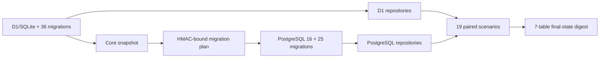

# PostgreSQL Core Semantic Parity

תאריך אימות מקומי: 2026-08-19

## 1. מטרה

1.1 המסמך מתעד הוכחה מצומצמת ודטרמיניסטית לכך שהתנהגות שכבת הליבה
זהה בין D1/SQLite לבין PostgreSQL.

1.2 ההוכחה אינה מסתפקת בהשוואת Schema. היא מתחילה מ־Snapshot של D1,
טוענת אותו ל־PostgreSQL דרך מנגנון ה־Core migration, מפעילה את אותם
Repository contracts ומשווה גם את תוצאות הפעולות וגם את המצב הסופי.

1.3 ההוכחה במסמך זה מכסה את שבע טבלאות ה־Core בלבד. ‏44 הטבלאות האחרות
עברו מאז Data conversion ותרחישי Parity נפרדים בתשעת מסמכי ה־Slice
הנוספים; אין לייחס את הראיה שלהם ל־Core harness המצומצם.

## 2. היקף

2.1 הטבלאות המכוסות:

1. `tenants`.
2. `tenant_memberships`.
3. `tenant_selections`.
4. `business_profiles`.
5. `contacts`.
6. `contact_consent_events`.
7. `audit_logs`.

2.2 תשעה־עשר התרחישים המכוסים:

1. קריאת Memberships לפי משתמש.
2. קריאת חברי Tenant לפי סדר Role.
3. יצירת Tenant selection.
4. Replay זהה של Selection.
5. עדכון Selection עם Version תקין.
6. דחיית Version ישן כ־Conflict.
7. דחיית Tenant שאינו כשיר.
8. יצירת Business profile עם Trim.
9. שמירה זהה ללא קידום Version.
10. עדכון Profile וקידום Version.
11. קריאת Contact לפי Tenant ו־ID.
12. בידוד Contact בין Tenants.
13. סדר דף Contacts.
14. Cursor של דף Contacts.
15. רישום Consent grant.
16. Replay זהה של Consent event.
17. Event ישן שאינו גובר על מצב חדש.
18. Event חדש שגובר ומעדכן את המצב.
19. דחיית Idempotency key שמתנגש בתוכן אחר.

## 3. לוגיקת ההשוואה

3.1 זרימת ההוכחה:



3.2 זמני `created_at` ו־`updated_at` שנוצרים על ידי מנוע מסד הנתונים
אינם חלק מההשוואה העסקית. הם נוצרים ברגעים שונים בשתי הריצות.

3.3 `BIGINT` מנורמל למספר רק בעמודות מספריות ידועות. אין המרה כללית
של מחרוזות מספריות, כדי ששדה טקסט כמו `target_id` לא ישנה סוג בטעות.

3.4 `JSON` של D1 ו־`JSONB` של PostgreSQL מנורמלים לאותו מבנה קנוני.

3.5 כל הבדל בתוצאה או במצב הסופי מפיל את התהליך. ה־Evidence המודפס
מכיל Counts ו־SHA-256 digests בלבד ואינו מכיל פרטי משתמש או Contact.

## 4. הפעלה

4.1 נדרש PostgreSQL 16 מקומי, ריק וייעודי בשם
`connect_core_semantic_parity`.

4.2 ה־URL חייב להיות Loopback, ללא Password, Query string או Fragment:

```bash
CONNECT_POSTGRES_CORE_PARITY_URL=postgresql://127.0.0.1:<port>/connect_core_semantic_parity npm run verify:postgres-core-semantic-parity
```

4.3 התהליך נכשל אם מסד היעד אינו ריק או אם גרסת PostgreSQL אינה 16.

## 5. תוצאת האימות

5.1 הרצה נקייה מול PostgreSQL 16 אמיתי עברה:

```text
PostgreSQL core semantic parity: PASS (19 scenarios, 7 tables, 19 rows, scenario da3a213cc3b262366482cb764251c83b1be2dd9fec706fb6f9318c858444cf2d, state ea3b6752d2d18a67c68b9411b830ba98652e03e76b9de3f3c0ac4b297277daff)
```

5.2 במהלך האימות נמצאו שני הבדלי ייצוג תקינים: PostgreSQL Driver מחזיר
`BIGINT` כמחרוזת ו־`JSONB` כאובייקט, בעוד SQLite מחזיר `INTEGER` כמספר
ו־JSON כמחרוזת. נוסף נרמול מוגבל ומפורש; לא נמצא פער עסקי.

5.3 שרת PostgreSQL הזמני נעצר ותיקיית הנתונים הזמנית נמחקה לאחר
הבדיקה.

## 6. מה ההוכחה אינה מכסה

6.1 ההוכחה אינה כוללת נתוני Production או Export חי מ־D1.

6.2 היא אינה מכסה את 44 הטבלאות שמחוץ ל־Core, עומס, Failover,
Backup/Restore, תורים או Cutover.

6.3 היא אינה מחליפה Staging rehearsal עם Accounts, Credentials,
Pool values ו־Rate-limit policy חיים.
