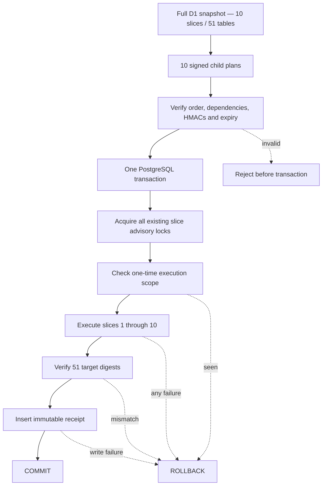

# PostgreSQL Full Data Migration Bundle Contract

תאריך אימות מקומי: 2026-08-20

## 1. מטרה

1.1 החוזה מאחד את עשרת ה־Data migration plans לחבילת Cutover אחת.

1.2 החבילה אינה מכילה קיצור דרך לטעינה. כל Slice עדיין נבדק ומבוצע דרך
ה־Protocol הייעודי שלו, אך כולם חולקים Transaction חיצוני יחיד.

1.3 כשל ב־Slice כלשהו, באימות יעד או בכתיבת Receipt גורם ל־Rollback של
כל עשרת ה־Slices.

## 2. זהויות וחתימות

2.1 לכל Child plan נשמרים `planId`, ‏`manifestDigest`, מספר טבלאות ומספר
שורות. ה־Bundle דורש את עשרת ה־IDs ואת סדר התלויות המדויק.

2.2 ‏`sourceDigest` הוא HMAC יציב הנגזר מגרסאות ה־Plans ומה־Manifest של
כל 51 הטבלאות. הוא אינו כולל את חלון הזמן ולכן אותו מקור נשאר מזוהה גם אם
נוצר עבורו Plan חדש.

2.3 ‏`bundleDigest` הוא HMAC הקושר יחד את המקור, כל Child plans וחלון הזמן.
`bundleId` נגזר ממנו דטרמיניסטית; אין Random ID.

2.4 חלון החיים המרבי הוא 15 דקות. Plan שהופעל לפני `createdAt` או אחרי
`expiresAt` נדחה לפני פתיחת Transaction יעד.

## 3. זרימת הביצוע

## 4. Replay protection

4.1 ‏Migration `0025_data_migration_bundle_receipts.sql` יוצרת Receipt
בלתי־משתנה עם Unique constraints על:

1. `bundle_id` — אותה חבילה אינה יכולה לרוץ שוב.
2. `source_digest` — אותו מקור אינו יכול לרוץ שוב תחת חלון חדש.
3. `bundle_digest` — חתימת Plan אינה יכולה להירשם פעמיים.
4. `evidence_digest` — Evidence חתום אינו יכול להשתייך לשתי הרצות.

4.2 ה־Receipt נכתב רק לאחר שכל עשרת ה־Slices וה־Target digests אומתו. הוא
נמצא באותו Transaction ולכן אינו יכול להעיד על טעינה שלא בוצעה בפועל.

4.3 ‏`execution_scope` קבוע וייחודי ל־`full-d1-cutover`, ולכן Database יעד
יכול לקבל חבילת Cutover מלאה אחת בלבד — גם אם HMAC key או חלון Plan הוחלפו.
הבדיקה מתבצעת לפני Child slice ראשון, וה־Primary key של הטבלה הוא שכבת הגנה
נוספת גם מול Writer שאינו משתמש ב־Protocol.

4.4 Trigger חוסם `UPDATE` ו־`DELETE` של Receipt. תיקון תפעולי עתידי יחייב
הליך Governance מפורש ולא שינוי שקט של הראיה.

## 5. אטומיות ונעילות

5.1 לפני כל כתיבה החבילה רוכשת לפי סדר קבוע את כל ששת Advisory lock keys
שבהם משתמשים ה־Slice protocols. כך גם הפעלה עצמאית ישנה של Slice תיחסם בזמן
ה־Bundle.

5.2 כל Child protocol מקבל Transaction manager מקונן שאינו פותח או סוגר
Transaction נוסף. רק ה־Transaction manager החיצוני רשאי לבצע Commit.

5.3 ה־Receipt table ננעל לפני בדיקת Replay. ‏Unique constraints נשארים
שכבת הגנה נוספת במקרה של Writer שאינו משתמש ב־Protocol.

## 6. ראיות מקומיות

6.1 בדיקות שליליות מוכיחות:

1. תפוגה או Tampering נדחים לפני Transaction.
2. Replay נדחה לפני הפעלת Child slice.
3. כשל ב־Slice מאוחר מבטל את ה־Slice המוקדם.
4. Receipt נכתב רק לאחר כל ה־Target verification.
5. אותו מקור שומר `sourceDigest` גם בחלון חדש, אך מקבל `bundleId` חדש.

6.2 חזרה נקייה מול PostgreSQL 16.13 אמיתי עברה עם:

1. 26 PostgreSQL migrations.
2. עשרה Slices ו־51 טבלאות תחת Transaction יחיד.
3. Receipt יחיד עם Source ו־Evidence digests.
4. דחיית Replay.
5. כל 58 תרחישי ה־Concurrency הקיימים.

6.3 החזרה השתמשה ב־D1 schema אמיתי אך ללא שורות. לכן היא מוכיחה את מנגנון
ההרכבה, הנעילות, האטומיות וה־Receipt — לא Cutover של נתוני לקוח.

## 7. מה עדיין חסר

7.1 נדרשת חזרה בסביבה מבוקרת עם Export מורשה ומלא, PostgreSQL Staging ריק,
HMAC key זמני המנוהל כ־Secret, ניטור משאבים ו־Rollback תפעולי.

7.2 אין להעביר לוגים, Plans או Evidence המכילים Payload של המקור. ראיית
השחרור החיצונית תכיל רק IDs, ‏Digests, Counts ותוצאות מאושרות.

7.3 ה־Bundle המקומי אינו הופך את יכולת Database ל־Production Ready. בחירת
ספק PostgreSQL, ערכי Pool חיים ו־Staging evidence עדיין פתוחים.
