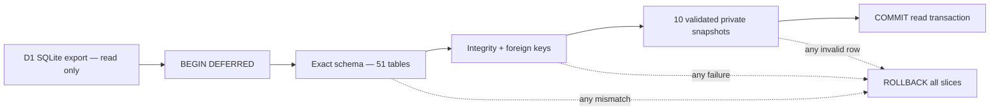

# PostgreSQL Full Source Snapshot Contract

תאריך אימות מקומי: 2026-08-20

## 1. מטרה

1.1 החוזה קורא Export יחיד של D1/SQLite ומפיק בזיכרון Snapshot פרטי לכל
עשרת ה־Data migration slices.

1.2 כל 51 הטבלאות נקראות תחת `BEGIN DEFERRED` יחיד. כך כל ה־Slices רואים
אותה נקודת זמן לוגית ולא עשרה מצבים שנקראו בזה אחר זה.

1.3 זהו Source preflight בלבד. הוא אינו כותב ל־PostgreSQL, אינו יוצר
Cutover plan ואינו מוכיח Staging או Production readiness.

## 2. זרימת הבדיקה



## 3. גבולות בטיחות

3.1 קובץ המקור חייב להיות נתיב מוחלט המסתיים ב־`.sqlite`, קובץ רגיל ולא
Symbolic link. הוא חייב להיות בבעלות המשתמש המריץ, ללא הרשאות Group/Other
וללא Hard links. הוא נפתח עם `readOnly: true` ו־SQLite extensions כבויים.

3.2 ה־Registry ומערך ה־Snapshot חייבים להסכים בדיוק על:

1. עשרה Slice IDs ובאותו סדר תלות.
2. סטטוס `rehearsed` לכל Slice.
3. כל 51 הטבלאות בדיוק פעם אחת.
4. חוזה העמודות והסדר של כל טבלה.

3.3 ‏`PRAGMA integrity_check` ו־`PRAGMA foreign_key_check` רצים פעם אחת
על ה־Export המלא. כשל ב־Schema, ‏Integrity, ‏Foreign key או Validator עסקי
גורם ל־Rollback; אין Snapshot חלקי.

3.4 הפלט למסוף מכיל רק מספר Slices, מספר טבלאות ומספר שורות כולל. הוא
אינו מכיל נתיב, שמות Tenants, מספרי טלפון, תוכן הודעות, Provider IDs או
Payload של ה־Snapshot.

3.5 לאחר סגירת SQLite נבדקים שוב Device, ‏Inode, גודל וזמן שינוי. החלפת
הקובץ או שינויו תוך כדי הבדיקה גורמים לכשל `source-changed`.

## 4. הפעלה על Export מורשה

4.1 אין לשמור Export ב־Git או בתוך Artifact ציבורי. המפעיל מציב אותו
בתיקייה זמנית ומוגנת ומריץ:

```bash
CONNECT_D1_FULL_MIGRATION_SOURCE_PATH="/absolute/protected/path/connect-export.sqlite" \
  npm run verify:d1-full-migration-snapshot
```

4.2 הצלחה מחזירה רק:

```text
D1 full migration source snapshot: PASS (10 slices, 51 tables, <row-count> rows)
```

4.3 מספר השורות הוא נתון תפעולי מצטבר בלבד. אין לצרף אותו ל־Ticket או
ל־Evidence חיצוני לפני אישור מדיניות החשיפה של סביבת היעד.

## 5. מה עדיין חסר

5.1 לפני חזרה מלאה בסביבה מבוקרת עדיין נדרשים:

1. Export חי ועקבי שנוצר באמצעות כלי Cloudflare מאושר.
2. HMAC key זמני ומוגן ליצירת Plans קצרי־תוקף.
3. PostgreSQL Staging ריק עם 25 המיגרציות המדויקות.
4. טעינת כל עשרת ה־Slices לפי סדר התלות ואימות ראיות מאוחד.
5. Load/Recovery rehearsal, ‏Rollback וחיסול מאובטח של Export ו־Plans.

5.2 אין לסמן את יכולת Database כ־Ready על בסיס בדיקת Source זו בלבד.
